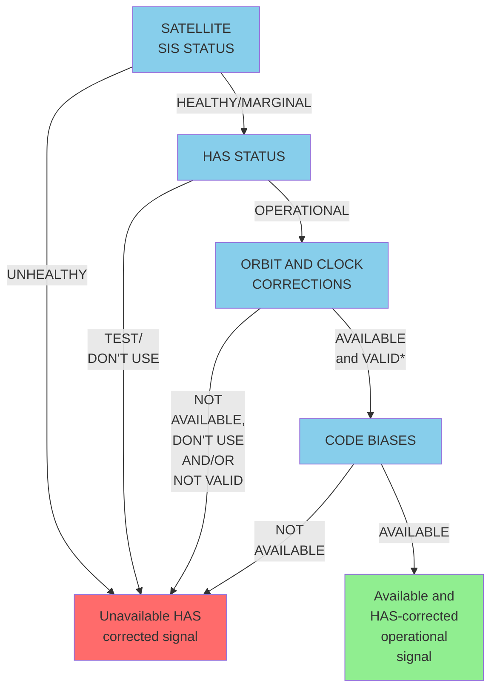
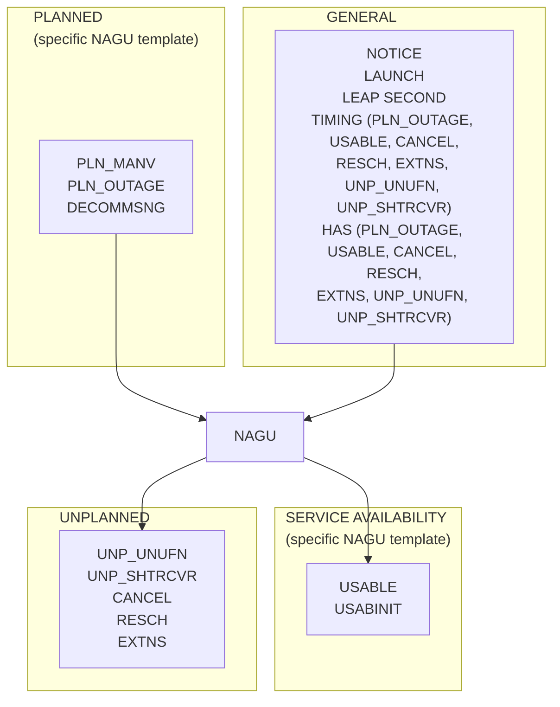

# GALILEO HIGH ACCURACY SERVICE SERVICE DEFINITION DOCUMENT (HAS SDD)

Issue 1.0

January 2023

#EUSpace

GALILEO HAS SERVICE DEFINITION DOCUMENT, ISSUE 1.0, JANUARY 2023

# TERMS AND CONDITIONS OF USE OF THE GALILEO HIGH ACCURACY SERVICE

The Galileo **High Accuracy Service (HAS)**, unless augmented by certified or otherwise legally approved dedicated systems designed to this effect, has been designed and can only be used for non-safety critical purposes, i.e. purposes that have no impact on the safety of human life and where an underperformance in availability, continuity, accuracy and/or integrity of the Galileo **Signal-in-Space (SIS)** could not cause any kind of direct or indirect personal damage, including bodily injuries or death.

## Scope of Galileo HAS commitments

Although care has been taken in designing, implementing and operating the system, as well as in providing the HAS, the HAS is not meant to offer any service guarantee to the users.

The minimum level of performance against which the system has been validated and is operated, as well as data of the actual performance of the HAS are expressed in statistical values that are valid under assumptions described in this document, **the Galileo HAS SDD**. The European Commission reserves the right to revise the Galileo HAS SDD should these assumptions change or reflect changes in performance during the deployment of the Galileo infrastructure. This commitment regarding the minimum level of performance shall be without prejudice to the disclaimer of liability below, measures potentially affecting service availability that may be taken either by the Security Accreditation Board, according to the Council decision 2021/698/CSFP, or in the interests of Member States' national security.

The European Union plans to take all necessary measures for the foreseeable future to maintain or exceed the minimum levels of the HAS performance described herein.

The minimum level of performance of the Galileo HAS, as specified in the Galileo HAS SDD under section 3, is obtained under the conditions and assumptions described in section 2.4. The users are also reminded that important notices (Notice Advisory to Galileo Users – NAGUs and Service Notices), which are published through the Galileo Service Centre, must be considered when planning to use the Galileo HAS for any purpose.

## User responsibilities

The user retains the responsibility to exercise a level of care appropriate with respect to the uses he intends to make of the Galileo HAS, considering the considerations outlined above.

The users are reminded that the timing and positioning performance they will experience is also driven by other parameters outside the control of the Galileo HAS provider (e.g. signal propagation errors or user receiver induced errors), which have to be considered when deciding to use the Galileo HAS for a given purpose.

Before any use of the Galileo HAS, users should study this document in order to understand how they can use the service, as well as to familiarise themselves with the performance level and other aspects of the service they can rely on, in particular, section 3 for a more comprehensive discussion of the relationships between the Galileo HAS performance and the end user Position Velocity Time (PVT) performance expectations.

In case of doubt, the users and other parties should contact the Galileo helpdesk (see section 1.6.5 for contact details) and their user equipment manufacturer.

© European Union 2023
Document subject to terms of use and disclaimers p. i-ii

i

GALILEO HAS SERVICE DEFINITION DOCUMENT, ISSUE 1.0, JANUARY 2023

## Disclaimer of liability

As the owner of the Galileo system, the European Union - including any of its institutions, offices or agencies, such as the European Commission, the European Union Agency for the Space Programme (EUSPA), and other entities acting on the basis of a contract or agreement with the European Union involved in the Galileo HAS service provision - does not offer any warranties of any kind (whether expressed or implied) with respect to the High Accuracy Service, including, but not limited to, the warranties regarding availability, continuity, accuracy, integrity, reliability and fitness for a particular purpose or meeting the users' requirements. No advice or information, whether oral or written, obtained from the European Union - including any of its institutions, offices or agencies, such as the European Commission, the European Union Agency for the Space Programme (EUSPA), and other entities acting on the basis of a contract or agreement with the European Union involved in the Galileo HAS service provision - shall create any such warranty.

By using the Galileo High Accuracy Service, the user accepts and agrees that the European Union - including any of its institutions, offices or agencies, such as the European Commission, the European Union Agency for the Space Programme (EUSPA), and other entities acting on the basis of a contract or agreement with the European Union involved in the Galileo HAS service provision - shall not be held responsible or liable for any damages resulting from the use of, misuse of, or the inability to use the Galileo High Accuracy Service, including, but not limited to, direct, indirect, special or consequential damages, including, but not limited to, damages for interruption of business, loss of profits, goodwill or other intangible losses, other than in accordance with Article 340 of the Treaty on the Functioning of the European Union.

ISBN 978-92-9206-069-5
doi: 10.2878/265974

© European Union 2023
Document subject to terms of use and disclaimers p. i-ii

ii

GALILEO HAS SERVICE DEFINITION DOCUMENT, ISSUE 1.0, JANUARY 2023

## DOCUMENT CHANGE RECORD

| REASON FOR CHANGE             | ISSUE | REVISION | DATE         |
| ----------------------------- | ----- | -------- | ------------ |
| First version of the document | 1     | 0        | January 2023 |

© European Union 2023
Document subject to terms of use and disclaimers p. i-ii

iii

GALILEO HAS SERVICE DEFINITION DOCUMENT, ISSUE 1.0, JANUARY 2023

# FOREWORD

This "Galileo – High Accuracy Service - Service Definition Document" (Galileo HAS SDD) defines the Minimum Performance Levels (MPLs) of the Galileo HAS.

The document will be updated in the future to reflect further changes and improvements of the High Accuracy Service.

© European Union 2023
Document subject to terms of use and disclaimers p. i-ii

iv

GALILEO HAS SERVICE DEFINITION DOCUMENT, ISSUE 1.0, JANUARY 2023

# TABLE OF CONTENTS

## SECTION 1: THE GALILEO HIGH ACCURACY SERVICE.........................................................................5

1.1 PURPOSE OF THE DOCUMENT ...................................................................................................5

1.2 SCOPE OF THE DOCUMENT ........................................................................................................6

1.3 TERMS AND CONDITIONS OF USE..............................................................................................6

1.4 ABBREVIATIONS AND ACRONYMS..............................................................................................6

1.5 GALILEO HIGH ACCURACY SERVICE DEFINITION ....................................................................6

1.5.1 HAS CORRECTIONS ..............................................................................................................7

1.5.2 HAS POSITIONING .................................................................................................................8

1.6 GALILEO SYSTEM OVERVIEW .....................................................................................................8

1.6.1 GALILEO SPACE SEGMENT..................................................................................................8

1.6.2 GALILEO GROUND SEGMENT..............................................................................................9

1.6.2.1 Ground Control Segment ..............................................................................................9

1.6.2.2 Ground Mission Segment............................................................................................10

1.6.3 GALILEO SERVICE FACILITIES ...........................................................................................10

1.6.4 GALILEO HAS SERVICE INFRASTRUCTURE.....................................................................11

1.6.5 THE EUROPEAN GNSS SERVICE CENTRE (GSC):
GALILEO INTERFACE WITH USERS...................................................................................12

1.6.5.1 Notification to Users (NAGU) ......................................................................................14

1.6.6 GALILEO TIME AND GEODETIC REFERENCE FRAMES...................................................14

1.6.6.1 Galileo Terrestrial Reference Frame ...........................................................................14

1.6.6.2 Galileo System Time ...................................................................................................15

## SECTION 2: GALILEO HIGH ACCURACY SERVICE DESCRIPTION......................................................16

2.1 SIGNAL IN SPACE ........................................................................................................................16

2.1.1 RELEVANT SIS INTERFACE CONTROL DOCUMENTS......................................................16

2.1.2 RELEVANT GNSS SIGNALS FOR HAS................................................................................16

2.1.2.1 Relevant Galileo signals for HAS ................................................................................16

2.1.2.2 Relevant GPS signals for HAS....................................................................................17

2.1.3 HAS SIS MESSAGES............................................................................................................18

2.1.3.1 HAS SIS pages ...........................................................................................................18

2.1.3.2 HAS SIS message types.............................................................................................19

2.1.3.3 HAS dummy pages .....................................................................................................19

2.1.3.4 HAS SIS status............................................................................................................20

2.1.3.5 Cyclic Redundancy Check ..........................................................................................20

2.1.4 VALIDITY OF HAS SIS CORRECTIONS...............................................................................20

2.1.5 HAS SIS BROADCAST SCHEMA .........................................................................................21

2.2 INTERNET DATA DISTRIBUTION ................................................................................................21

2.2.1 RELEVANT IDD INTERFACE CONTROL DOCUMENTS .....................................................21

2.2.2 HAS IDD MESSAGES ...........................................................................................................22

2.2.3 VALIDITY OF HAS IDD CORRECTIONS ..............................................................................22

2.3 USABILITY OF GALILEO HAS CORRECTIONS..........................................................................22

2.4 USAGE ASSUMPTIONS FOR HIGH ACCURACY SERVICE.......................................................23

2.4.1 HAS SUPPORTED SIGNAL COMBINATIONS......................................................................24

2.4.2 HAS USER RECEIVERS.......................................................................................................24

2.4.3 HAS CORRECTIONS ............................................................................................................24

2.4.4 LIMITATIONS ON HAS SIS STATUS.....................................................................................25

2.4.5 EXCLUDED ERRORS ...........................................................................................................25

© European Union 2023
Document subject to terms of use and disclaimers p. i-ii

1

GALILEO HAS SERVICE DEFINITION DOCUMENT, ISSUE 1.0, JANUARY 2023

## SECTION 3: GALILEO HAS MINIMUM PERFORMANCE LEVELS .........................................................26

3.1 HAS SERVICE AREA....................................................................................................................26

3.2 HAS CORRECTIONS....................................................................................................................27

3.2.1 HAS CORRECTIONS ACCURACY DEFINITIONS ...............................................................27

3.2.1.1 HAS orbit corrections accuracy definition....................................................................27

3.2.1.2 HAS clock corrections accuracy definition ..................................................................27

3.2.1.3 HAS code bias accuracy definition..............................................................................27

3.2.2 HAS CORRECTIONS ACCURACY MPL...............................................................................27

3.2.3 HAS CORRECTIONS AVAILABILITY – AT USER LEVEL - DEFINITION..............................28

3.2.4 HAS CORRECTIONS AVAILABILITY - AT USER LEVEL - MPL ...........................................28

3.3 PERFORMANCE LEVEL OF THE GNSS SERVICE CENTRE.....................................................29

3.3.1 TIMELY PUBLICATION OF NAGUS......................................................................................29

## APPENDIX A REFERENCE DOCUMENTS ..........................................................................................30

## APPENDIX B ABBREVIATIONS AND ACRONYMS ............................................................................31

## APPENDIX C DESCRIPTION OF ADVISORY NOTICE TO GALILEO USERS ...................................32

C.1 LIST OF DEFINED NAGUS...................................................................................................32

C.2 NAGU FORMAT.....................................................................................................................35

## APPENDIX D HAS PERFORMANCE CHARACTERISATION USER ALGORITHM............................38

## APPENDIX E GALILEO HAS TYPICAL POSITIONING PERFORMANCE..........................................39

E.1 HAS POSITIONING ACCURACY DEFINITION.....................................................................39

E.2 HAS POSITIONING ACCURACY TYPICAL PERFORMANCE .............................................39

E.3 HAS POSITIONING AVAILABILITY DEFINITION..................................................................40

E.4 HAS TYPICAL POSITIONING AVAILABILITY PERFORMANCE ..........................................40

© European Union 2023
Document subject to terms of use and disclaimers p. i-ii

2

GALILEO HAS SERVICE DEFINITION DOCUMENT, ISSUE 1.0, JANUARY 2023

## LIST OF TABLES

| Table 1. Reference Orbit Parameters. | 9 |
| Table 2. Galileo signals relevant for HAS | 17 |
| Table 3. GPS signals relevant for HAS | 18 |
| Table 4. C/NAV page layout | 19 |
| Table 5. Time allocation of HAS broadcast schema | 21 |
| Table 6. HAS corrections accuracy MPL | 28 |
| Table 7. HAS corrections availability MPL. | 28 |
| Table 8. HAS Timely publication of NAGUs MPL. | 29 |
| Table 9. List of general NAGUs. | 34 |
| Table 10. List of specific NAGUs. | 35 |
| Table 11. List of obsolete NAGUs. | 35 |
| Table 12. Galileo-only HAS typical positioning accuracy performance. | 39 |
| Table 13. Galileo + GPS HAS positioning accuracy typical performance. | 40 |
| Table 14. HAS positioning availability typical performance. | 41 |

© European Union 2023
Document subject to terms of use and disclaimers p. i-ii

3

GALILEO HAS SERVICE DEFINITION DOCUMENT, ISSUE 1.0, JANUARY 2023

## LIST OF FIGURES

| Figure 1 - High level scheme of the Galileo Ground Segment architecture | 11 |
| Figure 2 - Galileo broadcasting of HA data | 12 |
| Figure 3 - Overall context of the GSC | 13 |
| Figure 4 - Signals transmitted by Galileo satellites | 17 |
| Figure 5 – Galileo and GPS frequency plans | 18 |
| Figure 6 - Usability of Galileo HAS corrections | 23 |
| Figure 7 - Galileo HAS service area | 26 |
| Figure 8 - NAGU types and categorization | 33 |

© European Union 2023
Document subject to terms of use and disclaimers p. i-ii

4

GALILEO HAS SERVICE DEFINITION DOCUMENT, ISSUE 1.0, JANUARY 2023

# SECTION 1: THE GALILEO HIGH ACCURACY SERVICE

Galileo is the European Global Navigation Satellite System (EGNSS), under civil control, that provides satellite positioning services to European citizens and worldwide.

Galileo provides ranging signals in three different frequency bands, enabling single- and multi-frequency positioning for users equipped with suitable receivers.

As one of the services offered by Galileo, the Galileo High Accuracy Service is an open access and free of charge service based on the provision of precise corrections (orbit, clock, biases) transmitted in the Galileo E6 signal (E6-B, data component) from a subset of the Galileo satellites as well as via the internet, allowing the user to achieve improved positioning performance.

The precise corrections provided by the Galileo High Accuracy Service allow users to reduce the error associated with the orbit and clocks provided through the Galileo Open Service broadcast navigation messages and the GPS Standard Positioning Service navigation data. These corrections, together with the biases provided by the service and when processed by an appropriate algorithm, enable the computation of a High Accuracy PVT solution in real-time.

Future evolutions of the service will progressively improve the performance currently delivered by the HAS initial service.

This Service Definition Document describes the Galileo High Accuracy Service provided at the time of its publication. Future releases of this document will be issued to properly consider the further evolution of the Galileo HAS.

## 1.1 PURPOSE OF THE DOCUMENT

The purpose of this Galileo Services – High Accuracy Service Definition Document is to describe the characteristics and performance of the Galileo HAS provided through the Galileo Signal-in-Space (SIS) and the Internet Data Distribution (IDD) channels. The HAS SDD presents the MPLs targeted for such service and defines the conditions under which such MPLs can be reached. This document addresses all users of Galileo HAS. The Galileo HAS is provided free of charge to all users.

This HAS SDD consists of a main body and five appendices. It provides an overview of the EGNSS Programme as well as an overview of the HAS data format provided through the SIS and the IDD channels. It then presents the MPLs for the HAS. It concludes with the relevant reference documents. The appendices provide additional information on Galileo HAS and the expected performance evolution.

The main document comprises the following sections:

• Section 1: High-level overview of the Galileo HAS
• Section 2: The Galileo HAS service description and usage assumptions
• Section 3: The Galileo HAS performance parameters and Minimum Performance Levels
• Appendix A: Reference Documents
• Appendix B: Abbreviations and Acronyms
• Appendix C: Description of Advisory Notice to Galileo Users
• Appendix D: Main characteristics of the HAS performance characterisation User Algorithm (HAS-UA)
• Appendix E: HAS positioning performance characterisation

© European Union 2023
Document subject to terms of use and disclaimers p. i-ii
5

© European Union 2023
Document subject to terms of use and disclaimers p. i-ii
6

## 1.2 SCOPE OF THE DOCUMENT

This Galileo HAS SDD applies to the Galileo HAS as provided at the time of its publication.

The HAS SDD belongs to the series of Galileo Programme Reference Documents published for the benefit of Galileo users, to present and explain various aspects of the EGNSS concerning Galileo HAS. The other Programme Reference Documents are:

• The European GNSS (Galileo) – High Accuracy Service - Signal-in-Space Interface Control Document (HAS SIS ICD) [RD-1].

By describing exhaustively the HAS SIS, it specifies the interface between the Galileo Space Segment and the Galileo User Segment for the retrieval of HAS corrections through the SIS.

• The European GNSS (Galileo) – High Accuracy Service – Internet Data Distribution Interface Control Document (HAS IDD ICD) [RD-2].

By describing exhaustively the HAS IDD channel, it specifies the interface between the HAS ground server and the Galileo User Segment for the retrieval of HAS corrections through the IDD.

• The European GNSS (Galileo) – Galileo Open Service Signal-in-Space Interface Control Document [RD-5].

By describing exhaustively the OS SIS, including the specification of signals corrected by the Galileo HAS.

• The European GNSS (Galileo) – Galileo E6-B/C Codes Technical Note [RD-4].

By providing the specification of the Galileo E6-B and E6-C codes and complementing the OS SDD, it facilitates the development of Galileo E6-B/C receivers.

• The European GNSS (Galileo) – Galileo Open Service Definition Document [RD-3].

By providing performance specifications for the Galileo Open Service and related signals, it describes the characteristics of the Galileo OS.

All public Galileo Programme Reference Documents are made available to users through the web portal of the European GNSS Service Centre¹.

## 1.3 TERMS AND CONDITIONS OF USE

The terms and conditions of use of the Galileo High Accuracy Service are described at the beginning of this document.

## 1.4 ABBREVIATIONS AND ACRONYMS

Abbreviations and acronyms used in this document are provided in Appendix B.

## 1.5 GALILEO HIGH ACCURACY SERVICE DEFINITION

The Galileo High Accuracy Service is an open access and free of charge service. It is based on the provision of precise corrections (i.e. orbits and clocks) and biases transmitted in the Galileo E6 signal (E6-B, data component) from a subset of the Galileo satellites as well as via the internet. The service allows the user to achieve improved positioning performance compared to the performance of the Galileo Open Service [RD-3].

The current HAS SDD covers the provision of **Galileo HAS Initial Service only**. Its scope is limited to the provision of the HAS Service Level 1 (SL1, described below) with reduced coverage and performance with respect to the Full Service objectives as enabled by the current Galileo infrastructure (e.g. Galileo Sensor Stations – GSS – network). With respect to the products expected as part of the HAS Full Service SL1 (see below), it is to be noted that phase biases are not yet provided.

¹ https://www.gsc-europa.eu

GALILEO HAS SERVICE DEFINITION DOCUMENT, ISSUE 1.0, JANUARY 2023

In the future, the **Galileo HAS Full Service** will provide two different service levels:

• **Service Level 1 (SL1):**
  – Service area: global coverage.
  – Products (correction types): orbits and clocks corrections and code and phase biases.
  – Delivery channels: HAS SIS and HAS IDD.
  – Accuracy target (95%): 20 cm (horizontal) / 40 cm (vertical).
  – Availability target: 99%.
  – Convergence time target: 300 seconds.

• **Service Level 2 (SL2):**
  – Service area: regional coverage (the European Coverage Area – ECA²).
  – Products (correction types): SL1 products and atmospheric corrections.
  – Delivery channels: HAS SIS and HAS IDD.
  – Accuracy target (95%): 20 cm (horizontal) / 40 cm (vertical).
  – Availability target: 99%.
  – Convergence time target: 100 seconds.

The Galileo HAS committed performance is structured in two categories:

• The **Galileo HAS corrections (products) performance**: dealing with the High Accuracy products (i.e. orbit and clock corrections and code biases).

• The **Galileo HAS service area**: linked to the corrections performance commitments. It is to be noted that, while the worldwide service area is targeted for the Galileo HAS Full service, the Galileo HAS Initial Service targets a reduced service area.

Moreover, this document also provides (in Appendix E) metrics for the typical **Galileo HAS positioning performance** associated with the PVT solution that users can compute within the HAS service area using the HAS corrections with a suitable Precise Point Positioning (PPP) algorithm.

## 1.5.1 HAS CORRECTIONS

The Galileo HAS corrections consist of PPP corrections applicable to the reference Galileo and GPS navigation messages and the ranging measurements. The HAS corrections include orbit and clock corrections and code biases, and are applicable to the following Galileo and GPS navigation messages and signals:

• Galileo I/NAV navigation message and Galileo E1/E5a/E5b/E6 signals.

• GPS LNAV navigation message and GPS L1/L2C signals.

Future service evolutions will include phase biases and correct additional signals, such as Galileo E5 AltBOC and GPS L5.

The HAS corrections are provided through two redundant and complementary channels: the HAS SIS [RD-1] and the HAS IDD [RD-2]. The user has the flexibility to use one or the other channel. Note that the MPLs detailed in section 3 are fulfilled when the Galileo HAS corrections are received from the HAS SIS, from the HAS IDD, or from both channels.

The HAS corrections broadcast through the SIS channel are formatted as per HAS SIS ICD [RD-1].

The corrections broadcast through the IDD channel are formatted as per HAS IDD ICD [RD-2]. Access to the IDD channel is subject to a registration process³.

² European territories of EU Members States, Norway and Switzerland and the associated maritime and aeronautical areas adjacent and belonging to these countries. The European Coverage Area (ECA) includes Azores, Madeira and Canary Islands in the South West, Larnaca in the South East and Spitsbergen in the North.

³ https://www.gsc-europa.eu/galileo/services/galileo-high-accuracy-service-has/internet-data-distribution

© European Union 2023
Document subject to terms of use and disclaimers p. i-ii

7

GALILEO HAS SERVICE DEFINITION DOCUMENT, ISSUE 1.0, JANUARY 2023

## 1.5.2 HAS POSITIONING

By properly applying the Galileo HAS corrections, all users equipped with a Galileo receiver implementing a suitable PPP algorithm and who are located within the service area of the Galileo HAS are able to estimate their position. The typical accuracy and availability supported by Galileo HAS is presented in Appendix E.

The HAS typical positioning performance (Appendix E) is based on the Galileo HAS corrections performance described in section 3.2 and the implementation of the performance characterisation user algorithm (HAS-UA) described in Appendix D.

It is nevertheless possible to apply different HAS user algorithms, potentially optimised for different conditions (e.g. target application and/or environment), to the Galileo HAS corrections. The performance of such HAS user solutions is not covered within this document.

The HAS positioning typical performance depicted in Appendix E is developed under the conditions defined in section 2.4.

## 1.6 GALILEO SYSTEM OVERVIEW

The Galileo HAS service is provided through the current Galileo system.

The Galileo system is composed of a Core Infrastructure and a number of Service Facilities. The Core Infrastructure, in turn, comprises a Space Segment and a Ground Segment.

The Galileo Space Segment consists of a constellation of satellites transmitting navigation signals providing user access to the Galileo services. The Galileo Ground Segment consists of a ground infrastructure providing the functionality to monitor and control the satellite constellation and the generation and further dissemination of the mission data that are included in the navigation signals (i.e. the Galileo navigation message) and broadcast to the users.

The Galileo system, once fully deployed, will offer five high-performance services worldwide:

• Open Service (OS): Galileo open and free of user charge service set up for positioning and timing services.

• Public Regulated Service (PRS): Service restricted to government-authorised users, for sensitive applications that require a high level of service continuity.

• High Accuracy Service (HAS): A free access service complementing the OS, delivering High Accuracy data and providing better ranging accuracy, enabling users to achieve sub-meter level positioning accuracy. The HAS is the only service addressed in this document.

• Commercial Authentication Service (CAS): A service complementing the OS, providing a controlled access and authentication function to the users.

• Search and Rescue Service (SAR): Europe's contribution to COSPAS-SARSAT, an international satellite-based search and rescue distress alert detection system.

### 1.6.1 GALILEO SPACE SEGMENT

The Galileo Space Segment generates and transmits the Galileo navigation signals as specified in the Galileo OS SIS ICD [RD-5].

The baseline Galileo constellation configuration is defined as a 24/3/1 Walker constellation: 24 nominal Medium Earth Orbit (MEO) satellites are arranged in 3 orbital planes, with their ascending nodes uniformly distributed at intervals of 120 degrees, inclined at 56 degrees with respect to the Equator. Each orbital plane includes 8 satellites uniformly distributed within the plane, at intervals of 45 degrees of argument of latitude. The angular shift between satellites in two adjacent planes is 15 degrees. The constellation is complemented by spare satellites that can be repositioned to any given nominal slot within each orbit plane depending on maintenance or service evolution needs.

© European Union 2023
Document subject to terms of use and disclaimers p. i-ii

8

GALILEO HAS SERVICE DEFINITION DOCUMENT, ISSUE 1.0, JANUARY 2023

The constellation geometry repetition period corresponding to the nominal orbital parameters is approximately 10 sidereal days (corresponding to 17 orbital revolutions). This means that for any fixed Galileo user, the local satellite geometry at a given instant will repeat every 10 sidereal days, approximately.

The main reference orbit parameters of the Galileo constellation are specified in Table 1. Further details on the baseline and currently deployed Galileo constellation are provided in the OS SDD [RD-3].

| REFERENCE ORBIT PARAMETER | NOMINAL VALUE |
| ------------------------- | ------------- |
| Constellation Type        | Walker 24/3/1 |
| Orbit semi-major axis, m  | 29599801      |
| Orbit eccentricity        | 0             |
| Orbit inclination, deg    | 56.0          |
| Argument of Perigee, deg  | 0.0           |

**Table 1. Reference Orbit Parameters.**

## 1.6.2 GALILEO GROUND SEGMENT

The Galileo Ground Segment comprises both the Ground Control Segment and the Ground Mission Segment and it includes the following infrastructure:

• Two Galileo Control Centres (GCC), implementing ground control and ground mission capabilities at each site.

• A worldwide network of GSS, collects and forwards Galileo SIS measurements and data to the GCCs and the European GNSS Service Centre (GSC) in real time.

• A worldwide network of Galileo Uplink Stations (ULS), which distributes and uplinks the mission data to the Galileo constellation.

• A worldwide network of Telemetry, Tracking & Control stations (TTC stations), which collects and forwards telemetry data generated by the Galileo satellites, and distributes and uplinks the control commands required to maintain the Galileo satellites and constellation in nominal operational conditions.

An overview of the Galileo Ground Segment is provided in Figure 1.

The Galileo Ground Segment implements all functions required to:

• Generate the Galileo mission support data (e.g. satellite orbit and time synchronisation data, ionospheric correction model data and other information transmitted in the navigation signals).

• Perform the monitoring and control of all Galileo system assets (both ground and space segments).

• Interface with the Service Facilities (see section 1.6.3), including interface with the European GNSS Service Centre where the High Accuracy Data Generator (HADG) is allocated.

### 1.6.2.1 Ground Control Segment

The Galileo Ground Control Segment (GCS) provides a large range of functions to support the management and control of the satellite constellation. The scope of this functionality includes control and monitoring of the satellites and payload, planning and automation functions that allow safe and correct operations to take place, and the support of payload related operations by means of TT&C links.

© European Union 2023
Document subject to terms of use and disclaimers p. i-ii

9

GALILEO HAS SERVICE DEFINITION DOCUMENT, ISSUE 1.0, JANUARY 2023

### 1.6.2.2 Ground Mission Segment

The Galileo Ground Mission Segment (GMS) determines the navigation and timing data part of the navigation messages and transmits it - together with the data received from the GSC - to the satellite via its C-Band ground stations.

The GMS architecture consists of facilities deployed in the 2 GCCs plus ULS and GSS stations deployed at remote sites located around the world. The Ground Mission Segment includes the Processing Chain, which is in charge of computing the data to be broadcast in the Galileo navigation messages.

### 1.6.3 GALILEO service facilities

The Galileo Service Facilities are elements located outside the perimeter of the Galileo Core Infrastructure that support the provision of Galileo services.

The service facilities contributing to the provision of the Galileo HAS are:

• The GSC: the GSC hosts the High Accuracy Data Generator (HADG) and is the interface between the Galileo HAS user community and the Galileo system (see section 1.6.4 for further information).

• The Geodetic Reference Service Provider (GRSP): This entity supports the GCC in realising the Galileo Terrestrial Reference Frame (GTRF), consistently with the International Terrestrial Reference Frame (ITRF).

• The Time Service Provider (TSP): This entity supports the GCC in the realisation of the Galileo System Time (GST) and its alignment to the Coordinated Universal Time (UTC).

• The Galileo Security Monitoring Centre (GSMC): This facility is in charge of monitoring the system security.

An additional service facility, the Galileo Reference Centre (GRC), is responsible for monitoring and assessment of the performance of the Galileo services, completely independently from the Galileo core infrastructure and its operations.

© European Union 2023
Document subject to terms of use and disclaimers p. i-ii

10

GALILEO HAS SERVICE DEFINITION DOCUMENT, ISSUE 1.0, JANUARY 2023

| Space Segment | | | | | | |
|---|---|---|---|---|---|---|
| S-Band | TC TM | Mission Data C-Band | | Signal in Space L-Band | | |
| TTC | TTC | ULS | ULS | GSS | GSS | |
| | | | | | | |
| | | | GCCS | | | |
| | | | | | | |
| GRSP | GSMC | TSP | GSC | | | |
| | Galileo Service Facilities | | | | | |

**Figure 1 - High level scheme of the Galileo Ground Segment architecture**

## 1.6.4 GALILEO HAS SERVICE INFRASTRUCTURE

The Galileo HAS corrections are provided by the HADG.

The HADG computes the orbit and clock corrections as well as the signal biases and generates the HAS messages to be injected in the Galileo Infrastructure through the GSC, as well as the State Space Representation (SSR) messages to be distributed through the HAS IDD.

The HADG implements an Orbit Determination and Time Synchronisation (ODTS) process to generate the high accuracy data by processing inputs from the GSSs.

The high accuracy data is:

• Forwarded to the Galileo Core Infrastructure and then uplinked to the Galileo satellites to be broadcast via the Galileo E6-B signal component.

• Formatted to be broadcast via internet in real-time.

In the case of SIS broadcast, Galileo satellites will only broadcast high accuracy data when connected to an uplink station. By properly scheduling the provision of high accuracy data to the GSC interface, the HADG has the capability to select the data to be broadcast by each connected Galileo satellite.

© European Union 2023
Document subject to terms of use and disclaimers p. i-ii

11

GALILEO HAS SERVICE DEFINITION DOCUMENT, ISSUE 1.0, JANUARY 2023

**Figure 2 - Galileo broadcasting of HA data**

The capability of Galileo to broadcast high accuracy corrections through the SIS will evolve over time along with the continuous infrastructure deployment, and will be driven by the number of uplink stations as well as the number of satellites.

## 1.6.5 THE EUROPEAN GNSS SERVICE CENTRE (GSC): GALILEO INTERFACE WITH USERS

The GSC, part of the European GNSS infrastructure, provides the single centralised ground interface between the Galileo user communities (for OS, HAS and CAS) and the Galileo system infrastructure and operator, for the provision of specific services beyond the SIS transmitted by the Galileo satellites. It is accessible through its web portal⁴.

The GSC is conceived as a centre of expertise, knowledge sharing, custom performance assessment, information dissemination and support to the provision of value-added services enabled by the Galileo services. To implement these objectives, the GSC interfaces with the key elements of the Galileo ground segment, as well as with external entities. Figure 3 depicts the overall context of the GSC.

⁴ https://www.gsc-europa.eu

© European Union 2023
Document subject to terms of use and disclaimers p. i-ii

12

GALILEO HAS SERVICE DEFINITION DOCUMENT, ISSUE 1.0, JANUARY 2023

## Galileo Service Facilities

![Diagram showing Galileo Service Facilities architecture with Geodetic Reference, Time Reference, and Performance Monitoring at the top connecting to GNSS Service Centre in the middle, which connects to EGNOS Service Centre and Other GNSS Service Centres on the left, Galileo Control Centre and GSMC on the right, and various user icons (mobile, maritime, aviation, general, helicopter, agriculture, offshore) at the bottom]

* GNSS stands for 'Global navigation satellite system'

**Figure 3 - Overall context of the GSC**

The GSC has the task of interfacing with the user communities across the entire value chain.

The GSC web portal is conceived as the one-stop-shop providing ready access to key information for user communities of Galileo OS, High Accuracy and Safety-of-Life (SoL) services.

The functionality and services covered by the GSC are:

• HAS provision through the IDD interface.

• Helpdesk support: for answering general queries and incident notifications from users on Galileo Services and specific queries from Galileo receiver and application developers on the official Galileo user documents. In addition, registered users can subscribe to be informed in real time about events affecting the Galileo services.

• Information on Galileo system status: Publication of Galileo almanacs, constellation status and provision of Galileo Service Notices.

• Publication of notifications to users: General information on the constellation and current status of the different space vehicles are published by means of Notice Advisory to Galileo Users messages (NAGUs, see section 1.6.5.1), which inform regularly about the system status. Users have the possibility of subscribing to the automatic notification of NAGUs via e-mail.

• Reports on the Galileo High Accuracy Service navigation key performance indicators and on the GSC performance itself are also published for the users' information.

• Electronic Library, including Programme Reference documentation and general information.

• Support to GNSS developers, including the GNSS Simulation and Testing infrastructure (GSTI).

• Interface with other GNSS Service Providers.

© European Union 2023
Document subject to terms of use and disclaimers p. i-ii

13

• Galileo user satisfaction monitoring, including customised performance assessment, reporting and forecasts for specific communities, and support to the Galileo services development for each community or domain.

## 1.6.5.1 Notification to Users (NAGUs)

The GSC is responsible for the publication of Notice Advisory to Galileo Users (NAGU) messages. NAGUs are used to notify HAS users about planned and unplanned HAS outages concerning the SIS interface of the service. Potential relevant events concerning only the IDD interface will be directly notified to the registered HAS users via email.

Different kinds of NAGUs are issued depending on the specific event to be communicated.

The description of the structure and content of the NAGUs is provided in Appendix C. This information, together with the list of active and archived NAGUs can be also found on the GSC web page⁵, under "System Status".

Minimum Performance Levels for the timely publication of NAGUs for both unplanned and planned outage events are reported in section 3.3.1.

## 1.6.6 GALILEO TIME AND GEODETIC REFERENCE FRAMES

The Galileo system establishes its independent terrestrial reference frame and system time scale. The satellite positions and satellite clock offsets encoded in the navigation data are referenced to these Galileo time and terrestrial internal references. Without additional processing, the navigation solution computed by a Galileo OS receiver (using the mathematical algorithms described in the OS SIS ICD [RD-5] provides the receiver's position and time offset referenced to these internal references.

The Galileo system terrestrial and time references are:

• Galileo Terrestrial Reference Frame (GTRF): the Galileo spatial reference frame

The instantaneous satellite positions derived from the data provided in the OS SIS and using the algorithm defined in the OS SIS ICD [RD-5] are referenced to the GTRF. The GTRF is specified to always be in line with the ITRF, as defined by the International Earth Rotation and Reference Systems Service (IERS). The GTRF specification is provided in section 1.6.6.1.

• Galileo System Time (GST): the Galileo time and frequency reference

The instantaneous satellite clock parameters derived from the data provided in the OS SIS and using the algorithm defined in the OS SIS ICD [RD-5] are referenced to the Galileo System Time. The GST is aligned with the International Atomic Time (TAI) and the required parameters to transform it to UTC are transmitted in the navigation message, as explained in section 1.6.6.2.

### 1.6.6.1 Galileo Terrestrial Reference Frame

The Galileo Terrestrial Reference Frame is the independent realisation of the International Terrestrial Reference System based on the estimated coordinates of each one of the GSS sites.

The determination of the GSS positions is based on global free network adjustment and the precise network solution thus obtained is aligned to the ITRF. For this purpose, a significant number of ITRF stations co-located or non-co-located with GSSs are part of the network of stations operated by the GRSP.

The GTRF is a highly accurate realisation of the ITRS. At any time, the alignment between the GTRF and the latest physical realisation of the ITRF is such that the difference between the ITRF and the GTRF coordinates of the ITRF stations/markers used in the realisation of the GTRF is less than 3 cm (2σ).

The Galileo system uses the geodetic input information to produce navigation data (e.g. satellite ephemeris) referenced to the GTRF. Accordingly, the user position coordinates derived from Galileo position solutions are referenced to GTRF. Due to the good alignment of GTRF to ITRF both reference

GALILEO HAS SERVICE DEFINITION DOCUMENT, ISSUE 1.0, JANUARY 2023

© European Union 2023
Document subject to terms of use and disclaimers p. i-ii

14

⁵ https://www.gsc-europa.eu/system-service-status/nagu-information

GALILEO HAS SERVICE DEFINITION DOCUMENT, ISSUE 1.0, JANUARY 2023

frames are understood to be equivalent in the frame of this document. The GTRF is regularly aligned if new ITRF realisations are published.

To obtain the position in any reference frame different from ITRF, Galileo user equipment needs to apply the appropriate valid transformation parameters between the latest ITRF and the desired reference frame. This transformation is under the full control and responsibility of the Galileo user.

Concerning the interoperability between GPS and Galileo, the GPS terrestrial reference frame, WGS-84, and the GTRF are both realisations of the ITRF. Therefore, for most applications, a high level of interoperability is provided between the spatial positions obtained with GPS and those obtained with Galileo, without further activity by the user equipment.

## 1.6.6.2 Galileo System Time

The Galileo System Time is a continuous timescale based on the definition of the second (according to the International System of Units, SI) whose origin/reference epoch GST(T0) is defined as 13 seconds before 1999-08-22 00:00:00 UTC. UTC is the time scale endorsed by the 15th General Conference of Weights and Measures for worldwide time coordination and dissemination. It is the international time metrological standard and it is maintained, coordinated and disseminated by the International Bureau of Weights and Measures (BIPM).

UTC is defined as an atomic timescale (time interval is consistent with the SI definition of the second), but unlike GST, it is steered towards UT timescale (which is not based on atomic standards but on the Earth rotation period).

The time synchronisation information disseminated in the Galileo SIS (e.g. satellite clock offsets) is referenced to GST. This information allows the Galileo OS users to estimate their local time referenced to the GST realisation computed by the OS receiver.

To better support timing applications based on UTC, the Galileo OS data message includes additional parameters which enable the Galileo OS users to obtain a realisation of the UTC time by applying a correction to the GST (further details are provided in [RD-3]).

© European Union 2023
Document subject to terms of use and disclaimers p. i-ii

15

GALILEO HAS SERVICE DEFINITION DOCUMENT, ISSUE 1.0, JANUARY 2023

# SECTION 2: GALILEO HIGH ACCURACY SERVICE DESCRIPTION

This section provides a high-level description of Galileo HAS interfaces, definitions and minimum service usage assumptions:

• Subsection 2.1 provides a high-level overview of the Galileo HAS SIS interface. The reference document for details on such interfaces is the Galileo HAS SIS Interface Control Document (HAS SIS ICD) [RD-1].

• Subsection 2.2 provides a high-level overview of the Galileo HAS IDD interface. The reference document for details on such an interface is the Galileo HAS Internet Data Distribution Interface Control Document (HAS IDD ICD) [RD-2].

In the event of a conflict between the information described in this document and the HAS SIS ICD or the HAS IDD ICD, the ICDs shall prevail.

• Subsection 2.3 provides a diagram to easily understand the usability of Galileo HAS corrections, and

• Subsection 2.4 provides a description of the minimum usage assumptions for the Galileo HAS users.

## 2.1 SIGNAL IN SPACE

This section provides an overview of the Galileo HAS SIS characteristics.

### 2.1.1 RELEVANT SIS INTERFACE CONTROL DOCUMENTS

The Galileo OS SIS complies with the technical requirements related to the interface between the Space Segment and the OS receivers as established by the OS SIS ICD [RD-5].

Similarly, GPS SPS SIS is expected to comply with its applicable ICD [RD-6].

The Galileo HAS SIS is compliant with the technical requirements related to the interface between the Space Segment and the HAS receivers as established by the HAS SIS ICD [RD-1].

### 2.1.2 RELEVANT GNSS SIGNALS FOR HAS

#### 2.1.2.1 Relevant Galileo signals for HAS

Galileo transmits several signals and codes on four different carrier frequencies within the 1.1 to 1.6 GHz band, namely:

• E1, centred at 1575.42 MHz;

• E5a and E5b, centred at 1176.45 MHz and 1207.14 MHz respectively, multiplexed together through an AltBOC scheme and transmitted at the E5 carrier frequency centred at 1191.795 MHz;

• E6, centred at 1278.75 MHz.

A complete representation of the Galileo signal baseline is provided in Figure 4.

© European Union 2023
Document subject to terms of use and disclaimers p. i-ii

16

GALILEO HAS SERVICE DEFINITION DOCUMENT, ISSUE 1.0, JANUARY 2023

**Figure 4 - Signals transmitted by Galileo satellites**

More information is presented in the table below for all the mentioned frequency bands.

| Band | Carrierfreq. (MHz) | Signal Component | Modulation Type | Code rate(Mcps) | Data rate(bps) |
| ---- | ------------------ | ---------------- | --------------- | --------------- | -------------- |
| E5   | 1191.795           | E5 pilot         | AltBOC(15,10)   | 10.23           | -              |
| E5a  | 1176.450           | E5a-I data       | BPSK(10)        | 10.23           | 25             |
|      |                    | E5a-Q pilot      |                 |                 | -              |
| E5b  | 1207.140           | E5b-I data       | BPSK(10)        | 10.23           | 125            |
|      |                    | E5b-Q pilot      |                 |                 | -              |
| E6   | 1278.750           | E6-B data        | BPSK(5)         | 5.115           | 500            |
|      |                    | E6-C pilot       |                 |                 | -              |
| E1   | 1575.420           | E1-B data        | CBOC(6,1,1/11)  | 1.023           | 125            |
|      |                    | E1-C pilot       |                 |                 |                |

**Table 2. Galileo signals relevant for HAS**

Among the presented signals, Galileo HAS corrections are provided through the Galileo E6 frequency band. In particular, the Galileo E6-signal consists of:

• a data component (E6-B) with a data rate of 500 bps and a symbol rate of 1000 symbols per second, carrying C/NAV pages (see section 2.1.3), modulated with BPSK(5);

• a pilot-component (E6-C), modulated with BPSK(5). E6-C codes are planned to be encrypted in the near future for use in authenticated applications. Therefore, users and receiver manufacturers shall not assume the E6-C signal component will be permanently available.

More specifically, HAS corrections are disseminated through the E6-B data component. For this component, the navigation data stream is modulated with the corresponding ranging code. The code period is 1 ms and the primary code length is 5115 chips.

The E6-B primary codes are pseudo-random memory code sequences. Each set of codes for each signal component comprises 50 members.

More details on the E6-B spreading codes can be found in [RD-4].

## 2.1.2.2 Relevant GPS signals for HAS

GPS transmits several signals and codes on three different carrier frequencies within the 1.1 to 1.6 GHz band, namely:

• L1, centred at 1575.42 MHz;

• L2, centred at 1227.60 MHz;

• L5, centred at 1176.45 MHz.

© European Union 2023
Document subject to terms of use and disclaimers p. i-ii

17

GALILEO HAS SERVICE DEFINITION DOCUMENT, ISSUE 1.0, JANUARY 2023

The GPS frequency plan is provided in Figure 5.

![Galileo and GPS frequency plan diagram showing Lower L-Band and Upper L-Band frequency allocations. The diagram displays:

Lower L-Band (960-1300 MHz):
- ARNS and RNSS bands
- E5a, E5b, and E6 (Galileo Navigation Bands in purple)
- L5 and L2 (GPS Navigation Bands in pink)
- Frequency markers: 960, 1164, 1176.45, 1191.795, 1207.14, 1215, 1237, 1260, 1278.75, 1300

Upper L-Band (1559-1610 MHz):
- ARNS and RNSS bands
- E1 (Galileo Navigation Band in purple)
- L1 (GPS Navigation Band in pink)
- Frequency markers: 1559, 1575.42, 1587, 1591, 1610]

**Figure 5 – Galileo and GPS frequency plans⁶**

Table 3 presents more information about the GPS signals relevant to HAS.

| Band | Carrier freq. (MHz) | Signal Component | Modulation Type | Data rate (bps) |
| ---- | ------------------- | ---------------- | --------------- | --------------- |
| L1   | 1575.42             | L1 C/A           | BPSK(1)         | 50              |
| L2   | 1227.60             | L2 CL            | BPSK(1)         | -               |
| L5   | 1176.45             | L5 Q             | BPSK(10)        | -               |

**Table 3. GPS signals relevant to HAS**

## 2.1.3 HAS SIS MESSAGES

The Galileo HAS is provided through the SIS by means of the HAS messages.

### 2.1.3.1 HAS SIS pages

The HAS messages are encoded into HAS pages which are transmitted within the C/NAV pages broadcast in E6-B, as specified in the HAS SIS ICD [RD-1].

Every second, one C/NAV page of 492 bits is transmitted from each Galileo satellite. Every C/NAV page contains:

• 14 reserved bits;
• a 448-bit HAS page;
• 24 bits for the Cyclic Redundancy Check (CRC);
• 6 bits for the tail.

⁶ https://gssc.esa.int/navipedia/index.php/GPS_Signal_Plan

© European Union 2023
Document subject to terms of use and disclaimers p. i-ii

18

GALILEO HAS SERVICE DEFINITION DOCUMENT, ISSUE 1.0, JANUARY 2023

Table 4 below depicts the layout of the C/NAV and HAS pages.

| Sync | Symbols | Total (symbols) |
| ---- | ------- | ------------------- |
| 16   | 984     | 1000                |

| C/NAV page |          |     |      | Total (bits) |
| ---------- | -------- | --- | ---- | ---------------- |
| Reserved   | HAS page | CRC | Tail | 492              |
| 14         | 448      | 24  | 6    |                  |

| HAS page            |                      | Total (bits) |
| ------------------- | -------------------- | ---------------- |
| HAS page header | HAS encoded page | 448              |
| 24                  | 424                  |                  |

**Table 4. C/NAV page layout**

The HAS messages are encoded through an outer layer scheme called High Parity Vertical Reed-Solomon (HPVRS). The purpose of the outer layer coding of the HAS message pages is to speed up message reception, including conditions of fading, shadowing and interference.

Each HAS message is encoded into up to N=255 HAS encoded pages using a Reed-Solomon RS(255,32,224) scheme. The HAS pages are transmitted within the C/NAV pages broadcast by Galileo satellites connected to the ground infrastructure. The transmission of HAS encoded pages for each HAS message is not restricted to a single Galileo satellite, which enables the decoding of the HAS messages once a sufficient number of HAS pages has been retrieved by the user, independently of the Galileo satellite from which they were transmitted. The Galileo HAS SIS ICD [RD-1] provides a detailed description of the contents of the HAS pages and the HAS message decoding process.

## 2.1.3.2 HAS SIS message types

The HAS messages contain all the necessary parameters and information that enable the HAS users to access the Galileo HAS service. This includes the following corrections:

• satellite orbit corrections,
• satellite clock corrections,
• satellite code biases.

The corrections described above are grouped into two types of HAS messages:

• HAS slow messages which contain the mask, satellite orbit corrections and satellite code biases.
• HAS fast messages which contain the satellite clock corrections.

HAS slow and fast messages are linked through the Mask ID and the IOD7 set ID parameters as described in the HAS SIS ICD [RD-1]. The structure, content and application of the data provided in the HAS messages can be found in the Galileo HAS SIS ICD [RD-1].

## 2.1.3.3 HAS dummy pages

A HAS dummy page is broadcast in case no valid HAS data is transmitted by a Galileo satellite. HAS users shall ignore HAS dummy pages broadcast by the HAS. More details on their definition are presented in the Galileo HAS SIS ICD [RD-1].

7 Issue of Data

© European Union 2023
Document subject to terms of use and disclaimers p. i-ii

19

GALILEO HAS SERVICE DEFINITION DOCUMENT, ISSUE 1.0, JANUARY 2023

## 2.1.3.4 HAS SIS status

The information about the overall status of the HAS provided through the SIS is contained within the signals broadcast by the satellites by means of the HAS status flag (HASS). The HAS Status flag is contained in the HAS page header and it is transmitted in every C/NAV Page (except for HAS dummy pages).

The following HAS statuses are defined:

• **Operational mode:** HAS provides nominal performance as per Galileo HAS SDD.

• **Test mode:** HAS service testing activities ongoing. Nominal performance may not be met.

• **Do Not Use HAS:** Users shall stop using HAS from all satellites and discard all received messages.

The correspondence between the value of the HASS field in the HAS SIS and the HAS SIS status is defined in the Galileo HAS SIS ICD [RD-1].

## 2.1.3.5 Cyclic Redundancy Check

A checksum is provided within each C/NAV page, employing a CRC technique, to detect corruption of the received data. The detailed description of this checksum is provided in the Galileo HAS SIS ICD [RD-1].

Once a C/NAV page is received with a successful CRC, the user can proceed with the HAS message decoding process described in the HAS SIS ICD [RD-1]. If the CRC check is not correct, the C/NAV page shall be discarded.

The CRC checksum is related exclusively to the transmission channel, namely, it checks if the transmitted bits are correctly received. The CRC is not used to indicate any problem at the transmitter side (Galileo satellite), for example the correctness of the structure or the contents of the message as transmitted by the Galileo system.

## 2.1.4 Validity of HAS SIS corrections

The Galileo HAS SIS corrections are associated with a validity period: the period in which each set of HAS corrections is valid is provided using the Validity Index (VI) fields, starting from the time of applicability derived from the HAS message header.

Each type of correction provided through the SIS has a defined range. Specific values outside those ranges indicate that the data is not available or shall not be used.

HAS corrections are considered valid if:

• they are within their validity period and,

• they are not flagged as not available or not to be used and,

• HAS Status (HASS) flag is set as **operational** (see section 2.1.3.4).

Detailed information regarding the calculations of the validity period or the time-out ranges is provided in the Galileo HAS SIS ICD [RD-1].

Note that the update period of the HAS corrections is lower than the applicable validity periods. Even though the data can be used along its validity period, it is recommended that the Galileo HAS users apply the most recent broadcast corrections.

© European Union 2023
Document subject to terms of use and disclaimers p. i-ii

20

© European Union 2023
Document subject to terms of use and disclaimers p. i-ii

21

## 2.1.5 HAS SIS BROADCAST SCHEMA

The transmission of HAS pages follows a flexible Galileo HAS SIS broadcast schema compliant with the Galileo HAS SIS ICD [RD-1]. Currently, the scheme is configured based on a repetition period of 50 seconds. Within those 50 seconds, each second is allocated to the transmission of HAS encoded pages associated with one of the types of HAS messages indicated in section 2.1.3.2 or to the transmission of HAS dummy pages. The current time allocation within the repetition period is presented in Table 5.

| Time (seconds) | HAS encoded page | Time (seconds) | HAS encoded page |
| -------------- | ---------------- | -------------- | ---------------- |
| 0              | Slow message     | 25             | Slow message     |
| 1              | Slow message     | 26             | Slow message     |
| 2              | Slow message     | 27             | Fast message 3   |
| 3              | Slow message     | 28             | Fast message 3   |
| 4              | Slow message     | 29             | HAS Dummy        |
| 5              | Slow message     | 30             | Slow message     |
| 6              | Slow message     | 31             | Slow message     |
| 7              | Fast message 1   | 32             | Slow message     |
| 8              | Fast message 1   | 33             | Slow message     |
| 9              | HAS Dummy        | 34             | Slow message     |
| 10             | Slow message     | 35             | Slow message     |
| 11             | Slow message     | 36             | Slow message     |
| 12             | Slow message     | 37             | Fast message 4   |
| 13             | Slow message     | 38             | Fast message 4   |
| 14             | Slow message     | 39             | HAS Dummy        |
| 15             | Slow message     | 40             | Slow message     |
| 16             | Slow message     | 41             | Slow message     |
| 17             | Fast message 2   | 42             | Slow message     |
| 18             | Fast message 2   | 43             | Slow message     |
| 19             | HAS Dummy        | 44             | Slow message     |
| 20             | Slow message     | 45             | Slow message     |
| 21             | Slow message     | 46             | Slow message     |
| 22             | Slow message     | 47             | Fast message 5   |
| 23             | Slow message     | 48             | Fast message 5   |
| 24             | Slow message     | 49             | HAS Dummy        |

**Table 5. Time allocation of HAS broadcast schema**

## 2.2 INTERNET DATA DISTRIBUTION

In addition to the transmission through the Galileo E6-B SIS, as introduced in section 2.1, the Galileo HAS is also provided by means of the HAS IDD interface.

### 2.2.1 RELEVANT IDD INTERFACE CONTROL DOCUMENTS

The Galileo HAS IDD is compliant with the interface between the HAS ground server and the HAS receivers as specified by the HAS IDD ICD [RD-2].

The specification of the HAS IDD interface is provided in the HAS IDD ICD [RD-2], which is made available to HAS users upon successful registration: HAS users registered to the GSC website8 shall

8 https://www.gsc-europa.eu/

GALILEO HAS SERVICE DEFINITION DOCUMENT, ISSUE 1.0, JANUARY 2023

submit a duly filled registration form accepting the Terms and Conditions of use of the service that is available in the website⁹.

Note that requests for access to the Galileo HAS IDD interface are subject to the approval of the Galileo Programme.

## 2.2.2 HAS IDD MESSAGES

The HAS IDD messages contain all the necessary parameters and information that enable the HAS users to access the Galileo HAS service. This includes the following corrections:

• satellite orbit corrections,
• satellite clock corrections,
• satellite code biases.

The HAS IDD interface consists of the distribution of the Galileo high accuracy corrections described above in the SSR format over Ntrip (Networked Transport of RTCM via Internet Protocol) [RD-8].

## 2.2.3 VALIDITY OF HAS IDD CORRECTIONS

The SSR corrections are nominally provided with a 10-second update rate, although this parameter may be modified according to the Galileo HAS service needs - HAS IDD users are advised to check the source-table of the HAS ground server for up-to-date information on the configured update rate.

In case of interruptions in the nominal reception of the SSR messages (e.g. user connectivity problems or unavailability of the HAS IDD interface), the last available set of corrections remains usable for a maximum period of time from its reception. Detailed information regarding the validity period is provided in the Galileo HAS IDD ICD [RD-2]. After that period, users shall discard the subject corrections.

## 2.3 USABILITY OF GALILEO HAS CORRECTIONS

The following diagram presents how Galileo HAS users can determine if the signals and corrections they receive via SIS or IDD channels are available, usable or not.

⁹ https://www.gsc-europa.eu/galileo/services/galileo-high-accuracy-service-has/internet-data-distribution

© European Union 2023
Document subject to terms of use and disclaimers p. i-ii

22

GALILEO HAS SERVICE DEFINITION DOCUMENT, ISSUE 1.0, JANUARY 2023

**OS/SPS SIS STATUS CHECK (as per Galileo OS SDD / GPS ICD)**

**HAS Status CHECK (SIS)**

**HAS SATELLITE CORRECTIONS CHECK**

**HAS SIGNAL BIASES CHECK**

**Figure 6 - Usability of Galileo HAS corrections¹⁰**

## 2.4 USAGE ASSUMPTIONS FOR HIGH ACCURACY SERVICE

The evaluation of the Galileo HAS Minimum Performance Levels (MPLs) contained in this HAS SDD (section 3) are conditioned upon certain assumptions regarding the use of the HAS corrections and the HAS performance characterisation user algorithm (HAS-UA). These assumptions are described in the following subsections.

### 2.4.1 HAS SUPPORTED SIGNAL COMBINATIONS

Based on the signals supported by the Galileo HAS corrections, several frequency combinations may be selected by the Galileo HAS users. However, the Galileo HAS typical positioning performance described in this document considers the following signal combinations:

• Galileo-only users:
  – E1/E5a
  – E1/E5b
  – E1/E5a/E6-B

¹⁰ Note that "valid" is defined in section 2.1.4 for the HAS SIS interface and in 2.2.3 for the HAS IDD interface.

© European Union 2023
Document subject to terms of use and disclaimers p. i-ii

23

GALILEO HAS SERVICE DEFINITION DOCUMENT, ISSUE 1.0, JANUARY 2023

• Galileo + GPS users:
  - E1/E5a + L1/L2C
  - E1/E5b + L1/L2C
  - E1/E5a/E6-B + L1/L2C

## 2.4.2 HAS USER RECEIVERS

This Galileo HAS Service Definition Document assumes that the Galileo HAS user receiver is compliant to the technical requirements established either by the:

• Galileo HAS SIS ICD [RD-1] related to the interface between the Space Segment and Galileo HAS receivers, or

• Galileo HAS IDD ICD [RD-2] for the interface between the IDD server and the Galileo HAS receivers, or

• Both the Galileo HAS SIS ICD [RD-1] and the Galileo HAS IDD ICD [RD-2].

Note that the use of aiding sensors or systems is not considered.

Regarding the HAS typical positioning performance described for information in Appendix E, the HAS SDD assumes that the PPP algorithm is the performance characterisation user algorithm (HAS-UA) described in Appendix D, which includes carrier phase processing and applies the last broadcast corrections. Note that this algorithm does not assume a static receiver. In the case of the use of a different user algorithm, the observed performance may deviate from the one described in the HAS SDD.

In addition to the assumptions for user receivers provided in the Galileo OS SDD [RD-3]:

• HAS SIS users require the acquisition and tracking of Galileo E6-B signals without aiding from E6-C¹¹ for all Galileo satellites in view.

• HAS IDD users require a connection to the Galileo HAS ground server.

• A masking angle of 5 degrees over the local horizon is considered for the evaluation of the MPL and typical performance presented in the current SDD.

## 2.4.3 HAS CORRECTIONS

The Galileo HAS provides corrections for:

• Galileo E1, E5a, E5b and E6 signals.

• GPS L1 C/A, L2C signals.

• Galileo satellite I/NAV navigation messages with healthy/marginal SIS as per the OS SDD [RD-3].

• GPS satellite LNAV navigation messages with healthy SIS as per GPS Navigation User Interface [RD-6].

• Satellites not affected by NAGUs or NANUs.

The following considerations apply:

• The reference time and reference frame used for Galileo HAS are the GST and the Galileo Terrestrial Reference Frame (GTRF), respectively.

• The broadcast satellite positions and clock errors to which the HAS corrections are applied shall be computed according to the corresponding GNSS ICDs [RD-5] [RD-6].

• Code biases are provided for each supported signal/tracking mode.

¹¹ E6-C codes may be encrypted in the future for use in access-controlled applications. Therefore, users and receiver manufacturers shall not assume the E6-C signal component will be permanently available as an open signal.

© European Union 2023

• **Broadcast code biases for E6-C are also valid for E6-B. E6-C may be encrypted in the future for use in access-controlled applications. Therefore, users and receiver manufacturers shall not assume the E6-C signal component will be permanently available**.

• The MPLs defined in this document consider the use of the most recently broadcast corrections.

## 2.4.4 HAS SIS STATUS

This Galileo HAS SDD assumes that a Galileo receiver only uses for its positioning solution the Galileo HAS SIS message whose status is indicated as "Operational mode" (see section 2.1.3.4) in the HAS page header of non-dummy HAS pages (see section 2.1.3 for more details on HAS SIS messages).

Note that this only applies to HAS SIS users.

## 2.4.5 EXCLUDED ERRORS

The impact of the following contributions is not considered in the computation of the MPLs and typical performance:

• Signal distortions caused by propagation effects.

• Receiver hardware/software faults.

• Multipath and receiver multipath mitigation.

• User antenna effects.

• Receiver operator errors.

In addition, for the dissemination of HAS corrections through the IDD, also the impact of the following contributions is not considered in the computation of the MPLs and typical performance:

• Contributions to the user internet connection performance.

• User terminal interface failures.

© European Union 2023
Document subject to terms of use and disclaimers p. i-ii

25

GALILEO HAS SERVICE DEFINITION DOCUMENT, ISSUE 1.0, JANUARY 2023

# SECTION 3: GALILEO HAS MINIMUM PERFORMANCE LEVELS

This section specifies the Galileo High Accuracy Service performance in terms of Minimum Performance Levels (MPLs).

The Galileo HAS performance parameters are divided into the following categories, each described in one of the following subsections:

• The HAS service area (see subsection 3.1).

• The HAS corrections (see subsection 3.2).

• The performance level of the GNSS Service Centre – GSC - ( see subsection 3.3).

The MPLs related to the performance parameters listed above were derived from the specifications of the contributing infrastructure elements and their level of compliance, confirmed by the analysis of real data and they are the result of applying certain margins to cover unexpected events.

Galileo HAS service commits only to the MPL values provided within this section even though the Galileo HAS users can usually experience better performance. The user solution is expected to meet the Galileo HAS MPLs described in this section according to their statistical characterisation and ONLY under the assumptions listed in section 2.4.

## 3.1 HAS SERVICE AREA

The Galileo HAS service area is defined as the geographical area in which the Galileo HAS users can expect the fulfilment of the MPLs specified in this document. Additionally, the typical positioning performance described in Appendix E is also expected to be supported in this area.

The Galileo HAS service area is defined in the following figure:

|  |                          |   |                                                       |
| ----------------------------------------------------------------------------------------------------------------------------------------------------------------------------------------------------------------------------------------------------------------------------------------------------------------------------------------------------------------------------------------------------------- | ------------------------ | - | ----------------------------------------------------- |
|                                                                                                                                                                                                                                                                                                                                                                                                             | Galileo HAS service area |   | Area currently excluded from Galileo HAS service area |

**Figure 7 - Galileo HAS service area**

© European Union 2023
Document subject to terms of use and disclaimers p. i-ii

26

GALILEO HAS SERVICE DEFINITION DOCUMENT, ISSUE 1.0, JANUARY 2023

Note that the service area is GLOBAL excluding the following areas identified in the figure above:
• Rectangle defined by Latitudes [60ºS – 60ºN] and Longitudes [90ºE – 180ºE]
• Rectangle defined by Latitudes [60ºS – 60ºN] and Longitudes [125ºW – 180ºW]

Any HAS user in the excluded areas may still use the Galileo HAS service. However, the MPLs specified in this document ONLY cover the service area defined above.

## 3.2 HAS CORRECTIONS

The Galileo HAS corrections are characterised in terms of accuracy and availability.

### 3.2.1 HAS CORRECTIONS ACCURACY DEFINITIONS

This section provides the accuracy performance parameters of the Galileo HAS corrections (HAS orbit and clock corrections and code biases). Note that they are applicable to the corrections provided through the SIS and the IDD channels.

#### 3.2.1.1 HAS orbit corrections accuracy definition

The error of the orbit corrections provided by the HAS for a given satellite and epoch is defined as the instantaneous 3D¹² residual error (difference between the corrected and the reference value) in the satellite position resulting after applying the HAS orbit corrections on top of the broadcast ephemeris of the reference navigation message.

The HAS orbit corrections accuracy is the statistical characterisation of the error of the orbit corrections over a reference period of time.

#### 3.2.1.2 HAS clock corrections accuracy definition

The error of the clock corrections provided by the HAS for a given satellite and epoch is defined as the instantaneous residual error in the disseminated clock offset with respect to Galileo System Time (GST), resulting after applying the HAS clock corrections on top of the broadcast clock correction of the reference navigation message.

The HAS clock corrections accuracy is the statistical characterisation of the error of the clock corrections over a reference period of time.

#### 3.2.1.3 HAS code bias accuracy definition

The error of the code biases provided by the HAS for a given signal and epoch is defined as the instantaneous error of the broadcast bias.

The HAS code bias accuracy is the statistical characterisation of the error of the code biases over a reference period of time.

### 3.2.2 HAS CORRECTIONS ACCURACY MPL

This section provides the MPLs of the accuracy of the HAS corrections (HAS orbit and clock corrections and code biases) as defined in the previous section.

¹² 3D error is computed as the square root of the sum of the squared individual NTW (NTW Satellite Coordinate System) component errors

© European Union 2023
Document subject to terms of use and disclaimers p. i-ii

27

GALILEO HAS SERVICE DEFINITION DOCUMENT, ISSUE 1.0, JANUARY 2023

| FIGURE OF MERIT                | MPL                                                                                                                            | CONDITIONS AND CONSTRAINTS                                                                                                                                         |
| ------------------------------ | ------------------------------------------------------------------------------------------------------------------------------ | ------------------------------------------------------------------------------------------------------------------------------------------------------------------ |
| HAS orbit corrections accuracy | • ≤ 20 cm (95%) for Galileo • ≤ 33 cm (95%) for GPS over the instantaneous constellation average (computed as the RMS) | • Calculated over a period of 30 days • All HAS-corrected and valid Galileo/GPS satellites in view from any point in the service area specified in section 3.1 |
| HAS clock corrections accuracy | • ≤ 12 cm (95%) for Galileo • ≤ 15 cm (95%) for GPS over the instantaneous constellation average (computed as the RMS) |                                                                                                                                                                    |
| HAS code biases accuracy       | • ≤ 50 cm (95%) for Galileo and GPS over the instantaneous constellation average (computed as the RMS)                     |                                                                                                                                                                    |

**Table 6. HAS corrections accuracy MPL**

## 3.2.3 HAS CORRECTIONS AVAILABILITY – AT USER LEVEL - DEFINITION

The availability of HAS corrections for a given satellite/signal is defined as the percentage of time in which valid HAS corrections for the satellite/signal are available to the user. Note that the validity of corrections is specified in Figure 6.

Related to the definition above, the Galileo HAS corrections availability (supported by the HAS) refers to the availability of a sufficient number of satellites for which HAS corrections are available and valid as seen by a Galileo HAS user.

Note that for the HAS SIS interface, there are no constraints on the number of satellites providing the corrections since the MPL is related to the availability of corrections for a number of satellites and it is not related to the number of satellites broadcasting the corrections.

## 3.2.4 HAS CORRECTIONS AVAILABILITY - AT USER LEVEL - MPL

The HAS corrections availability MPL as defined in the previous section is specified in Table 7.

| FIGURE OF MERIT              | MPL                      | CONDITIONS AND CONSTRAINTS                                                                                                                                                                                                               |
| ---------------------------- | ------------------------ | ---------------------------------------------------------------------------------------------------------------------------------------------------------------------------------------------------------------------------------------- |
| HAS corrections availability | ≥ 87 % Galileo-only  | • 5 degrees elevation mask • Calculated over a period of 30 days • At least 5 HAS-corrected and valid (see section 2.3) satellites in view • At the Worst User Location (WUL) of the service area (specified in section 3.1) |
|                              | ≥ 95 % Galileo + GPS | • 5 degrees elevation mask • Calculated over a period of 30 days • At least 8 HAS-corrected and valid (see section 2.3) satellites in view • At the WUL of the service area (specified in section 3.1)                       |

**Table 7. HAS corrections availability MPL.**

© European Union 2023
Document subject to terms of use and disclaimers p. i-ii

28

GALILEO HAS SERVICE DEFINITION DOCUMENT, ISSUE 1.0, JANUARY 2023

## 3.3 PERFORMANCE LEVEL OF THE GNSS SERVICE CENTRE

As described in section 1.6.5, the GSC acts as the single interface for help and support between the Galileo HAS user community and the Galileo system infrastructure and operator. It is responsible, among other tasks, for reporting on the status of the service through the dissemination of NAGUs and for providing helpdesk service to the users.

The GSC performance is characterised by the timely publication of NAGUs.

### 3.3.1 TIMELY PUBLICATION OF NAGUS

The timely publication of NAGUs refers to the time intervals within which Galileo NAGUs are published, before any planned event or after any unplanned event.

Planned service outage events are anticipated through the publication of a specific NAGU at least 48 hours in advance of the outage event, based on Galileo operations and maintenance plans.

For unforeseen (unplanned) service outage events, the notification through the publication of a specific NAGU is provided not later than 30 hours after the detection of the event.

The MPL for the timely publication of NAGUs for the HAS is specified in Table 8.

| MPL OF THE TIMELY PUBLICATION OF NAGUS      | CONDITIONS AND CONSTRAINTS                                 |
| ------------------------------------------- | ---------------------------------------------------------- |
| ≥ 48 hours before the outage event          | • For scheduled events affecting the service.              |
| ≤ 30 hours after the detection of the event | • For unscheduled outages or events affecting the service. |

**Table 8. HAS Timely publication of NAGUs MPL.**

© European Union 2023
Document subject to terms of use and disclaimers p. i-ii

29

GALILEO HAS SERVICE DEFINITION DOCUMENT, ISSUE 1.0, JANUARY 2023

# Appendix A – REFERENCE DOCUMENTS

| **RD-1.** | European GNSS (Galileo) High Accuracy Service Signal-In-Space Interface Control Document (HAS SIS ICD).                                   |
| --------- | ----------------------------------------------------------------------------------------------------------------------------------------- |
| **RD-2.** | European GNSS (Galileo) High Accuracy Service Internet Data Distribution Interface Control Document (HAS Internet Data Distribution ICD). |
| **RD-3.** | European GNSS (Galileo) Open Service (OS) Service Definition Document (OS SDD).                                                           |
| **RD-4.** | European GNSS (Galileo) Galileo E6-B/C Codes Technical Note.                                                                              |
| **RD-5.** | European GNSS (Galileo) Open Service Signal-In-Space Interface Control Document (OS SIS ICD).                                             |
| **RD-6.** | NAVSTAR GPS Space Segment/Navigation User Interfaces, IS-GPS-200.                                                                         |
| **RD-7.** | GPS Standard Positioning Service Performance Standard, 5th Edition, April 2020.                                                           |
| **RD-8.** | RTCM 10410.1 Standard for Networked Transport of RTCM via Internet Protocol (Ntrip Version 2.0 with Amendment 1, June 28th, 2011.         |

© European Union 2023
Document subject to terms of use and disclaimers p. i-ii

30

GALILEO HAS SERVICE DEFINITION DOCUMENT, ISSUE 1.0, JANUARY 2023

# Appendix B – ABBREVIATIONS AND ACRONYMS

| AltBOC | Alternative BOC modulation                                                                          | IERS    | International Earth Rotation and Reference Systems Service |
| ------ | --------------------------------------------------------------------------------------------------- | ------- | ---------------------------------------------------------- |
| AUL    | Average User Location                                                                               | IOC     | Initial Operational Capability                             |
| BIPM   | International Bureau of Weights and Measures                                                        | IOD     | Issue of Data                                              |
| BOC    | Binary Offset Carrier modulation                                                                    | IOV     | In-Orbit Validation                                        |
| BPSK   | Binary Phase Shift Keying                                                                           | ITRF    | International Terrestrial Reference Frame                  |
| COSPAS | Space System for the Search of Vessels in Distress (Cosmicheskaya Sistyema Poiska Avariynich Sudov) | ITRS    | IERS Terrestrial Reference System                          |
| CRC    | Cyclic Redundancy Check                                                                             | LNAV    | GPS Legacy Navigation                                      |
| ECA    | European Coverage Area                                                                              | MEO     | Medium Earth Orbit                                         |
| EGNSS  | European GNSS                                                                                       | MPL     | Minimum Performance Level                                  |
| EKF    | Extended Kalman Filter                                                                              | NAGU    | Notice Advisory to Galileo Users                           |
| EU     | European Union                                                                                      | NAV     | NAVigation                                                 |
| EUSPA  | European Union Agency for the Space Programme                                                       | NAVSTAR | Navigation System using Time And Ranging                   |
| F/NAV  | Navigation Message broadcast on Galileo E5a signal                                                  | NTRIP   | Networked Transport of RTCM via Internet Protocol          |
| FDE    | Fault Detection and Exclusion                                                                       | NTW     | NTW Satellite Coordinate System                            |
| FOC    | Full Operational Capability                                                                         | ODTS    | Orbit Determination & Time Synchronization                 |
| GAL    | GALileo                                                                                             | OS      | Open Service                                               |
| GCC    | Galileo Control Centre                                                                              | PPP     | Precise Point Positioning                                  |
| GCS    | Galileo Control Segment                                                                             | PRS     | Public Regulated Service                                   |
| GGTO   | Galileo-GPS Timing Offset                                                                           | PVT     | Position Velocity and Timing                               |
| GMS    | Galileo Mission Segment                                                                             | RAIM    | Receiver Autonomous Integrity Monitoring                   |
| GNSS   | Global Navigation Satellite System                                                                  | RMS     | Root Mean Square                                           |
| GPS    | Global Positioning System                                                                           | RTCM    | Radio Technical Commission for Maritime services           |
| GRC    | Galileo Reference Centre                                                                            | SAR     | Search And Rescue                                          |
| GRSP   | Geodetic Reference Service Provider                                                                 | SARSAT  | Search and Rescue Satellite-Aided Tracking                 |
| GSA    | European GNSS Agency                                                                                | SD      | Service Declaration                                        |
| GSAT   | Galileo SATellite                                                                                   | SDD     | Service Definition Document                                |
| GSC    | European GNSS Service Centre                                                                        | SIS     | Signal-in-Space                                            |
| GSMC   | Galileo Security Monitoring Centre                                                                  | SPS     | Standard Positioning System                                |
| GSS    | Galileo Sensor Station                                                                              | SSR     | State Space Representation                                 |
| GST    | Galileo System Time                                                                                 | TAI     | International Atomic Time                                  |
| GSTI   | GNSS Simulation and Testing infrastructure                                                          | TC      | Telecommand                                                |
| GTRF   | Galileo Terrestrial Reference Frame                                                                 | TCP     | Transmission Control Protocol                              |
| HADG   | High Accuracy Data Generator                                                                        | TM      | Telemetry                                                  |
| HAS    | High Accuracy Service                                                                               | TSP     | Time Service Provider                                      |
| HPE    | Horizontal Position Error                                                                           | TTC     | Telemetry, Tracking & Control                              |
| HPVRS  | High Parity Vertical Reed-Solomon                                                                   | UA      | User Algorithm                                             |
| HTTP   | HyperText Transfer Protocol                                                                         | ULS     | Galileo Uplink Station                                     |
| HTTPS  | HTTP Secure                                                                                         | UT      | Universal Time                                             |
| I/NAV  | Navigation message broadcast on Galileo E5b and E1 signals                                          | UTC     | Coordinated Universal Time                                 |
| ICD    | Interface Control Document                                                                          | WGS-84  | World Geodetic System 1984                                 |
| IDD    | Internet Data Distribution                                                                          | WUL     | Worst User Location                                        |

© European Union 2023

GALILEO HAS SERVICE DEFINITION DOCUMENT, ISSUE 1.0, JANUARY 2023

# Appendix C – DESCRIPTION OF ADVISORY NOTICE TO GALILEO USERS

NAGUs (Notice Advisory to Galileo Users) are used to notify Galileo users about the SIS status of all satellites in the Galileo constellation and the service status. Different categories of NAGUs are issued depending on the specific event to be communicated.

The information provided here, together with the list of active and archived NAGUs can be also found on the GSC web page¹³, under "System Status".

## C.1 LIST OF DEFINED NAGUS

The following four categories of NAGUs exist:

1) **Planned NAGU:** all activities/events that have been scheduled and that could potentially have an impact on the SIS and/or the performance levels. Planned NAGUs aim to inform users about the activity/event with reasonable advance notice, ahead of their occurrence.

2) **Unplanned NAGU:** all activities/events that have an impact on the SIS and/or the performance levels that have not been scheduled and could not be foreseen in advance, before their occurrence. The aim of unplanned NAGUs is to inform users about the activity/event within a reasonable time, after their occurrence.

3) **Service Availability NAGU:** all events related to the restoration of service provision, following the end of a planned outage or the recovery of an unplanned outage.

4) **General NAGU:** all activities performed on the Galileo system, or any occurring events, that potentially or substantially have an impact on the SIS and/or on the performance levels, which would not be already covered by a planned or unplanned NAGU. All NAGUs addressing specific HAS events will fall into this category.

Figure 8 presents graphically a summary of the various types of NAGUs. Regarding The NAGU categorization the list of NAGU presented in the OS SDD is complemented with specific NAGUs for the High Accuracy Service as follows:

• HAS PLN_OUTAGE
• HAS USABLE
• HAS CANCEL
• HAS RESCH
• HAS EXTNS
• HAS UNP_UNUFN
• HAS UNP_SHTRCVR

¹³ https://www.gsc-europa.eu

© European Union 2023
Document subject to terms of use and disclaimers p. i-ii

32

GALILEO HAS SERVICE DEFINITION DOCUMENT, ISSUE 1.0, JANUARY 2023

**Figure 8 - NAGU types and categorization**

It is to be noted that HAS related NAGUs will always concern the SIS interface of the HAS. Potential relevant events concerning only the IDD interface will be directly notified to the registered HAS users via email.

Table 9 and Table 10 provide the detail of each kind of NAGU. The NAGUs in Table 11 are obsolete and will no longer be published, however, they are listed below for consistency with the NAGU archive available at GSC.

© European Union 2023
Document subject to terms of use and disclaimers p. i-ii

33

GALILEO HAS SERVICE DEFINITION DOCUMENT, ISSUE 1.0, JANUARY 2023

| NAGU TYPE(ABBREVIATION)          | NAGU TYPE                                      | NAGU DESCRIPTION                                                                                                                                                                                                                           |
| -------------------------------- | ---------------------------------------------- | ------------------------------------------------------------------------------------------------------------------------------------------------------------------------------------------------------------------------------------------ |
| GENERAL (NOTICE)                 | General notice                                 | General notifications such as announcing the IOV campaign, Service validations, announcement of Service declarations, introduction of services, IOC, FOC, etc.                                                                             |
| GENERAL (LAUNCH)                 | Launch                                         | Notification of the satellite launch.                                                                                                                                                                                                      |
| GENERAL (LEAP SECOND)        | Leap second                                    | Notification of a leap second adjustment affecting UTC time scale, following the related announcement by IERS.                                                                                                                             |
| GENERAL (TIMING PLN\_OUTAGE) | Planned outage timing services                 | Notification of a planned operation entailing an outage of timing related services, consisting of GGTO and UTC determination capabilities at the user level.                                                                               |
| GENERAL (TIMING USABLE)      | Availability of timing services                | Notification of availability of timing services following the end of a planned operation/ recovery of an unplanned outage with impact related only to timing services.                                                                     |
| GENERAL (TIMING CANCEL)          | Cancellation of planned outage timing services | Cancellation of published general NAGU notification for a planned operation entailing an outage only affecting the timing services.                                                                                                        |
| GENERAL (TIMING RESCH)           | Reschedule of planned outage timing services   | Provision of new start/end times for published general NAGU notification for a planned operation entailing an outage only affecting the timing services.                                                                                   |
| GENERAL (TIMING EXTNS)       | Extension of planned outage timing services    | Provision of new end time for published planned NAGU entailing an outage only affecting the timing services.                                                                                                                               |
| GENERAL (TIMING UNP\_UNUFN)  | Unplanned outage timing services               | This general NAGU provides notification of an unplanned outage related with timing services.                                                                                                                                               |
| GENERAL (TIMING UNP\_SHTRCVR)    | Short term outage timing services              | This general NAGU provides notification of short-term timing services outage that have been recovered before a NAGU could be published.                                                                                                    |
| GENERAL (HAS PLN\_OUTAGE)    | Planned outage HAS                             | Notification of a planned operation entailing an outage of the High Accuracy Service.  A HAS outage consists of the complete absence of valid HAS orbit and/or clock corrections for all satellites in the HAS SIS (C/NAV message) |
| GENERAL (HAS USABLE)         | Availability of HAS                            | Notification of availability of High Accuracy Service following the end of a planned operation/ recovery of an unplanned outage with impact related to High Accuracy Service.                                                              |
| GENERAL (HAS CANCEL)         | Cancellation of planned outage HAS             | Cancellation of published general NAGU notification for a planned operation entailing an outage affecting the High Accuracy Service.                                                                                                       |
| GENERAL (HAS RESCH)          | Reschedule planned outage HAS                  | Provision of new start/end times for published general NAGU notification for a planned operation entailing an outage affecting the High Accuracy Service.                                                                                  |
| GENERAL (HAS EXTNS)          | Extension of planned outage HAS                | Provision of the new end time for published planned NAGU entailing an outage affecting the High Accuracy Service.                                                                                                                          |
| GENERAL (HAS UNP\_UNUFN)     | Unplanned outage HAS                           | This general NAGU provides notification of an unplanned outage related to the High Accuracy Service.                                                                                                                                       |
| GENERAL (HAS UNP\_SHTRCVR)   | Short term outage HAS                          | This general NAGU provides notification of short-term High Accuracy Service outage that has been recovered before a NAGU could be published.                                                                                               |

**Table 9. List of general NAGUs.**

© European Union 2023
Document subject to terms of use and disclaimers p. i-ii

34

GALILEO HAS SERVICE DEFINITION DOCUMENT, ISSUE 1.0, JANUARY 2023

| NAGU TYPE(ABBREVIATION) | NAGU TYPE                        | NAGU DESCRIPTION                                                                                                                                                                                                                                                                                                                |
| ----------------------- | -------------------------------- | ------------------------------------------------------------------------------------------------------------------------------------------------------------------------------------------------------------------------------------------------------------------------------------------------------------------------------- |
| PLN\_MANV               | General notice                   | General notifications such as announcing the IOV campaign, Service validations, announcement of Service declarations, introduction of services, IOC, FOC, etc.                                                                                                                                                                  |
| PLN\_OUTAGE             | Planned outage                   | Planned activity, in space or ground segment, that can potentially cause an outage of the broadcast satellite Signal-in-Space, including the broadcast of HAS corrections. It includes the planned outage start time and end time.                                                                                              |
| CANCEL                  | Cancellation                     | Cancellation of published NAGUs.                                                                                                                                                                                                                                                                                                |
| RESCH                   | Reschedule                       | Provision of new start/end times for an already published NAGU of the "PLANNED" category.                                                                                                                                                                                                                                       |
| EXTNS                   | Extension                        | Provision of the new end time for an already published NAGU of the "PLANNED" category, or notification of the planned outage end time for a published NAGU of the "UNPLANNED" category (UNP\_UNUFN).  Provision of the new end time for published planned NAGU entailing an outage affecting the High Accuracy Service. |
| DECOMMSNG               | Satellite decommissioned         | Beginning of decommissioning phase. The end time for the nominal provision of service is specified.                                                                                                                                                                                                                             |
| UNP\_UNUFN              | Unavailable until further notice | Unscheduled outage of the broadcast satellite Signal-in-Space, characterised by an undefined duration.                                                                                                                                                                                                                          |

**Table 10. List of specific NAGUs.**

The following NAGU types are obsolete and will no longer be published, however, they are listed below for consistency with the NAGU archive available at GSC.

| NAGU TYPE(ABBREVIATION) | NAGU TYPE                      | NAGU DESCRIPTION                                                                                                                                                                                                                                                                        |
| ----------------------- | ------------------------------ | --------------------------------------------------------------------------------------------------------------------------------------------------------------------------------------------------------------------------------------------------------------------------------------- |
| AVAILINIT               | Satellite first time available | The satellite is for the first time providing healthy SIS following the completion of satellite in- orbit commissioning activities.  The type of clock used to drive the navigation payload is also indicated.  Satellite is not yet contributing to service provision. |
| AVAILABLE               | Available for testing          | Satellite available for testing purposes. This NAGU type was used prior to the Initial Services Declaration. As of 15th of December, 2016, the OS Initial Services Declaration has taken place and USABLE NAGU will be published instead of AVAILABLE NAGU.                             |

**Table 11. List of obsolete NAGUs.**

## C.2 NAGU FORMAT

The format of NAGUs issued to Galileo users through the European GNSS Service Centre web portal follows two possible templates:

• Specific NAGUs template (for Planned, Unplanned and Service Availability notices).

• General NAGUs template (for General notices).

These NAGU templates are described in the next sections and can be downloaded from the European GNSS Service Centre web portal.

Please note that the NAGU format for the High Accuracy Service is equivalent to the one for the Open Service [RD-3]. Format is specified here for convenience.

© European Union 2023
Document subject to terms of use and disclaimers p. i-ii

35

GALILEO HAS SERVICE DEFINITION DOCUMENT, ISSUE 1.0, JANUARY 2023

## C.2.1 Specific NAGU

Specific NAGUs follow the format below:

| NOTICE ADVISORY TO GALILEO USERS (NAGU) | YYYYNNN                         |
| ------------------------------------------- | ------------------------------- |
| DATE GENERATED (UTC):                       | YYYY-MM-DD hh:mm                |
|                                             |                                 |
| NAGU TYPE: AS PER NAGU DEFINITION       |                                 |
| NAGU NUMBER:                                | YYYYNNN                         |
| NAGU SUBJECT:                               | AS PER NAGU TEMPLATE            |
| NAGU REFERENCED TO:                         | YYYYRRR OR N/A                  |
| START DATE EVENT (UTC):                     | YYYY-MM-DD hh:mm                |
| END DATE EVENT (UTC):                       | YYYY-MM-DD hh:mm OR N/A         |
| SATELLITE AFFECTED:                         | SATELLITE\_NAME                 |
| SPACE VEHICLE ID:                           | SVID                            |
| SIGNAL(S) AFFECTED:                         | E1, E5a, E5b, E6-B, E6-C OR ALL |
|                                             |                                 |
| EVENT DESCRIPTION:                          | AS PER NAGU TEMPLATE            |

## C.2.2 General NAGU

General NAGUs follow a simplified version of the format used for specific NAGUs, providing additional flexibility on the definition of the subject (e.g. launch, validation campaigns, status flags, etc.):

| NOTICE ADVISORY TO GALILEO USERS (NAGU)       | YYYYNNN                                             |
| ------------------------------------------------- | --------------------------------------------------- |
| DATE GENERATED (UTC):                             | YYYY-MM-DD hh:mm                                    |
|                                                   |                                                     |
| NAGU TYPE: AS PER GENERAL NAGU DEFINITION |                                                     |
| NAGU NUMBER:                                      | YYYYNNN                                             |
| NAGU SUBJECT:                                     | FREE TEXT                                           |
| NAGU REFERENCED TO:                               | YYYYRRR OR N/A                                      |
| START DATE EVENT (UTC):                           | YYYY-MM-DD hh:mm                                    |
| END DATE EVENT (UTC):                             | YYYY-MM-DD hh:mm OR N/A OR UNTIL FURTHER NOTICE |
| SATELLITE AFFECTED:                               | SATELLITE\_NAME OR ALL                              |
|                                                   |                                                     |
| EVENT DESCRIPTION:                                | AS PER GENERAL NAGU TEMPLATE                    |

© European Union 2023 Document subject to terms of use and disclaimers p. i-ii

36

GALILEO HAS SERVICE DEFINITION DOCUMENT, ISSUE 1.0, JANUARY 2023

## C.2.3 Description of NAGU's content

The fields used within the specific and general NAGUs are defined as follows:

1) HEADER: The first line of the text field refers to the title "NOTICE ADVISORY TO GALILEO USERS" (NAGU), followed by the NAGU number in the format YYYYNNN, where:

   a.YYYY: Gregorian year.

   b.NNN: sequential number of the NAGU, starting with 001 on the 1st of January every year and incrementing by 1 for each subsequent NAGU.

2) DATE GENERATED (UTC): The date when the NAGU is generated on the GSC web portal, in UTC time scale with format YYYY-MM-DD hh:mm, where:

   a.YYYY: Gregorian year.

   b.MM: number of the month from 1-12 in sequence starting with 1 being January, and finishing with 12 being December.

   c.DD: day within the Gregorian month

   d.hh: hour in the 24 hour format

   e.mm: minute

3) NAGU TYPE: The different NAGU types as defined in Appendix C.2.

4) NAGU NUMBER: Reference to the NAGU number in the format YYYYNNN (as defined in the Header field).

5) NAGU SUBJECT: The subject of the NAGU summarizing the information provided in the "Event Description". The text to be used in the subject is defined by the template of each NAGU. For GENERAL NAGU, this is a free text description.

6) NAGU REFERENCED TO: If the current NAGU refers to a previous NAGU, this field contains the referenced NAGU number in the format YYYYRRR, where:

   a.YYYY: Gregorian year when the NAGU was issued.

   b.RRR: issue number of the NAGU for that year.

7) Otherwise, the field contains N/A (not applicable) when there is no reference to a previous NAGU.

8) START DATE EVENT (UTC): The start date of the event notified by the NAGU, in UTC time scale with format YYYY-MM-DD hh:mm.

9) END DATE EVENT (UTC): The end date of the event notified by the NAGU, in UTC time scale with format YYYY-MM-DD hh:mm, or defined as Not Applicable or defined as Until Further Notice.

10) SATELLITE AFFECTED: The name of the satellite affected (GSAT, Galileo SATellite). For GENERAL NAGU, this field contains ALL to indicate that all satellites are affected.

11) SPACE VEHICLE ID: The Space Vehicle ID (SVID) of the satellite affected. This field is not present in the GENERAL NAGU.

12) SIGNAL(S) AFFECTED: The signal(s) affected by the satellite indicated in the NAGU. The signals affected can be one or a combination of the following: E1, E5a, E5b, E6-B, E6-C or ALL. Partial outage/availability of the signals is indicated in the NAGU subject if ALL signals are not affected. This field is not present in the GENERAL NAGU.

13) EVENT DESCRIPTION: The event description follows the templates defined for each NAGU.

© European Union 2023
Document subject to terms of use and disclaimers p. i-ii

37

GALILEO HAS SERVICE DEFINITION DOCUMENT, ISSUE 1.0, JANUARY 2023

# Appendix D – HAS PERFORMANCE CHARACTERISATION USER ALGORITHM

The typical positioning performance reported in this SDD (Appendix E) has been determined with the HAS performance characterisation User Algorithm (HAS-UA). The HAS-UA PVT solution is estimated using a PPP algorithm based on an Extended Kalman Filter (EKF) processing the satellite-satellite Single Differences (SD) of un-combined measurements that have undergone a quality check including outlier detection and cycle slip detection and correction. The HAS-UA implements a Receiver Autonomous Integrity Monitoring (RAIM) algorithm for Fault Detection and Exclusion (FDE).

The EKF state vector is composed of user position, velocity and acceleration, troposphere zenith delay, slant ionospheric delays, and carrier phase ambiguities. The current HAS-UA provides a float-ambiguity based solution and assumes kinematic conditions.

The inputs to the filter consist of:

• satellite-satellite single differences of pseudo-range, carrier phase, and Doppler measurements,
• GPS LNAV and Galileo I/NAV broadcast navigation data,
• Galileo HAS corrections (i.e. orbit/clock corrections and code biases).

Application of the HAS corrections to the broadcast navigation data and to the pseudo-range measurements is done as per HAS SIS ICD [RD-1] and HAS IDD ICD [RD-2].

The HAS-UA can work in either double-frequency or triple-frequency modes supporting both Galileo single constellation and Galileo + GPS dual constellation mode. Specifically, the HAS-UA supports the following working modes.

• Dual Frequency modes:
  – Galileo-only: E1/E5a, E1/E5b, E1/E6-B
  – Galileo and GPS: E1/E5a + L1/L2C, E1/E5b + L1/L2C, E1/E6-B + L1/L2C
• Triple Frequency mode:
  – Galileo-only: E1/E5a/E6-B
  – Galileo and GPS: E1/E5a/E6-B + L1/L2C

© European Union 2023
Document subject to terms of use and disclaimers p. i-ii
38

GALILEO HAS SERVICE DEFINITION DOCUMENT, ISSUE 1.0, JANUARY 2023

# Appendix E – GALILEO HAS TYPICAL POSITIONING PERFORMANCE

To complement the information provided in section 3, this Appendix provides details on the typical user positioning performance of the Galileo HAS. The Galileo HAS typical positioning performance is characterised in terms of positioning accuracy and availability.

The metrics related to the positioning performance are derived from the specifications of the contributing infrastructure elements and their level of compliance, confirmed by the analysis of real data based on the use of the HAS performance characterisation User Algorithm (HAS-UA) outlined in Appendix D.

Note that the differences in the performance presented in this Appendix, i.e. Galileo-only and Galileo+GPS, are directly related to the number of corrected satellites in view by the user.

**The information in this Appendix is provided exclusively for reference and does not in any way affect the MPLs presented in section 3 of this Galileo HAS SDD. Therefore, the Galileo HAS service does not commit to the values provided within this section which have been characterised as indicative metrics. The user positioning solution is expected to meet the typical values described in this section according to their statistical characterisation ONLY under the assumptions listed in section 2.4.**

## E.1 HAS POSITIONING ACCURACY DEFINITION

The HAS position error is defined as the instantaneous difference between the reference horizontal (respectively vertical) position and the horizontal (respectively vertical) position estimated by the Galileo HAS user receiver at any time after convergence has been achieved.

The HAS horizontal positioning accuracy (respectively vertical) is the statistical characterisation of the position horizontal error (respectively vertical) over a reference period of time.

## E.2 TYPICAL HAS POSITIONING ACCURACY PERFORMANCE

The typical HAS positioning accuracy as defined in the previous subsection and specified in Table 12 for Galileo-only users and in Table 13 for Galileo + GPS users, considers HAS users applying valid HAS corrections from the SIS or the IDD interface.

© European Union 2023
Document subject to terms of use and disclaimers p. i-ii
39

GALILEO HAS SERVICE DEFINITION DOCUMENT, ISSUE 1.0, JANUARY 2023

| FIGUREOF MERIT                              | TYPICALPERFORMANCE       | CONDITIONS AND CONSTRAINTS                                                                                                                                                                                                                                                                                                                                                                                                                      |
| ------------------------------------------- | ------------------------ | ----------------------------------------------------------------------------------------------------------------------------------------------------------------------------------------------------------------------------------------------------------------------------------------------------------------------------------------------------------------------------------------------------------------------------------------------- |
| HAS horizontal positioning accuracy | ≤ 25 cm Galileo-only | • 68th percentile • Over any 24 hours period • For the signal combinations supported by the HAS (specified in section 2.4.1)                                                                                                                                                                                                                                                                                                            |
| HAS vertical positioning accuracy   | ≤ 30 cm Galileo-only | • Using the performance characterisation user algorithm - or HAS-UA - outlined in Appendix D • At least 5 HAS-corrected and valid satellites in view above 5 degrees elevation under open sky conditions • Static user • Applying orbit and clock corrections and code biases for the involved signals • At the Average User Location14 (AUL) of the service area (specified in 3.1) • Usage assumptions as per section 2.4 |

**Table 12. Typical Galileo-only HAS positioning accuracy performance.**

| FIGUREOF MERIT                              | TYPICALPERFORMANCE            | CONDITIONS AND CONSTRAINTS                                                                                                                                                                                                                                                                                                                                                                                             |
| ------------------------------------------- | ----------------------------- | ---------------------------------------------------------------------------------------------------------------------------------------------------------------------------------------------------------------------------------------------------------------------------------------------------------------------------------------------------------------------------------------------------------------------- |
| HAS horizontal positioning accuracy | ≤ 15 cm for Galileo + GPS | • 68th percentile • Over any 24 hours period • For the signal combinations supported by the HAS (specified in section 2.4.1)                                                                                                                                                                                                                                                                                   |
| HAS vertical positioning accuracy   | ≤ 20 cm for Galileo + GPS | • Using the performance characterisation user algorithm - or HAS-UA -outlined in Appendix D • At least 8 satellites in view above 5 degrees elevation for Galileo + GPS users under open sky conditions • Static user • Applying orbit and clock corrections and code biases for the involved signals • At the AUL14 of the service area (specified in 3.1) • Usage assumptions as per section 2.4 |

**Table 13. Typical Galileo + GPS HAS positioning accuracy performance.**

## E.3 HAS POSITIONING AVAILABILITY DEFINITION

The Galileo HAS positioning availability is defined as the percentage of time over a reference period in which both the horizontal and vertical positioning accuracy typical performance defined in section E.2 are achieved.

14 Average over all user locations

© European Union 2023
Document subject to terms of use and disclaimers p. i-ii

40

GALILEO HAS SERVICE DEFINITION DOCUMENT, ISSUE 1.0, JANUARY 2023

## E.4 HAS TYPICAL POSITIONING AVAILABILITY PERFORMANCE

The Galileo HAS typical positioning availability performance as defined in the previous subsection is specified in Table 14, for both Galileo-only and Galileo + GPS users.

The Galileo HAS typical positioning availability performance considering the application of valid HAS corrections from the SIS or the IDD interface.

| FIGUREOF MERIT                   | TYPICALPERFORMANCE | CONDITIONS AND CONSTRAINTS                                                                                                                                                                                                                                                                                                                                                                                                                                                                                                                                                                                                                                                                                                                                                         |
| -------------------------------- | ------------------ | ---------------------------------------------------------------------------------------------------------------------------------------------------------------------------------------------------------------------------------------------------------------------------------------------------------------------------------------------------------------------------------------------------------------------------------------------------------------------------------------------------------------------------------------------------------------------------------------------------------------------------------------------------------------------------------------------------------------------------------------------------------------------------------- |
| HAS positioning availability | ≥ 90 %             | • Fulfilling both horizontal and vertical positioning accuracy as per section E.2 • Calculated over a period of 30 days • For the signal combinations supported by HAS (specified in section 2.4.1) • Using the HAS performance characterisation user algorithm (HAS-UA) described in Appendix D • Under open sky conditions • At least 5 HAS-corrected and valid satellites in view above 5 degrees elevation for Galileo-only users • At least 8 HAS-corrected and valid satellites in view above 5 degrees elevation for Galileo + GPS users • Static user • Applying orbit and clock corrections and code biases for the involved signals • At the AUL¹⁴ of the service area (specified in 3.1) • Usage assumptions as per section 2.4 |

**Table 14. HAS positioning availability typical performance.**

© European Union 2023
Document subject to terms of use and disclaimers p. i-ii

41

TS-05-22-435-EN-N

LINKING SPACE TO USER NEEDS

www.euspa.europa.eu

@EU4Space

@EU4Space

EUSPA

@space4eu

EUSPA