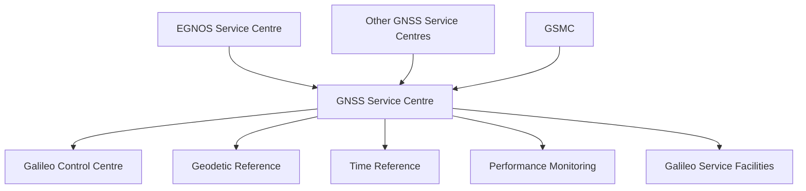
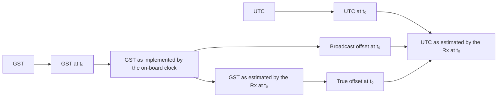

# GALILEO OPEN SERVICE
# SERVICE DEFINITION
# DOCUMENT (OS SDD)

Issue 1.3 | November 2023

#EUSpace


More information on the European Union is available on the Internet (http://europa.eu).

Luxembourg: Publications Office of the European Union, 2023

ISBN: 978-92-9206-074-9
doi: 10.2878/08361


GALILEO - OPEN SERVICE - SERVICE DEFINITION DOCUMENT, ISSUE 1.3, 2023

## TERMS AND CONDITIONS OF USE OF THE GALILEO OPEN SERVICE

The Galileo OS, unless augmented by certified or otherwise legally approved dedicated systems designed to this effect, has been designed and can only be used for non-safety critical purposes, i.e. purposes that have no impact on the safety of human life and where an underperformance in availability, continuity, accuracy and/or integrity of the Galileo SIS could not cause any kind of direct or indirect personal damage, including bodily injuries or death.

### Scope of Galileo OS Commitment

Although care has been taken in designing, implementing and operating the system, as well as in providing the OS, the OS is not meant to offer any service guarantee to the users.

The minimum level of performance against which the system has been validated and is operated, as well as data of actual performance of the OS are expressed in this document in statistical values that are valid under assumptions described in the Galileo OS SDD. The European Commission reserves the right to revise the Galileo OS SDD should these assumptions change or to reflect changes in performance during the deployment of the Galileo infrastructure. This commitment regarding the minimum level of performance shall be without prejudice to the disclaimer of liability below, measures potentially affecting service availability that may be taken either by the Security Accreditation Board, or according to the Council decision 2021/698/CSFP, or in the interests of Member States' national security.

The European Union plans to take all necessary measures for the foreseeable future to maintain or exceed the minimum levels of the OS performance described herein.

The minimum level of performance of the Galileo OS, as specified in the Galileo OS SDD, is obtained under the condition that the user equipment processes the health and status flags as described in section 2.3.1.3 and only uses signals declared "HEALTHY". The users are also reminded that important notices (Notice Advisory to Galileo Users – NAGUs and Service Notices), which are published through the GNSS Service Centre, must be considered when planning to use the Galileo OS for any purpose.

### User responsibilities

The user retains his responsibility to exercise a level of care appropriate with respect to the uses he intends to make of the Galileo OS, taking into account the considerations outlined above.

The users are reminded that the timing and positioning performance they will experience is also driven by other parameters outside the control of the Galileo OS provider (e.g. signal propagation errors or user receiver induced errors), which have to be pondered when deciding to use the Galileo OS for a given purpose.

Before any use of the Galileo OS, users should study this document in order to understand how they can use the service, as well as to familiarise themselves with the performance level and other aspects of the service they can rely on, in particular the Annex C.4 for a more comprehensive discussion of the relationships between the Galileo OS performance and the end user Position Velocity Time (PVT) performance expectations.

In case of doubt, the users and other parties should contact the Galileo helpdesk (see section 1.6.4 for contact details) and their user equipment manufacturer.

### Disclaimer of liability

As the owner of the Galileo system, the European Union - including any of its institutions, offices or agencies, such as the European Commission, the European Union Agency for the Space Programme (EUSPA), and other entities acting on the basis of a contract or agreement with the European Union involved in the Galileo OS service provision - does not offer any warranties of any kind (whether expressed or implied) with respect to the Open Service, including, but not limited to, the warranties regarding availability, continuity, accuracy, integrity, reliability and fitness for a particular purpose or meeting the users' requirements. No advice or information, whether oral or written, obtained from the European Union - including any of its institutions, offices or agencies, such as the European Commission, the European Union Agency for the Space Programme (EUSPA), and other entities acting on the basis of a contract or agreement with the European Union involved in the Galileo OS service provision - shall create any such warranty.

By using the Galileo Open Service, the user accepts and agrees that the European Union - including any of its institutions, offices or agencies, such as the European Commission, the European Union Agency for the Space Programme (EUSPA), and other entities acting on the basis of a contract or agreement with the European Union involved in the Galileo OS service provision - shall not be held responsible or liable for any damages resulting from the use of, misuse of, or the inability to use the Galileo Open Service, including, but not limited to, direct, indirect, special or consequential damages, including, but not limited to, damages for interruption of business, loss of profits, goodwill or other intangible losses, other than in accordance with Article 340 of the Treaty on the Functioning of the European Union.

ii


# DOCUMENT CHANGE RECORD

| REASON FOR CHANGE                                                                                                                                                                                                                                                                                                                                                                                                                                                                                                                                                                                                                                                                                                      | ISSUE | REVISION | DATE          |
| ---------------------------------------------------------------------------------------------------------------------------------------------------------------------------------------------------------------------------------------------------------------------------------------------------------------------------------------------------------------------------------------------------------------------------------------------------------------------------------------------------------------------------------------------------------------------------------------------------------------------------------------------------------------------------------------------------------------------- | ----- | -------- | ------------- |
| First issue                                                                                                                                                                                                                                                                                                                                                                                                                                                                                                                                                                                                                                                                                                            | 1     | 0        | December 2016 |
| The text of various sections of the document has been improved.<br/><br/>New parameters and respective Minimum Performance Levels have been added, specifically the Availability of the Position Dilution of Precision and the Availability of Positioning and UTC Service. As a consequence, the Minimum Performance Level for the Availability of Ranging Service has been removed.<br/><br/>The text of various sections of the document has been improved or updated.<br/><br/>Various MPL values have been improved.<br/><br/>The definition of the Ranging Rate Accuracy has been added.<br/><br/>The definition and expected value of Galileo URA have been added.<br/><br/>Annex E structure has been updated. | 1     | 1        | May 2019      |
| Version aligned with Galileo Open Service - Enhanced Services Update milestone.<br/><br/>Establishes new MPLs on metrics of particular relevance for the Aviation Users Community: Ranging Accuracy at higher confidence level, Range Rate Accuracy, Time Determination Accuracy, Positioning Accuracy, URA, Psat, Pconst.<br/><br/>Introduces the new Galileo Extended Operations Mode (EOM), addressing increased usability and robustness of Service.                                                                                                                                                                                                                                                               | 1     | 2        | July 2021     |
|                                                                                                                                                                                                                                                                                                                                                                                                                                                                                                                                                                                                                                                                                                                        | 1     | 3        | July 2023     |


# FOREWORD

This "Galileo - Open Service - Service Definition Document" (Galileo OS SDD) defines the Minimum Performance Levels (MPLs) of the Galileo Open Service (OS).

The document will be updated in the future to reflect further changes and improvements of the Galileo Open Service, in particular during the deployment of the Galileo system infrastructure, until the Full Operational Capability (FOC) is achieved.

iii


GALILEO - OPEN SERVICE - SERVICE DEFINITION DOCUMENT, ISSUE 1.3, 2023

# TABLE OF CONTENTS

## SECTION 1: THE GALILEO OPEN SERVICE...... 2

1.1 PURPOSE OF THE DOCUMENT .................2

1.2 SCOPE OF THE DOCUMENT .......................2

1.3 TERMS AND CONDITIONS OF USE ..........3

1.4 ABBREVIATIONS AND ACRONYMS ........3

1.5 GALILEO OPEN SERVICE DEFINITION.....3

1.5.1 GALILEO OS RANGING SERVICE ............ 3

1.5.2 GALILEO OS POSITIONING SERVICE.......................................................................... 4

1.5.3 GALILEO OS UTC TIME DETERMINATION SERVICE.....................................4

1.6 GALILEO SYSTEM OVERVIEW ...................4

1.6.1 GALILEO SPACE SEGMENT ...................... 4

1.6.2 GALILEO GROUND SEGMENT .................5

1.6.3 GALILEO SERVICE FACILITIES .................6

1.6.4 THE EUROPEAN GNSS SERVICE CENTRE (GSC): GALILEO INTERFACE WITH USERS................................................................. 7

1.6.5 GALILEO TIME AND GEODETIC REFERENCE FRAMES ................................................ 8

## SECTION 2: GALILEO OPEN SERVICE SIS CHARACTERISTICS AND MINIMUM USAGE ASSUMPTIONS....................................................... 11

2.1 OS SIS INTERFACE CONTROL DOCUMENT REQUIREMENTS............................. 11

2.2 OVERVIEW OF OS SIS INTERFACE CHARACTERISTICS ................................................11

2.2.1 GALILEO OS SIS RF CHARACTERISTICS ..................................................11

2.2.2 GALILEO OS SIS NAV MESSAGE CHARACTERISTICS ..................................................12

2.3 OVERVIEW OF GALILEO OS PERFORMANCE CHARACTERISTICS ..............13

2.3.1 GALILEO OS SIS STATUS.........................13

2.3.2 GALILEO OS ACCURACY: RANGING SERVICE...................................................18

2.3.3 GALILEO OS ACCURACY: TIME SERVICE........................................................................18

2.3.4 GALILEO OS ACCURACY:

POSITIONING ............................................................. 19

2.3.5 GALILEO OS AVAILABILITY ................... 20

2.3.6 GALILEO OS: EXTENDED OPERATIONS MODE............................................... 21

2.4 USAGE ASSUMPTIONS FOR OPEN SERVICE PERFORMANCE .................................... 21

2.4.1 OS USER RECEIVERS................................ 21

2.4.2 LIMITATIONS ON OS SIS STATUS....... 22

2.4.3 EXCLUDED ERRORS ................................. 23

2.5 OPERATIONAL CAPABILITY EVOLUTION ............................................................... 23

## SECTION 3: GALILEO OS MINIMUM PERFORMANCE LEVELS......................................25

3.1 OVERVIEW...................................................... 25

3.2 GALILEO OS CONSTELLATION DEFINITION ................................................................ 25

3.3 GALILEO OS ACCURACY .......................... 26

3.3.1 GALILEO SIS RANGING ACCURACY MPL ....................................................... 27

3.3.2 GALILEO SIS RANGING ACCURACY AT HIGHER PERCENTILES.................................... 28

3.3.3 GALILEO SIS RANGE RATE ACCURACY MPL ....................................................... 28

3.3.4 GALILEO SIS UTC TIME DISSEMINATION ACCURACY MPL.................... 28

3.3.5 GALILEO SIS UTC FREQUENCY DISSEMINATION ACCURACY MPL.................... 29

3.3.6 GALILEO UTC TIME DETERMINATION ACCURACY................................................................. 29

3.3.7 GALILEO OS POSITIONING ACCURACY................................................................. 29

3.4 GALILEO OS AVAILABILITY ..................... 30

3.4.1 GALILEO PER-SLOT AVAILABILITY .... 30

3.4.2 AVAILABILITY OF THE GALILEO UTC TIME DISSEMINATION SERVICE......................... 30

3.4.3 AVAILABILITY OF THE GALILEO POSITION DILUTION OF PRECISION ................ 31

3.4.4 AVAILABILITY OF THE GALILEO POSITIONING SERVICE.......................................... 31

3.4.5 AVAILABILITY OF THE GALILEO UTC TIME DETERMINATION SERVICE ....................... 32

3.5 ADDITIONAL FUNCTIONALITY............... 33

3.5.1 GALILEO OS COMPATIBILITY AND INTEROPERABILITY WITH OTHER GNSS ...... 33

3.6 GALILEO SUPPORT FOR AVIATION ..... 34

iv


v

3.7 PERFORMANCE LEVEL FOR THE GNSS SERVICE CENTRE .......................................36

3.7.1 TIMELY PUBLICATION OF NAGUS.......36

ANNEX A: REFERENCE DOCUMENTS .............39

ANNEX B: ABBREVIATIONS AND ACRONYMS...................................................41

ANNEX C: OS SIS BACKGROUND INFORMATION AND PVT ACCURACY PERFORMANCE DRIVERS...................................43

C.1. INTRODUCTION ..............................................43

C.1.1 SCOPE ................................................................43

C.1.2 LIMITATIONS ...................................................43

C.2. CONSTELLATION............................................43

C.2.1 RELATIONSHIP WITH SECTION 3.2.......43

C.2.2 BASELINE 24-SLOT CONSTELLATION CONFIGURATION......................................................43

C.3. SERVICE COVERAGE.....................................45

C.3.1 RELATIONSHIP WITH SECTION 3.2.......45

C.3.2 PER-SATELLITE COVERAGE.....................45

C.3.3 SERVICE VOLUME .........................................45

C.4. ACCURACY........................................................45

C.4.1 RELATIONSHIP WITH SECTION 3.3.......45

C.4.2 DEFINITION OF SIGNAL-IN-SPACE RANGING ERROR ......................................................45

C.4.3 INSTANTANEOUS SISE PERFORMANCE METRICS .......................................................................45

C.4.4 TIME DEPENDENCY ......................................47

C.4.5 UERE BUDGET ................................................49

C.4.6 USER TOTAL UNCERTAINTY IN UTC TIME ESTIMATION ....................................................51

C.4.7 IONOSPHERIC DELAY MODEL FOR GALILEO SINGLEFREQUENCY USERS ..............51

C.4.8 SINGLE-FREQUENCY GROUP DELAY TIME CORRECTION ERRORS................................51

C.5. INTEGRITY..........................................................51

C.6. CONTINUITY .....................................................51

ANNEX D: GALILEO OS PERFORMANCE EVOLUTION AND ADDITIONAL PERFORMANCE PARAMETERS ........................53

D.1. INTRODUCTION ..............................................53

D.1.1 SCOPE................................................................53

D.1.2 LIMITATIONS...................................................53

D.1.3 GALILEO CONSTELLATION EXPECTED EVOLUTION ................................................................53

D.2 GALILEO SIS RANGING ACCURACY: EVOLUTION OF EXPECTED SISE ......................53

D.3 EVOLUTION OF THE EXPECTED AVAILABILITY OF GLOBAL PDOP....................53

D.4. EVOLUTION OF THE EXPECTED GALILEO OS POSITIONING PERFORMANCE...................54

D.4.1 EVOLUTION OF THE GALILEO OS POSITIONING EXPECTED ACCURACY ............54

D.4.2 EVOLUTION OF THE GALILEO OS POSITIONING EXPECTED AVAILABILITY .......54

D.5. ADDITONAL PERFORMANCE PARAMETERS...........................................................55

D.5.1 EXPECTED SIS RANGING ACCURACY IN EXTENDED OPERATIONS MODE .................55

D.5.2 I/NAV IMPROVEMENTS............................55

D.5.3 ACCURACY OF ALMANAC .......................56

ANNEX E: DESCRIPTION OF ADVISORY NOTICES TO GALILEO..........................................58

E.1. LIST OF DEFINED NAGUS............................58

E.2. NAGU FORMAT ...............................................62

E.2.1 SPECIFIC NAGU .............................................62

E.2.2 GENERAL NAGU.............................................62

E.2.3 DESCRIPTION OF NAGU'S CONTENT...62


GALILEO - OPEN SERVICE - SERVICE DEFINITION DOCUMENT, ISSUE 1.3, 2023

# LIST OF FIGURES

**Figure 1**. High level scheme of the Galileo Ground Segment Architecture............................................................. 6

**Figure 2**. Overall context of the GSC................................7

**Figure 3**. Signals transmitted by Galileo satellites....11

**Figure 4**. Example of decision tree for the determination of the status of broadcast SIS...............16

**Figure 5**. Graphical representation of the various components of the total uncertainty in the estimation of the UTC Time......................................................................19

**Figure 6**. NAGU types..........................................................36

**Figure 7**. SISE projection onto the line of sight for each user location.............................................................................46

**Figure 8**. Typical SISE vs. Prediction Time from ToE (all batches). For illustration only - Performance will gradually improve over time toward the full system deployment..............................................................................48

**Figure 9**. Typical SISE vs. Prediction Time during Extended Operations Mode. For illustration only. ......48

**Figure 10**. Graphical summary of the various types of NAGUs.......................................................................................58

vi


vii

# LIST OF TABLES

**Table 1.** Reference Orbit Parameters. 5

**Table 2.** Mapping of Message types to Signal Components 12

**Table 3.** Signal Health Status Bit Values. 14

**Table 4.** Data Validity Status Bit Values. 14

**Table 5.** SISA index values relevant to the assessment of the SIS Status. 15

**Table 6.** Galileo Open Service SIS Status vs SIS Status Flags 17

**Table 7.** Summary of SIS flags to be checked by the different Galileo OS users to compute the Status of Signals-in-Space 17

**Table 8.** Galileo Constellation Parameters (Ref. Epoch: 2016/11/21 00:00:00) – Reference constellation for this OS SDD. 26

**Table 9.** Galileo SIS Ranging Accuracy MPL for any satellite. 27

**Table 10.** Galileo SIS Ranging Accuracy MPL over all satellites. 27

**Table 11.** Galileo OS Ranging Accuracy performance calculated at 99.9% percentile (on yearly basis). 28

**Table 12.** Galileo OS Range Rate Accuracy performance MPL. 28

**Table 13.** Galileo SIS UTC Time Dissemination Accuracy MPL. 28

**Table 14.** Galileo SIS UTC Frequency Dissemination Accuracy MPL. 29

**Table 15.** Galileo OS Time Determination Accuracy MPL at any user location 29

**Table 16.** Galileo OS Positioning Accuracy MPL at average user location 29

**Table 17.** Galileo OS Positioning Accuracy MPL at worst user location 29

**Table 18.** MPL of the Per-Slot Availability. 30

**Table 19.** MPL of the Availability of the Galileo OS UTC Time Dissemination Service. 30

**Table 20.** MPL of the Availability of the Galileo Position Dilution Of Precision. 31

**Table 21.** MPL of the Availability of the Galileo Positioning service, at average user location. 31

**Table 22.** MPL of the Availability of the Galileo Positioning service, at worst user location. 32

**Table 23.** MPL of the Availability of the Galileo UTC Time Determination service, from any point in the service coverage. 33

**Table 24.** MPL of Galileo GST-GPS Time Offset Determination Accuracy. 34

**Table 25.** MPL of Galileo GST-GPS Time Offset Determination Availability. 34

**Table 26.** Galileo URA for DF users. 35

**Table 27.** Galileo URA for SF users. 35

**Table 28.** Galileo probability of Single SIS fault. 35

**Table 29.** Galileo probability of constellation SIS fault. 36

**Table 30.** MPL of the Timely publication of NAGUs. 37

**Table 31.** Galileo Constellation Reference Technical Parameters. 43

**Table 32.** Galileo Constellation at FOC. Reference Geometry at 2016/11/21 00:00:00 UTC. 44

**Table 33.** Typical UERE budget for Single Frequency E1 – Rural Pedestrian (RP) User Environment (**). 49

**Table 34.** Typical UERE budget for Dual Frequency E1/E5a – Rural Vehicle (RV) User Environment (**). 49

**Table 35.** Evolution of the Expected Availability of Global PDOP. 54

**Table 36.** Evolution of the Expected Galileo OS Positioning Performance in nominal configuration (in metres, 95% values). 54

**Table 37.** Typical Galileo OS Positioning Service Availability (global average) and expected evolution. 54

**Table 38.** Galileo Extended Operations Mode Expected SIS Ranging Accuracy 55

**Table 39.** Time to CED (95%) in open sky environment with perfect channel conditions 56

**Table 40.** Typical RedCED Ranging Accuracy Performance 56

**Table 41.** Galileo almanac SIS Ranging Accuracy typical values over all satellites, Global Average, when almanac's clock and ephemeris information is used. 56

**Table 42.** List of general NAGUs. 59

**Table 43.** List of specific NAGUs. 60

**Table 44.** List of obsolete NAGUs. 61


1

SECTION I
THE GALILEO
OPEN SERVICE


GALILEO - OPEN SERVICE - SERVICE DEFINITION DOCUMENT, ISSUE 1.3, 2023

# SECTION 1: THE GALILEO OPEN SERVICE

Galileo is the European Global Navigation Satellite System (EGNSS), under civil control, that provides satellite positioning services to European citizens and worldwide.

Galileo provides ranging signals on three different frequencies, in two different frequency bands, enabling single- and dual- frequency positioning for users equipped with suitable receivers.

As one of the services offered by Galileo, the Galileo Open Service (OS) enables free of charge, global ranging, positioning and timing, by means of the Galileo OS Signal-In-Space (SIS).

In order for users to be able to benefit as early as possible from the Galileo services, the Galileo Initial Services provision phase started before the Galileo core infrastructure was fully deployed, in 2016. Since then, in parallel to the infrastructure deployment, the performance of the Galileo Services has improved. This Service Definition Document describes the Galileo Open Service provided at the time of its publication. Future releases of this document may be issued to properly take into account any further evolution of the Galileo OS.

## 1.1 PURPOSE OF THE DOCUMENT

The purpose of this Galileo Services - Open Service Definition Document is to describe the characteristics and performance of the Galileo OS provided through the Galileo OS SIS. The OS SDD presents the Minimum Performance Levels (MPLs) targeted for such service and defines the conditions under which such MPLs can be reached. This document addresses all users of Galileo OS. The Galileo OS is provided free of charge to all users.

This OS SDD consists of a main body and five annexes. It provides an overview of the EGNSS programme as well as an overview of the OS SIS. It then presents the MPLs for the OS. It concludes with the relevant reference documents. The annexes provide additional information on Galileo OS and about the performance at FOC.

The main document comprises the following sections:

1) The Galileo Open Service

   The main purpose of this section is to introduce the document, define the Galileo Open Service and to provide a general description of the Galileo system.

2) Galileo Open Service SIS Characteristics and Minimum Usage Assumptions

   This section includes a description of the Galileo SIS and the definition of the parameters used to identify the MPLs.

3) Galileo OS MPLs

   This section provides the Galileo Services - Open Service MPLs and describes additional OS SIS functionality.

The following Annexes close the document:

• Annex A: Reference Documents.

• Annex B: Abbreviations and Acronyms.

• Annex C: OS SIS Background Information and PVT Accuracy Performance Drivers.

• Annex D: Galileo Open Service - Performance Evolution.

• Annex E: Description of Notice Advisory to Galileo Users.

## 1.2 SCOPE OF THE DOCUMENT

This Galileo OS SDD applies to the Galileo OS as provided at the time of its publication. This document does not address Galileo restricted access signals such as the E1A signal or the signals broadcast in the E6 band.

The OS SDD belongs to the series of Galileo Programme Reference Documents published for the benefits of Galileo users, to present and explain various aspects of the EGNSS concerning Galileo OS. The other Programme Reference Documents are:

• The European GNSS (Galileo) – Open Service – Signal In Space Interface Control Document (Annex A [1] (OS SIS ICD)).

  By describing exhaustively the SIS, it specifies the interface between the Galileo Space Segment and the Galileo User Segment. It is addressed to the whole Galileo OS user community.

2


3

The European GNSS (Galileo) – Open Service – Ionospheric Correction Algorithm for Galileo Single-Frequency Users (Annex A [2]).

It describes in detail the reference algorithm to be implemented by user receivers to compute the Galileo ionospheric corrections. It is addressed mainly to Galileo OS receiver manufacturers.

All public Galileo Programme Reference Documents are made available to users through the web portal of the European GNSS Service Centre (http://www.gsc-europa.eu).

## 1.3 TERMS AND CONDITIONS OF USE

The terms and conditions of use of the Galileo Open Service are described at the beginning of this document.

## 1.4 ABBREVIATIONS AND ACRONYMS

Abbreviations and acronyms used in this document are provided in Annex B.

## 1.5 GALILEO OPEN SERVICE DEFINITION

The Galileo Open Service is a free of charge global ranging, positioning and timing service. Each Galileo satellite transmits navigation signals (Signal-In-Space, SIS) in three frequency bands. The OS SIS, broadcast on two out of these three bands, provide access to the Galileo OS ranging, positioning and timing services for users equipped with a Galileo OS compatible receiver. The following services are supported by Galileo OS SIS:

- Single-Frequency and Dual-Frequency Ranging,
- Single-Frequency and Dual-Frequency Positioning,
- UTC Time Determination.

Open Services are provided in either single-frequency (SF) or dual-frequency (DF) mode. In the case of SF usage mode, the user equipment tracks and processes the information provided by only one of the three OS frequencies (see 2.2 for more details). The different OS single-frequency usage modes are E5a (only), E5b (only) and E1 (only). In any SF usage mode, specific compensations need to be applied: Broadcast Group Delay (BGD), to compensate for specific satellite systematic delays between the different frequencies, and ionospheric compensation, to compensate for atmospheric delays of the signals. The respective algorithms are specified in the Galileo OS SIS ICD (Annex A [1]) and in the Ionospheric Correction Algorithm for Galileo Single-Frequency Users (Annex A [2]).

In the case of DF usage mode, the user equipment tracks and processes the information provided by two of the three OS frequencies. The different OS dual-frequency usage modes are E1/E5a and E1/E5b. In dual-frequency usage modes, BGD compensation is not required, and the ionospheric delays are cancelled out by Galileo OS receivers, taking advantage of the dispersion property of the ionosphere, which renders the resulting delay inversely proportional to the square of the signal frequency, allowing to implement "iono-free" linear combination of the ranging observables collected on two different carriers.

### 1.5.1 GALILEO OS RANGING SERVICE

Ranging allows users to continuously estimate their distance to the satellite. This measure is the core of positioning services since the user's position and time can be estimated using ranging measurements from (at least) four different satellites. GNSS ranging services comprise a set of electromagnetic signals transmitted by satellites and properly modulated to carry the information, generated by an appropriate ground infrastructure, needed by receivers to estimate the user-to-satellite range.

The Galileo OS Ranging Service is provided in both SF usage mode and DF usage mode.

DF usage mode is in general characterised by higher accuracy of the range measurement. The use of two frequencies permits in most cases a better compensation of the disturbing effect of the ionosphere on the SIS, thus providing better performance to the end user.

The Galileo OS Ranging Service is interoperable with GPS ranging services and therefore it provides a direct benefit to users who are able to exploit both Galileo and GPS constellations, by increasing the number of available signals-in-space.


GALILEO - OPEN SERVICE - SERVICE DEFINITION DOCUMENT, ISSUE 1.3, 2023

## 1.5.2 GALILEO OS POSITIONING SERVICE

By combining the ranging measurements with the navigation parameters delivered by the SIS, all users equipped with a Galileo OS receiver who are located within the Service Volume of the Galileo OS (see Section C3.3) are able to estimate their position and time. The Positioning Service is provided in either single-frequency or dual-frequency mode.

The Galileo OS Positioning Service, which is based on the Galileo OS Ranging Service, is interoperable with GPS positioning services. It therefore provides a direct benefit to users who are able to exploit both Galileo and GPS constellations, by increasing the number of available satellites in view.

## 1.5.3 GALILEO OS UTC TIME DETERMINATION SERVICE

GNSS satellites also broadcast data which allow GNSS receivers to relate the GNSS time scale to international reference timescales. The precise atomic clocks in the Galileo system allow delivery to users of very accurate timing data. The OS UTC Time Determination Service provides Galileo users worldwide with direct and accurate access to the Universal Time Coordinated (UTC) reference. It provides both the integer seconds offset between the Galileo System Time (GST) and UTC (see also section 1.6.5.2) and the fractional GST-UTC difference at nanosecond level. This allows users to time-stamp their data in UTC or local time and to precisely synchronise to UTC their clocks, which can be situated at very different locations in the world.

## 1.6 GALILEO SYSTEM OVERVIEW

The Galileo system is composed of a Core Infrastructure and a number of Service Facilities. The Core Infrastructure, in turn, comprises a Space Segment and a Ground Segment.

The Galileo Space Segment consists of a constellation of satellites transmitting navigation signals providing user access to the Galileo services. The Galileo Ground Segment consists of a ground infrastructure providing the functionality to monitor and control the satellite constellation and the generation and further dissemination of the mission data that are included in the navigation signals (i.e. the Galileo navigation message) and broadcast to the users.

The Galileo system offers seven high-performance services worldwide:

- **Open Service** (OS): Galileo open and free of user charge service set up for positioning and timing services. The OS are the only services addressed in this document.

- **Open Service Navigation Message Authentication** (OSNMA): provided by tags allocated in the Navigation message carried by E1-B SIS, allows user receivers to authenticate the acquired navigation data that it uses to achieve position and time, allowing to distinguish if the source of those parameters is genuinely Galileo system or any malicious spoofing entity.

- **Public Regulated Service** (PRS): Service restricted to government-authorised users, for sensitive applications that require a high level of service continuity.

- **High Accuracy Service** (HAS): A free access service complementing the OS, delivering high accuracy data, enabling users to achieve sub-meter level positioning accuracy.

- **Commercial Authentication Service** (CAS): A service complementing the OS, providing a controlled access and authentication function to the users.

- **Search and Rescue Service** (SAR): Europe's contribution to COSPAS-SARSAT, an international satellite-based search and rescue distress alert detection system.

- **Emergency Warning Service** (EWS): A worldwide service to broadcast emergency warnings linked to natural or man-made disasters.

## 1.6.1 GALILEO SPACE SEGMENT

The Galileo Space Segment generates and transmits the Galileo navigation signals as specified in the Galileo OS SIS ICD (Annex A [1]).

The baseline Galileo constellation configuration is defined as a 24/3/1 Walker constellation: 24 nominal Medium Earth Orbit satellite slots are arranged in 3 orbital planes, with their ascending nodes uniformly distributed at intervals of 120 degrees, inclined at 56 degrees with respect to the Equator. Each orbital plane includes 8 satellite slots uniformly distributed within the plane, i.e. at intervals of 45 degrees of argument of latitude. The angular shift between

4


satellites in adjacent planes is 15 degrees. Satellites in service in these slots are referred to as nominal satellites. These nominal satellites contribute to the achievement of the service performance in this SDD.

The constellation may be complemented by Galileo auxiliary satellites, which occupy orbital slots that are not part of the baseline constellation and are not defined a priori. Auxiliary satellites that are in the baseline orbital planes may be repositioned to any given nominal slot within its orbital plane, depending on maintenance or service evolution needs. The processing by Galileo receivers of healthy SIS broadcast by auxiliary satellites is not required in order to achieve the service performance presented in this OS SDD, although their use results in an improvement of the service performance.

Furthermore, the Galileo constellation may comprise:

• Not-in-service satellites, i.e. satellites that are currently not providing Galileo services and are not broadcasting a navigation SIS.

• Decommissioned Satellites, i.e. satellites that are removed from service permanently.

The constellation geometry repetition period corresponding to the nominal orbital parameters is approximately 10 sidereal days (corresponding to 17 orbital revolutions). This means that for any fixed Galileo user, the local satellite geometry at a given instant will repeat every 10 sidereal days, approximately.

The main reference orbit parameters of the Galileo constellation are specified in Table 1. The constellation is further described in Annex C, while the constellation that is operational at the time of publication of this OS SDD is described in section 3.2.

The up-to-date status of the Galileo constellation is available through the European GNSS Service Centre (GSC) webpage¹.

**Table 1. Reference Orbit Parameters.**

| REFERENCE ORBIT PARAMETER | NOMINAL VALUE |
| ------------------------- | ------------- |
| Constellation Type        | Walker 24/3/1 |
| Orbit semi-major axis, m  | 29599801      |
| Orbit eccentricity        | 0             |
| Orbit inclination, deg    | 56.0          |
| Argument of Perigee, deg  | 0.0           |


## 1.6.2 GALILEO GROUND SEGMENT

The Galileo Ground Segment comprises both the Ground Control Segment and the Ground Mission Segment and it includes the following infrastructure:

• Two Galileo Control Centres (GCC), implementing ground control and ground mission capabilities at each site.

• A worldwide network of Galileo Sensor Stations (GSS), which collects and forwards Galileo SIS measurements and data to the GCCs in real time.

• A worldwide network of Galileo Uplink Stations (ULS), which distributes and uplinks the mission data to the Galileo constellation.

• A worldwide network of Telemetry, Tracking & Control stations (TTC stations), which collects and forwards telemetry data generated by the Galileo satellites, and distributes and uplinks the control commands required to maintain the Galileo satellites and constellation in nominal operational conditions.

An overview of the Galileo Ground Segment is provided in Figure 2, where only the Galileo Ground Segment functionality related to the Open Service is included.

The Galileo Ground Segment implements all functions required to:

• Generate the Galileo mission support data (e.g. satellite orbit and time synchronisation data, ionospheric correction model data and other information transmitted in the navigation signals).

• Perform the monitoring and control of all Galileo system assets (both ground and space segment).

• Interface with the Service Facilities (see section 1.6.3), entities that are not part of the Galileo core infrastructure ground segment but nevertheless have a role in the provision of the Galileo services and are considered part of the Galileo System (e.g. Time Service Provider, Geodetic Reference Service Provider, COSPAS - SARSAT mission segment, European GNSS Service Centre).

----

¹ www.gsc-europa.eu/system-service-status/constellation-information

5


GALILEO - OPEN SERVICE - SERVICE DEFINITION DOCUMENT, ISSUE 1.3, 2023

## 1.6.2.1 Ground Control Segment

The Galileo Ground Control Segment (GCS) provides a large range of functions to support the management and control of the satellite constellation. The scope of this functionality includes control and monitoring of the satellites and payload, planning and automation functions that allow safe and correct operations to take place, and the support of payload related operations by means of TT&C links.

## 1.6.2.2 Ground Mission Segment

The Galileo Ground Mission Segment (GMS) determines the navigation and timing data part of the navigation messages and transmits it to the satellite via its C-Band ground stations.

The GMS architecture consists of facilities deployed in the 2 Galileo Control Centres (GCCs) plus ULS and GSS Stations deployed at remote sites located around the world. The Ground Mission Segment includes the Processing Chain, which is in charge of computing the data to be broadcast in the Galileo navigation messages.

## 1.6.3 GALILEO SERVICE FACILITIES

The Galileo Service Facilities are elements located outside the perimeter of the Galileo Core Infrastructure that support the provision of Galileo services.

The service facilities contributing to the provision of the Galileo OS are:

• The European GNSS Service Centre (GSC): GSC is the interface between the Galileo user community and the Galileo system (see section 1.6.4 for further information).

• The Geodetic Reference Service Provider (GRSP): This entity supports the GCC in realising the Galileo Terrestrial Reference Frame (GTRF), consistently with the international Terrestrial Reference Frame (ITRF).

• The Time Service Provider (TSP): This entity supports the GCC in the realisation of the Galileo System Time (GST) and its alignment to the Coordinated Universal Time (UTC).

• The Galileo Security Monitoring Centre (GSMC): This facility is in charge of monitoring the system security.

An additional service facility, the Galileo Reference Centre (GRC), is responsible for monitoring and assessment of the performance of the Galileo services, completely independently from the Galileo core infrastructure and its operations.

| Space Segment              |      |                         |     |                            |   |   |
| -------------------------- | ---- | ----------------------- | --- | -------------------------- | - | - |
| TCS<br/>S-Band<br/>TM      |      | Mission Data<br/>C-Band |     | Signal in Space<br/>L-Band |   |   |
| TTC                        |      | ULS                     |     | GSS                        |   |   |
| GCCs                       |      |                         |     |                            |   |   |
| GRSP                       | GSMC | TSP                     | GSC |                            |   |   |
| Galileo Service Facilities |      |                         |     |                            |   |   |


*Figure 1.* High level scheme of the Galileo Ground Segment Architecture.

6


7

## THE EUROPEAN GNSS SERVICE CENTRE (GSC): GALILEO INTERFACE WITH USERS

The European GNSS Service Centre (GSC), part of the European GNSS infrastructure, provides the single centralised ground interface between the Galileo user communities and the Galileo system infrastructure and operator, for the provision of specific services

beyond the SIS transmitted by the Galileo satellites. It is accessible through its web portal www.gsc-europa.eu.

The GSC is conceived as a centre of expertise, knowledge sharing, custom performance assessment, information dissemination and support to the provision of value- added services enabled by the Galileo services. To implement these objectives, the GSC interfaces with the key elements of the Galileo ground segment, as well as with external entities. Figure 2 depicts the overall context of the GSC.



*GNSS stands for 'Global navigation satellite system'

**Figure 2. Overall context of the GSC.**

### GSC Functionality

The GSC has the task of interfacing with the user communities across the entire value chain.

The GSC web portal is conceived as the one-stop-shop providing ready access to key information for user communities of Galileo OS, OSNMA, High Accuracy and SAR services.

The functionality and services covered by the GSC are:

• **Helpdesk support:**
  For answering general queries and incident notifications from users on Galileo SIS and specific queries from Galileo receiver and application developers on the official Galileo user documents. In addition, registered users can subscribe to be informed in real time about events affecting the Galileo services.


GALILEO - OPEN SERVICE - SERVICE DEFINITION DOCUMENT, ISSUE 1.3, 2023

• Information on Galileo system status:

  Publication of Galileo almanacs and ephemeris data, of constellation status and provision of Galileo Service Notices.

• Publication of notifications to users:

  General information on the constellation and current status of the different space vehicles are published by means of Notice Advisory to Galileo Users messages (NAGUs, see section 1.6.4.1.1), which inform regularly about the system status. Users have the possibility of subscribing to the automatic notification of NAGUs via e-mail.

• Reports on the Galileo Open Service navigation key performance indicators and on the GSC performance itself are also published for the users' information.

• Electronic Library, including Programme Reference documentation and general information.

• Support to GNSS developers, including the GNSS Simulation and Testing infrastructure (GSTI).

• Interface with other GNSS Service Providers.

• Galileo user satisfaction monitoring, including customised performance assessment, reporting and forecasts for specific communities, and support to the Galileo services development for each community or domain.

### 1.6.4.1.1 Notifications To Users (NAGUS)

The GSC is responsible for the publication of Notice Advisory to Galileo Users (NAGU) messages. NAGUs are used to notify Galileo users about the SIS status of all satellites in the Galileo constellation. Different kinds of NAGUs are issued depending on the specific event to be communicated, related to either changes in the constellation (commissioned and decommissioned satellites, for example) or to occurrence and recovery of (planned and unplanned) outages of SIS.

Examples of planned events that are anticipated through the publication of a specific NAGU are satellite manoeuvres and maintenance activities, declaration of a satellite entering into service, recovery from outages. Examples of unplanned events that are notified through the publication of a specific NAGU are satellite failure, information about short outages already recovered, unscheduled outages of SIS of an undefined duration.

The description of the structure and content of the NAGUs is provided in Annex E. This information, together with the list of active and archived NAGUs

can be also found in the GSC web page, www.gsc-europa.eu, under "System Status".

Specific MPLs apply for the timely publication of NAGUs (see section 3.7.1).

## 1.6.5 GALILEO TIME AND GEODETIC REFERENCE FRAMES

The Galileo system establishes its independent terrestrial reference frame and system time scale. The satellite positions and satellite clock offsets encoded in the navigation data are referenced to these Galileo time and terrestrial internal references. Without additional processing, the navigation solution computed by a Galileo OS receiver (using the mathematical algorithms described in the SIS-ICD) provides the receiver's position and time offset referenced to these internal references.

The Galileo system terrestrial and time references are:

• Galileo Terrestrial Reference Frame (GTRF): the Galileo spatial reference frame

  The instantaneous satellite positions derived from the data provided in the OS SIS and using the algorithm defined in the OS SIS ICD (Annex A [1]) are referenced to the GTRF. The GTRF is specified to always be in line with the international terrestrial reference frame, as defined by the international Earth Rotation and Reference Systems Service (IERS). The GTRF specification is provided in section 1.6.5.1.

• Galileo System Time (GST): the Galileo time and frequency reference

  The instantaneous satellite clock parameters derived from the data provided in the OS SIS and using the algorithm defined in the OS SIS ICD (Annex A [1]) are referenced to the Galileo System Time. The GST steered to TAI with an offset of 19 seconds and the required parameters to transform it to UTC are transmitted in the navigation message, as explained in section 1.6.5.2.

### 1.6.5.1 Galileo Terrestrial Reference Frame

The Galileo Terrestrial Reference Frame is the independent realisation of the international Terrestrial Reference System based on the estimated coordinates of each one of the Galileo Sensor Station (GSS) sites.

8


9

The determination of the GSS positions is based on global free network adjustment and the precise network solution thus obtained is aligned to the international Terrestrial Reference Frame. For this purpose, a significant number of ITRF stations co-located or non- co-located with GSSs are part of the network of stations operated by the GRSP.

The GTRF is a highly accurate realisation of the ITRS. At any time, the alignment between the GTRF and the latest physical realisation of the ITRF is such that the difference between the ITRF and the GTRF coordinates of the ITRF stations/markers used in the realisation of the GTRF is less than 3 cm (2σ).

The Galileo system uses the geodetic input information to produce navigation data (e.g. satellite ephemeris) referenced to the GTRF. Accordingly, the user position coordinates derived from Galileo position solutions are referenced to GTRF. Due to the good alignment of GTRF to ITRF both reference frames are understood to be equivalent in the frame of this document. The GTRF is regularly aligned if new ITRF realisations are published.

To obtain the position in any reference frame different from ITRF, Galileo OS user equipment needs to apply the appropriate valid transformation parameters between the latest ITRF and the desired reference frame. This transformation is under full control and responsibility of the Galileo OS user.

Concerning the interoperability between GPS and Galileo, the GPS terrestrial reference frame and the GTRF are both realisations of the ITRF. Therefore, for most OS applications, a high level of interoperability is provided between the spatial positions obtained with GPS and those obtained with Galileo, without further activity by the user equipment.

## Galileo System Time

The Galileo System Time is a continuous timescale based on the definition of the second (according to the international System of Units, SI) whose origin/reference epoch GST(T0) is defined as 13 seconds before 1999-08-22 00:00:00 UTC. UTC is the time scale endorsed by the 15th General Conference of Weights and Measures for worldwide time coordination and dissemination. It is the international time metrological standard and it is maintained, coordinated and disseminated by the BIPM.

UTC is defined as an atomic timescale (time interval is consistent with the SI definition of the second), but unlike GST, it is steered towards UT timescale (which is not based on atomic standards but on the Earth rotation period).

The time synchronisation information disseminated in the Galileo SIS (e.g. satellite clock offsets) is referenced to GST. This information allows the Galileo OS users to estimate their local time referenced to the GST realisation computed by the OS receiver.

In order to better support timing applications based on UTC, the Galileo OS data message includes additional parameters which enable the Galileo OS users to obtain a realisation of the UTC time by applying a correction to the GST (further details are provided in Annex C.4.6). These parameters provide a prediction of GST-UTC based on UTC realisations available at, currently, a minimum of 5 European metrological institutes.


GALILEO-OPEN SERVICE-SERVICE DEFINITION DOCUMENT, ISSUE 1.3, 2023

10

# SECTION 2: GALILEO OPEN SERVICE SIS CHARACTERISTICS AND MINIMUM USAGE ASSUMPTIONS


11

# SECTION 2: GALILEO OPEN SERVICE SIS CHARACTERISTICS AND MINIMUM USAGE ASSUMPTIONS

## 2.2 OVERVIEW OF OS SIS INTERFACE CHARACTERISTICS

This section starts with a short description, which is provided for information purposes. The reference document for details of the Galileo OS SIS Interface characteristics is the OS SIS ICD (Annex A [1]).

In the event of conflict between the OS SIS interface characteristics described in this document and the ICD, the latter shall prevail.

A description is then provided of the different MPLs, along with the minimum usage assumptions for the users of the Galileo OS.

### 2.1 OS SIS INTERFACE CONTROL DOCUMENT REQUIREMENTS

The OS SIS complies with the technical requirements related to the interface between the Space Segment and the OS receivers as established by the OS SIS Interface Control Document (ICD) (Annex A [1]).

### 2.2 INTERFACE CHARACTERISTICS GALILEO OS SIS RF CHARACTERISTICS

Galileo comprises several signals and codes within the 1.1 to 1.6 GHz band, namely:

- E1 signal, centred at 1575.42 MHz;
- E5a and E5b signals, at 1176.45 MHz and 1207.14 MHz respectively, multiplexed together through an AltBOC scheme and transmitted at the E5 carrier frequency centred at 1191.795 MHz;
- E6 signal, centred at 1278.75 MHz.

A complete representation of the Galileo signal baseline is provided in Figure 3.

The Galileo SF OS is provided by each of the three signals: E1 E5a and E5b, whereas the Galileo DF OS is provided by each of the following signal combinations broadcast by the same satellite:

- E1 and E5a;
- E1 and E5b.

The E1 OS signal comprises a pair of components modulated with the CBOC(6,1,1/11) scheme:

- a data component (E1-B), carrying the I/NAV navigation message (see section 2.2.2) with a data rate of 125 bps and a symbol rate (after FEC) of 250 sps, modulated with CBOC(6,1,1/11,+);
- a data-less component (E1-C), modulated with a CBOC(6,1,1/11,-).

| E5<br/>E5b-I<br/>E5a-I<br/>AltBOC(15,10)<br/>E5b-Q<br/>E5a-Q<br/>1176.45 MHz<br/>1207.14 MHz | E6<br/>E6-BC<br/>BPSK(5)<br/>E6-A<br/>1278.75 MHz | E1<br/>E1-BC<br/>CBOC(6,1,1/11)<br/>E1-A<br/>1575.42 MHz |
| -------------------------------------------------------------------------------------------- | ------------------------------------------------- | -------------------------------------------------------- |


Figure 3. Signals transmitted by Galileo satellites.


GALILEO - OPEN SERVICE - SERVICE DEFINITION DOCUMENT, ISSUE 1.3, 2023

The E5 signal is made of four components multiplexed together through an AltBOC(15,10) scheme:

A pair of components on the E5a carrier:

• a data component (E5a-I), carrying the F/NAV navigation with a data rate of 25 bps and a symbol rate of 50 sps;

• a data-less component (E5a-Q);

A pair of components on the E5b carrier:

• a data component (E5b-I), carrying the I/NAV navigation message with a data rate of 125 bps and a symbol rate of 250 sps;

• a data-less component (E5b-Q).

All components of E5a and E5b are generated coherently, which allows them to be processed together for increased accuracy and redundancy, when required.

## 2.2.2 GALILEO OS SIS NAV MESSAGE CHARACTERISTICS

The Galileo OS provides two different message types (see **Table 2**): the F/NAV and the I/NAV navigation messages.

**Table 2**. Mapping of Message types to Signal Components.

| MESSAGE TYPE | COMPONENT      |
| ------------ | -------------- |
| F/NAV        | E5a-I          |
| I/NAV        | E5b-I and E1-B |


The complete navigation message data are transmitted on each data component as a sequence of frames. A frame is composed of several sub-frames, and a subframe in turn is composed of several pages. The page is the basic structure for building the navigation messages.

Each navigation message contains the necessary parameters and status flags enabling the OS Users to access the SF and DF positioning and timing services. These include:

• the time parameters and clock corrections, needed to compute satellite clock offsets and time conversions;

• the ephemeris parameters, needed to compute the satellite payload antenna coordinates;

• the service parameters, with satellite signal health status information;

• the ionospheric parameters model, needed for single-frequency receivers;

• the almanacs, allowing less precise computation of the position of all satellites in the constellation to facilitate the initial acquisition of the signals by the receiver.

The purpose, structure and content, with full details concerning the Galileo OS SIS Navigation Messages and their use can be found in the Galileo OS SIS ICD (Annex A [1]). Please take note for the need of processing SIS health status flags following the specification in **Table 7**, depending on implementing a SF or DF solution.

In the context of this document, the term "navigation message" refers to a sub-frame (50 seconds for F/NAV and 30 seconds for I/NAV), which contains ephemeris, clock and ionospheric corrections or SIS status information, that is, Page Type 1 to 4 for the F/NAV and Word Type 1 to 6 for the I/NAV, unless otherwise specified.

### 2.2.2.1 THE CYCLIC REDUNDANCY CHECK (CRC) IN GALILEO NAVIGATION MESSAGE

To detect corruption of the received data, a checksum is used by the Galileo navigation message, employing a CRC technique. The detailed description of this checksum is provided in the OS SIS ICD (Annex A [1]).

The CRC is not used to indicate any problem at satellite level, on the transmitter side. The CRC checksum is related exclusively to the errorless reception of the transmitted bits, i.e. to the transmission channel, not to the correctness of the structure or the contents of the message as transmitted by the Galileo system. The CRC within the navigation message of Galileo is therefore not involved in the definition of the SIS Status.

If the CRC checksum is not passed successfully, the respective data must be rejected and no determination of the SIS Status is possible. Once a navigation message is received with a successful CRC, the user can then proceed to the SIS Status determination, as described in the next section, and eventually to the utilisation of such SIS.

12


## 2.3 OVERVIEW OF GALILEO OS PERFORMANCE CHARACTERISTICS

The Galileo OS performance characteristics are the following: Status, Accuracy and Availability.

### 2.3.1 GALILEO OS SIS STATUS

Users of the Galileo OS can obtain information about the OS SIS Status, i.e. about the operational status of the OS SIS broadcast by each one of the Galileo satellites, through the signals themselves, when transmitted.

The Galileo OS SIS Status can take one of the following four values:

• Healthy
• Unhealthy
• Marginal
• Extended Operations Mode

The meaning of the four possible values of the SIS Status is the following:

• SIS "Healthy": The SIS is expected to meet the MPL².
• SIS "Unhealthy": The SIS is out of service or under test.
• SIS "Marginal": The SIS is in neither of the two previous states.
• SIS "Extended Operations Mode": The SIS is expected to meet reduced ranging accuracy (see section 2.3.6).

The Galileo OS MPLs reported in the Galileo OS SDD refer exclusively to Healthy SIS, unless stated otherwise.

No MPL is defined for Unhealthy or Marginal SIS. This implies that no SIS performance parameter is bounded in its error for SIS in a Marginal or Unhealthy state. It is explicitly recommended not to use any SIS flagged as Marginal or Unhealthy.

#### 2.3.1.1 SIS Status dissemination

The status of each Galileo signal involved in the provision of OS is determined by the SIS Status information embedded in the navigation message or by the presence of a specific "dummy message" that may replace the standard one (see section 2.3.1.2). Users are also notified off-line about the SIS status of the satellites in the Galileo constellation through the publication of the Notice Advisory to Galileo Users, by the GSC (see section 1.6.4).

#### 2.3.1.2 Dummy navigation message

Dummy pages are defined in the Galileo OS SIS ICD (Annex A [1]) (Page/Word Types 63 for F/NAV and I/NAV, respectively). Such dummy pages, if

The Extended Operations Mode is a Galileo operational mode characterized by a gradually degrading accuracy with respect to the nominal operational mode, in case the Galileo OS navigation message generation function is interrupted for more than 24 hours.

A navigation solution obtained with Galileo SIS is expected to meet the MPLs reported in the Galileo OS SDD only if receivers comply with the assumptions reported in section 2.4, including the use of navigation parameters within their broadcast period (see also section C.4.4).

It is noted that if the SIS broadcast by an auxiliary satellite is flagged Healthy, such SIS complies with the accuracy MPLs defined in this OS SDD and may be used by Galileo users, without compromising performance. The presence of healthy SIS broadcast by auxiliary satellites always improves the Dilution of Precision, allowing users who are able to exploit them to obtain a navigation solution with improved accuracy and availability, especially in urban environments.

Nonetheless, auxiliary satellites are not required to fulfil the OS SDD availability MPLs of the Galileo constellation. This implies that their SIS might be flagged as Marginal or Unhealthy for a higher percentage of time than the Galileo satellites belonging to the baseline constellation, without impacting the availability commitment. Moreover, the measured availability of the auxiliary satellites is not considered in the availability calculations of the Galileo services.

² This assertion does not apply to the Minimum Performance Level for the provision of the Galileo-GPS System Time Offset (GGTO, see section 3.5.1.1). Healthy SIS can broadcast parameters that indicate a non-valid GGTO (see (Annex A [1]) for more details about the dummy value of the GGTO parameters).

13


GALILEO - OPEN SERVICE - SERVICE DEFINITION DOCUMENT, ISSUE 1.3, 2023

transmitted, replace all the sub-frames containing ephemeris and clock corrections of the navigation message, which is then defined as dummy navigation message. A dummy navigation message indicates an Unhealthy SIS. Therefore, as soon as a dummy page, i.e. Page/Word Types 63, is decoded by a receiver, the respective SIS must be considered Unhealthy.

Once the transmission of the dummy message terminates and normal transmission is recovered, users must follow the appropriate procedure to check the SIS Status, as described in the next sections, before starting to reuse the SIS.

Note that in the case of Dual-Frequency (DF) users, a dummy navigation message on either one of the frequencies implies that the DF SIS is not Healthy (see also section 2.3.1.4³).

## 2.3.1.3 SIS Status flags

The status of the Signal-In-Space is encoded within the navigation message through three SIS Status Flags:

- The Signal Health Status (SHS) flag.
- The Data Validity Status (DVS) flag.
- The Signal-In-Space Accuracy (SISA) value.

Full details concerning the position of the Galileo SIS Status flag within the Galileo SIS Navigation Message can be found in the Galileo OS SIS ICD (Annex A [1]).

### Signal Health Status (SHS)

The SHS flag is contained in the navigation data and the almanac messages of each Galileo OS signal (E1, E5a or E5b). For E1 and E5b, the SHS flags are included in the I/NAV navigation data stream. For E5a, the SHS flag is included in the F/NAV navigation data stream.

The SHS flag to be used is the one broadcast in the navigation data transmitted by the satellite whose SIS is being used.

The SHS flags broadcast as part of the almanac data are provided for convenience in support of satellite acquisition but shall not be used operationally to determine the SIS Status.

The SHS flag can be raised by the system at any moment⁴. The SHS flags can take the values defined in the OS SIS ICD (Annex A [1]), which are recalled

for convenience in **Table 3**.

**Table 3**. Signal Health Status Bit Values.

| SIGNALHEALTHSTATUS(SHS) | DEFINITION                                                   |
| ----------------------- | ------------------------------------------------------------ |
| 0                       | Signal OK                                                    |
| 1                       | Signal out of service                                        |
| 2                       | Signal will be out of service/<br/>Extended operations mode⁵ |
| 3                       | Signal component currently in<br/>Test                       |


### Data Validity Status (DVS)

For each Galileo OS signal (E1, E5a or E5b), the DVS flag is contained in the navigation data. For E1 and E5b, the DVS flags are included in the I/NAV navigation data stream. For E5a, the DVS flag is included in the F/NAV navigation data stream. The flag can assume the values defined in the OS SIS ICD (Annex A [1]), which are recalled for convenience in **Table 4**.

The DVS can be triggered independent of navigation message refresh and users shall expect that its value can change at any time.

**Table 4**. Data Validity Status Bit Values.

| DATAVALIDITYSTATUS(DVS) | DEFINITION                          |
| ----------------------- | ----------------------------------- |
| 0                       | Navigation data valid               |
| 1                       | Working without guarantee<br/>(WWG) |


### Signal-In-Space Accuracy (SISA)

For E1 and E5b, the SISA index is contained in the I/NAV navigation data stream. For E5a, the SISA index is contained in the F/NAV navigation data stream.

As described in the OS SIS ICD, the SISA is a prediction of the minimum standard deviation (1σ) of the unbiased Gaussian distribution which over-bounds the Signal–in–Space Error (SISE, see section 2.3.2.1) predictable distribution for all possible user locations within the satellite coverage area. Such prediction applies to ranging measurements obtained from DF SIS combinations, hence **Table 7** quotes SISA(E1,E5a) and SISA(E1,E5b). The SISA parameter

³ *The navigation message, specifically the I/NAV, transmitted on E1 and E5b, has been designed to include another type of page: the Alert Pages (see OS SIS ICD, Annex A [1] for a detailed definition). The transmission of Alert Pages is a capability that the Galileo system is currently not exploiting.*

⁴ *The Time To Alert between the occurrence of an event and the setting of the SHS is under definition.*

⁵ *For more details please see section 2.3.6 and Table 6.*

14


15

can assume 255 values. Nevertheless, when the SISA is used as one of the means for determining the SIS Status, it must be considered as a binary indicator, with its only meaningful values being "No Accuracy Prediction Available" (that is NAPA, when SISA=255) or "not NAPA" (when SISA≠255). Note that those SISA values described in the OS SIS ICD (Annex A [1]) as Spare (from 126 to 254) are to be considered as "not NAPA".

Note also that a fixed SISA value of 125 is used in combination with the SHS flag set to 2, to notify that the Galileo OS service is operating in Extended Operations Mode (see Table 3 and Table 6). In Extended Operations Mode the SISA flag must still be considered as the same binary indicator as mentioned above. Therefore, a raw SISA value of 125 during Extended Operations Mode is still to be considered as "not NAPA", being not representative of any sizing of the ranging error.

The SISA index values relevant to the assessment of the SIS Status, as defined in the OS SIS ICD (Annex A [1]), are recalled for convenience in Table 5.

| SISA INDEX | SISA VALUE                              |
| ---------- | --------------------------------------- |
| 255        | No Accuracy Prediction Available (NAPA) |
| 0 … 254    | Not NAPA                                |


**Table 5. SISA index values relevant to the assessment of the SIS Status.**

## 2.3.1.4 Mapping between SIS Status Flags and SIS Status

The mapping between the values of the SIS Health Status Flags, presented in section 2.3.1.3, and the four values of the SIS Status is provided in Table 6. In order to determine the Status for a specific SIS broadcast by a Galileo satellite, the user must ensure

that the navigation message has been properly received, i.e. it has successfully passed the CRC check (see section 2.2.2.1).

The first condition to be fulfilled by the navigation message in order for the user to proceed with the determination of the SIS Status is that it must not be a dummy message. As explained in section 2.3.1.2, in case of dummy message the respective SIS must be considered Unhealthy.

If the message is not dummy, the user can proceed with checking the other conditions to determine the SIS Status as specified in Table 6. The order in which the flags are checked by a receiver on receipt of a non-dummy navigation message is arbitrary and up to the manufacturer. The value of each flag can be read (and taken into account) independently from the value of the other flags. An example of a possible decision tree for the determination of the SIS Status is provided in Figure 4.

As an example of receiver operations, in section 2.3.1.3 it is explained that DVS flag equal to WWG implies that the respective SIS cannot be considered Healthy but, depending on the value of the other flags, only Marginal. This means that the SIS might not meet the MPLs defined in this document. As soon as receivers detect that the DVS value has been set back to 0, and that, taking into account the other relevant flags, the SIS Status is back to Healthy, they will have to retrieve the most recently broadcast navigation data in order to use such SIS.


GALILEO - OPEN SERVICE - SERVICE DEFINITION DOCUMENT, ISSUE 1.3, 2023

```mermaid
flowchart TD
    Start([Start])
    Start --> DummyMsg{Dummy<br/>Message?}
    
    DummyMsg -->|YES| Unhealthy[Unhealthy]
    DummyMsg -->|NO| SHS1{SHS = 1<br/>or SHS = 3?}
    
    SHS1 -->|YES<br/>SHS = "Out of Service" or "In Test"| Unhealthy
    SHS1 -->|NO<br/>SHS = 0 or 2| DVS1{DVS = 1?}
    
    DVS1 -->|YES<br/>DVS = "WWG"| Marginal[Marginal]
    DVS1 -->|NO<br/>DVS = 0 = "NDV"| SISA255{SISA = 255?}
    
    SISA255 -->|YES<br/>SISA = "NAPA"| Marginal
    SISA255 -->|NO<br/>SISA <> 255| SHS2{SHS = 2?}
    
    SHS2 -->|YES<br/>EOM activated| EOM[Extended Operations<br/>Mode]
    SHS2 -->|NO<br/>SHS = 0 = "OK"| Healthy[Healthy]
```

*Figure 4*. Example of decision tree for the determination of the status of broadcast SIS.⁶

⁶ *Decision tree for user receivers able to interpret SHS = 2 as SIS in Extended Operations Mode (EOM). In the case that EOM is activated, receivers implemented as per SDD issue 1.2 or earlier will consider the SIS as "marginal".*

16


17

<html>

| SIS STATUS       | Dummy(not usable) | Unhealthy          | Unhealthy   | Marginal                                            | Marginal                                            | ExtendedOperations Mode                                                                                         | Healthy                          |
| ---------------- | ----------------- | ------------------ | ----------- | --------------------------------------------------- | --------------------------------------------------- | --------------------------------------------------------------------------------------------------------------- | -------------------------------- |
| MESSAGE<br/>TYPE | Yes               | No                 | No          | No                                                  | No                                                  | No                                                                                                              | No                               |
| DUMMY            | N/A               | 1 = Out of Service | 3 = In Test | 0 = Signal OK<br/>2 = Extended<br/>Operations Mode⁷ | 0 = Signal OK<br/>2 = Extended<br/>Operations Mode⁷ | 2 = Extended<br/>Operations Mode⁷<br/>(formerly "Will be<br/>out of Service"⁸)                                  | 0 = Signal OK                    |
| SHS              | N/A               | Any Value          | Any Value   | 1 = "WWG"                                           | Any Value                                           | 0 = "NDV"                                                                                                       | 0 = "NDV"                        |
| DVS              | N/A               | Any Value          | Any Value   | Any Value                                           | raw value 255 =<br/>"NAPA"                          | typical raw value =<br/>125<br/>(Not intended to be<br/>representative of<br/>ranging accuracy<br/>when in EOM) | raw value ≠ 255 =<br/>not "NAPA" |
| SISA             | N/A               | Any Value          | Any Value   | Any Value                                           | raw value 255 =<br/>"NAPA"                          | (Not intended to be<br/>representative of<br/>ranging accuracy<br/>when in EOM)                                 | raw value ≠ 255 =<br/>not "NAPA" |


</html>

**Table 6. Galileo Open Service SIS Status vs SIS Status Flags.**

This means that all parameters to be used by a receiver have to be retrieved after the SIS is (back to) Healthy in order to ensure that the MPLs are expected to be met.

Note also that the value of SIS Status flags applies to the whole sub-frame they belong to. As an example, the DVS flag in the I/NAV message is located in Word Type 5 but its value is applicable also to the content of the Word Type 1, 2, 3 and 4.

Depending on the service to be used, Single-Frequency (SF) or Dual-Frequency (DF), Users will have to check the value of the various flags on different signals.

Table 7 shows the summary of the SIS Status Flags to be checked by the different Galileo OS users for both SF and DF services.

Furthermore, it is recalled that messages with Age of Ephemeris beyond 4 hours are to be considered expired and thus not usable.

<html>

| USERS        | SINGLEFREQUENCY<br/>I/NAV<br/>E1 | SINGLEFREQUENCY<br/>I/NAV<br/>E5b | DUALFREQUENCY<br/>F/NAV<br/>E5a | DUALFREQUENCY<br/>F/NAV<br/>E1 | DUALFREQUENCY<br/>I/NAV<br/>E5a | DUALFREQUENCY<br/>I/NAV<br/>E1/E5b |
| ------------ | -------------------------------- | --------------------------------- | ------------------------------- | ------------------------------ | ------------------------------- | ---------------------------------- |
| E5aHS        |                                  |                                   | ×                               | ×                              |                                 |                                    |
| E5aDVS       |                                  |                                   | ×                               | ×                              |                                 |                                    |
| SISA(E1,E5a) |                                  |                                   | ×                               | ×                              |                                 |                                    |
| E1BHS        | ×                                |                                   |                                 | ×                              | ×                               |                                    |
| E1BDVS       | ×                                |                                   |                                 | ×                              | ×                               |                                    |
| E5bHS        |                                  | ×                                 |                                 |                                | ×                               |                                    |
| E5bDVS       |                                  | ×                                 |                                 |                                | ×                               |                                    |
| SISA(E1,E5b) |                                  | ×                                 |                                 |                                | ×                               | ×                                  |


</html>

**Table 7. Summary of SIS flags to be checked by the different Galileo OS users to compute the Status of Signals-in-Space.**

⁷ As interpreted by receivers applying OS SDD V1.3 and above, as well as OS SIS ICD V2.1.

⁸ As interpreted by receivers unable to construe EOM.


GALILEO - OPEN SERVICE - SERVICE DEFINITION DOCUMENT, ISSUE 1.3, 2023

## 2.3.2 GALILEO OS ACCURACY: RANGING SERVICE

The Galileo OS Ranging Service Accuracy performance is based on the following two parameters:

• Galileo OS Ranging Accuracy.

• Galileo OS Ranging Rate Accuracy.

### 2.3.2.1 Galileo OS Ranging Accuracy

The Galileo OS Ranging Accuracy is defined as a statistical measure of the Galileo SIS Ranging Error (SISE). SISE is defined as the combination of two error contributions, originating from the instantaneous difference between the true position and on-board time offset of a Galileo satellite, and the related user estimates obtained from broadcast OS navigation message parameters. The estimation error in satellite position coordinates is projected to the user-satellite direction, while the estimation error in its clock offset w.r.t. the Galileo System Time (GST) is converted to units of length; then, the two contributions are added together.

In the case of a SF user, an additional contribution adds up to the SISE, consisting in the offset between the true bias affecting its code range measurements, and the estimate provided by the applicable broadcast BGD parameter.

The SISE is the system contribution to the GNSS error budgets to the User Equivalent Range Error (UERE), and contains all effects originating from and/or controlled by the Galileo system, while user local effects as well as atmospheric effects and SIS propagation effects (ionospheric/tropospheric) are not considered.

Since the instantaneous SISE depends on the user-satellite direction i.e. on the user position, the Global Average SISE is defined as the root-mean-square of the instantaneous SISE across the coverage area of the Galileo satellite considered. In turn, the constellation average of the instantaneous SISE is defined as the root-mean square of the "global average" as defined above, across the Galileo constellation at a given time.

The Galileo OS Ranging Accuracy (respectively Galileo OS Ranging Accuracy over all satellites) is defined as the 95<sup>th</sup> and 99.9<sup>th</sup> percentile of the time series of the global average SISE (respectively of the constellation average SISE). They are only measured for time periods during which the transmitted SIS was healthy. Galileo OS Ranging Accuracy (and therefore Galileo OS Ranging Accuracy over all satellites) are evaluated over all age of data (AOD<sup>9</sup>) values, i.e. the SISE time series will consider the navigation message at the age of data when it was observed. Expected ranging accuracies for different values of AOD are provided in Annex D.

### 2.3.2.2 Galileo OS Ranging Rate Accuracy

The Galileo SIS Ranging Rate Error (SISRE) is the first derivative of the SISE (excluding discontinuities due to the navigation message updates). It describes the error on the rate of the SISE due to the satellite navigation message ephemeris and clock errors. For short time intervals, the SISRE is dominated by the stability of the Galileo on-board clocks. The Galileo SIS Ranging Rate Accuracy at 95% Global Average for each satellite is therefore derived from the stability of the on-board clock for a measurement time interval of 3 seconds.

## 2.3.3 GALILEO OS ACCURACY: TIME SERVICE

The Galileo OS provides means for users to determine UTC by estimation of the GST-UTC difference using the parameters transmitted in the Galileo OS SIS. This is done by first estimating the local offset from GST, and secondly estimating the offset of GST with respect to UTC applying the GST-to-UTC conversion provided in the Galileo OS navigation data (see Annex A [1]). The accuracy in the UTC estimation, which is called the Galileo OS UTC Time Determination Accuracy, depends therefore on both the instantaneous GST determination error and on the error in the broadcast GST-UTC conversion parameters. This second component is defined as the Galileo SIS UTC Time Dissemination Accuracy.

The Galileo OS UTC Time Dissemination Accuracy performance is characterised by:

• Galileo SIS UTC Time Dissemination Accuracy.

• Galileo SIS UTC Frequency Dissemination Accuracy.

As for all performance parameters included in the OS SDD, the UTC Time Dissemination Accuracy and the UTC Time Determination Accuracy do not include effects that are not under the control of the Galileo

<sup>9</sup> The Age of Data is the elapsed time since the generation of the navigation message data.

18


19

## 2.3.4 GALILEO OS ACCURACY:

**Figure 5. Graphical representation of the various components of the total uncertainty in the estimation of the UTC Time.**



**Time axis**

- **Uncertainty of the on-board implementation of GST** (depends on on-board clock modelling)
- **Uncertainty of GST-UTC estimation due to broadcast parameters (UTC Time Dissemination Accuracy)**
- **Total uncertainty in GST estimation** due to system contribution (on-board clock modelling) and Rx contribution (noise, interference, etc.)
- **Total uncertainty in UTC estimation** Includes system (on-board clock modelling and broadcast parameters) and Rx induced uncertainties (noise, interference, etc.)

**UTC Time Determination Accuracy**

### 2.3.1 Galileo SIS UTC Time Dissemination Accuracy

Galileo SIS UTC Time Dissemination Accuracy is the SIS component of the overall user's UTC Time Determination, which is driven by the accuracy of the broadcast GST-UTC parameters.

Galileo SIS UTC Time Dissemination Accuracy is defined as the 95th percentile of the broadcast GST-UTC conversion parameters error.

### 2.3.2 Galileo SIS UTC Frequency Dissemination Accuracy

The Galileo SIS UTC Frequency Dissemination Accuracy, defined on the basis of the derivative of the

operator, such as user local contributions depending on the receivers or due to atmospheric effects, which have to be accounted for to assess the total uncertainty in the UTC estimation experienced by the user. Figure 5 shows the various components of the total uncertainty in the estimation of the UTC Time.

### 2.3.3 Galileo OS UTC Time Determination Accuracy

Galileo OS UTC Time Dissemination Accuracy, is the major contribution to the UTC frequency transfer accuracy. Galileo SIS UTC Frequency Dissemination Accuracy is defined as the 95th percentile of the first derivative of the broadcast GST-UTC conversion parameters error, i.e. the normalised frequency offset relative to UTC.

UTC Time Determination Accuracy is defined as a statistical measure of the UTC Time Determination error of a GNSS user. The accuracy of the UTC solution experienced by the user, i.e. the Galileo UTC Time Determination Accuracy depends on the instantaneous GST determination error and on the error in the broadcast GST-UTC conversion parameters.

The total UTC determination accuracy is obtained as the root sum square of the GST determination accuracy and the UTC time dissemination accuracy.

## POSITIONING

Positioning Accuracy is defined as a statistical measure of the positioning error of a GNSS user. The positioning error consists of the difference between the true user position vector in GTRF coordinates and the solution obtained by the receiver. Such error vector is commonly projected into a local topocentric coordinate system to obtain horizontal and vertical errors.


GALILEO - OPEN SERVICE - SERVICE DEFINITION DOCUMENT, ISSUE 1.3, 2023

Positioning accuracy depends both on the measurement accuracy of the range observations and on the geometry of the visible satellites (as e.g. characterized by the Position Dilution of Precision). The measurement accuracy is both impacted by error sources that are under control of the GNSS system (e.g. SISE and BGD) and by non-system contributions to the UERE budget (e.g. residual ionospheric and tropospheric delay compensation error, multipath, receiver noise etc.).

The positioning accuracy MPL does not include effects that are not under the control of the Galileo system and is computed for both single and dual frequencies as well as for the average and worst user location. It is provided as a monthly value.

## 2.3.5 GALILEO OS AVAILABILITY

In the computation of all the Galileo OS availability MPLs, both planned and unplanned outages are included. Outages comprise the time intervals when SIS is not broadcast.

The availability performance of the Galileo OS comprises:

### 2.3.5.1 Per-slot availability of OS SIS

Per-Slot Availability of OS SIS is defined as the average availability of Healthy SIS at any nominal slot of the Galileo satellite constellation occupied by nominal satellites¹⁰. The Per-Slot Availability is provided as normalised annual value.

### 2.3.5.2 Availability of the Galileo OS UTC Time Dissemination Service

The Availability of the Galileo OS UTC Time Dissemination Service is computed at any user location as the percentage of time when a user is provided with a healthy SIS, either single-frequency (E1, E5a, E5b) or dual-frequency (E1/E5a, E1/E5b), allowing UTC time estimation. The MPL for the Availability of Galileo OS UTC Time Dissemination Service is specified for the worst user location within the service coverage (see section C3 for the definition of service coverage). It is provided as a monthly value.

### 2.3.5.3 Availability of the Galileo OS Position Dilution of Precision (PDOP)

The Availability of PDOP is computed at any user location as the percentage of time at least 4 Galileo satellites are visible, above a minimum elevation of 5 degrees, transmitting healthy SIS and with a PDOP <= 6. The availability of global PDOP is specified for the average user location within the service coverage, i.e. computed as the average over all user locations¹¹. It is provided as a monthly value.

### 2.3.5.4 Availability of the Galileo OS DF and SF Positioning Service

The availability of PDOP (section 3.4.3) and the OS SIS ranging accuracy (section 3.3.1) determine the availability of Galileo OS DF and SF Positioning Service. This MPL is provided as a monthly value.

At any user location, the availability of DF and SF Positioning service for OS is computed as the percentage of time that the DF and SF horizontal and vertical positioning error is less than or equal to a specific threshold at 95%, considering only SIS error contributions and only healthy Galileo SIS. The MPL for availability of the Galileo positioning service is specified both for the average user location (AUL) within the service coverage area, i.e. computed as the average over all user locations, and for the worst user location (WUL) within the service coverage area (see section C3 for the definition of service coverage).

### 2.3.5.5 Availability of the Galileo OS UTC Time Determination Service

The Availability of UTC Time Determination service for OS is computed at any user location as the percentage of time that the UTC Time Determination error is less than or equal to a specific threshold at 95%, considering only SIS error contributions and only healthy Galileo SIS, for users at a known location. The MPL for the availability of

¹⁰ The Galileo constellation is currently under deployment. The up-to-date status of the Galileo constellation is available through the European GNSS Service Centre (GSC) webpage at https://www.gsc-europa.eu/system-service-status/constellation-information

¹¹ Expected values for the availability of the Galileo OS PDOP for WUL are provided in Annex D.

20


21

Galileo UTC Time Determination Service is specified for the average user location within the service coverage (AUL), i.e. computed as the average over all user locations within the service coverage (see section C.3. for the definition of service coverage). It is provided as a monthly value.

## 2.5 GALILEO OS: EXTENDED OPERATIONS MODE

As mentioned already in section 2.3.2.1, the ranging accuracy of Galileo OS service depends on the accuracy of a series of parameters broadcast in the Galileo Navigation Message, allowing to reconstruct the orbit path and the on-board clock behaviour in the forthcoming period. These predictions degrade over time, constituting the need to continuously calculate and uplink fresh navigation data to the Galileo constellation, with an appropriate frequency. In nominal conditions, the Galileo OS Service has a 24 hour prediction window for the navigation parameters broadcast in the Galileo Navigation Message. For details, please refer to Annex C.4.

In the exceptional case when these parameters cannot be refreshed for more than 24 hours, the Galileo Extended Operations Mode provides long term navigation data via the Galileo Navigation Message. The mode allows for a SIS with gracefully decaying ranging accuracy for up to 6 days. The Galileo Extended Operations Mode is characterised by the following:

• The transition to and from Extended Operations Mode is seamless and transparent to the user;

• The Ranging Accuracy gradually degrades with respect to the nominal operating mode;

• Users will be notified of the operational mode via SIS and NAGU.

In addition to the above, it is to be noted that users of receivers not able to exploit the capability provided by the Extended Operations Mode, will identify the SIS as Marginal. These receivers will therefore assume that all errors are unbounded in their size, as presented in section 2.3.1 for Marginal SIS.

The Extended Operations Mode Ranging Accuracy is defined as the 95th percentile of the time series of the global average SISE. They are only measured for time periods during which the transmitted SIS is in Extended Operations Mode. The typical value of the ranging accuracy for satellites in EOM is provided in Annex C.4. No MPL is provided in this

## 2.4 USAGE ASSUMPTIONS FOR OPEN SERVICE PERFORMANCE

The MPLs contained in this OS SDD are conditioned upon certain assumptions regarding the use of the OS SIS. Those assumptions are as follows.

### 2.4.1 OS USER RECEIVERS

This OS SDD assumes that the Galileo OS user receiver complies with the technical requirements related to the interface between the Space Segment and Galileo OS receivers as established by the Galileo OS SIS ICD (Annex A [1]). The use of aiding sensors or systems is not considered.

For each frequency or pair of frequencies used, it is assumed that the user receiver is capable of tracking the respective OS SIS (compliant to the SIS ICD (Annex A [1])) from all Galileo nominal satellites, in view above a masking angle of 5 degrees over the local horizon, and with the receiver operating within the Galileo Service Volume (as defined in section C3.3). The user has unobstructed visibility of the sky above this mask angle. As detailed in section 2.4.3, any error source related to the user receiver is not accounted for in the definition of the MPL. It is also assumed that the user receiver uses, as described in section 5.1 of the OS SIS ICD (Annex A [1]), up-to-date ephemeris and clock data for all satellites. More specifically, receivers must retrieve the values of navigation parameters relevant to the type of navigation solution to be computed from the most recent navigation data set broadcast on a Healthy SIS by the Galileo system after the start of the current receiver operation. The performance resulting from the usage of any other set of parameters, including reduced clock and ephemeris data, is not expected to meet the MPL.

The navigation solution is expected to meet the MPLs only if receivers do not use navigation parameters beyond their broadcast period (see C.4.4 for further details).

User receivers do not need to make use of the SIS broadcast by auxiliary satellites in order to achieve the navigation performance presented in the OS version of the OS SDD.


GALILEO - OPEN SERVICE - SERVICE DEFINITION DOCUMENT, ISSUE 1.3, 2023

SDD, however they may use them to achieve better performance.

It is underlined that Galileo receivers, like most GNSS receivers, can increase navigation performance by implementing fault detection and isolation algorithms, for example by using algorithms based on the consistency of redundant pseudorange observations (such as Receiver Autonomous Integrity Monitoring (RAIM) algorithms).

## 2.4.1.1 Usage of parameters identified by an Issue of Data

As defined in the OS SIS ICD, (Annex A [1]), the navigation parameters are disseminated in data batches, each identified by an Issue of Data (IOD) value. The identification of each batch by an IOD value enables:

- the users to distinguish the data in different batches received from each satellite;
- the user receiver to compute the full batch of data even if it misses some pages or starts receiving the data somewhere during the transmission.

Two independent IODs are defined for:

- the ephemeris, satellite clock correction parameters and SISA;
- the almanac.

To compute position and clock corrections, receivers must use, for each satellite, IOD-tagged parameters corresponding to the same IOD Value. Moreover, these parameters must be retrieved from the most recent navigation data set broadcast on a Healthy SIS by the Galileo satellite after the start of the current receiver operation. These are the two conditions regarding the IOD-tagged parameters under which the navigation solution is expected to meet the MPL. The utilisation of parameters identified by different IOD Values from a single satellite is not recommended and the resulting performance is not expected to meet the MPL.

Galileo satellites are not expected to all transmit the same IOD. For positioning, users can combine SIS from different satellites with different IOD Values provided that the navigation parameters derived from each satellite are tagged by a unique IOD Value.

It is relevant to note that IOD Values are not necessarily incremented in steps of one and that an IOD with higher value does not necessarily mean that it tags more recent data. The only valid comparison between IOD Values is whether they are equal or not.

Concerning the parameters not tagged by an IOD, i.e. the BGD, the ionospheric corrections, the GST-UTC and GST-GPS conversion parameters, the DVS and the SHS flags, as stated in section 2.4.1, receivers must retrieve their values (for those parameters relevant to the type of navigation solution to be computed¹²) from the most recent navigation data set broadcast on a Healthy SIS by the Galileo system after the start of the current receiver operation. This is the condition regarding the parameters not tagged by an IOD under which the navigation solution is expected to meet the MPL.

The satellite specific parameters (BGD, DVS, SHS) have to be obtained separately from each satellite and for each frequency while system parameters (ionospheric corrections, GST-UTC and GST-GPS conversion parameters) can be obtained from any Healthy SIS.

## 2.4.2 LIMITATIONS ON OS SIS STATUS

This OS SDD assumes that a Galileo receiver will only use OS SIS whose Status is indicated as Healthy. This OS SDD explicitly assumes that a Galileo receiver will not make use of an OS SIS whose health status is indicated as either Marginal or Unhealthy. Please consider that, as per Table 6, the special combination SHS=2, DVS=0, SISA=125 indicates that Galileo system enabled the Extended Operations Mode: in this case, SIS may be utilised (by enabled receivers), but it is only expected to meet a reduced ranging accuracy.

### 2.4.2.1 Priority of broadcast OS SIS Health Status information

As described in section 2.3.1, for each Galileo OS signal (E1, E5a, E5b), SHS, DVS and SISA are flags contained in the navigation data messages and configured by Galileo system to allow obtaining the SIS Status, thus its usability. As detailed in Annex A [1]:

- I/NAV message contains SIS health status flags applicable for SF E1, E5b, and for DF E1-E5a, E1-E5b. SISA(E1,E5b) is included in Type 3

¹² As an example, DF users do not need to retrieve ionospheric parameters.

22


23

word, SHS and DVS flags are included in the Type 5 word;

• F/NAV message carries SIS health status flags applicable for SF E5a and for DF E1-E5a. All SISA (E1,E5a), SHS and DVS flags are included in the Type 1 word.

These are the flags that should be used on routinely basis for determining the SIS Status.

Additionally, these flags are also included in the corresponding almanac messages for indicative purposes. This allows focusing the search of satellites during initial acquisition on satellites with a healthy signal. In cases of conflict, the value in the Type 5 words of the I/Nav and the Type 1 words of the F/Nav message streams must be used, in line with section 2.3.1.3.

## 2.5 OPERATIONAL CAPABILITY EVOLUTION

The entry into the service provision phase of the Galileo OS took place before the Galileo core infrastructure is fully deployed. As a consequence, an evolution of the performance is expected as the system, including both space segment and ground segment, reaches its full operational capability (FOC).

The MPLs included in the current version of the document have been derived taking into account the current Galileo system deployment status. Future updates of the MPLs may be considered for subsequent versions of the OS SDD, as the Galileo system evolves over time.

Information about the current Galileo system status is available to users through the European GNSS Service Centre (GSC) webpage (see section 1.6.4).

## EXCLUDED ERRORS

The MPLs reported in section 3 of this OS SDD do not take into account any error source that is not under direct control of the Galileo system. Specifically excluded errors comprise those due to the effects of:

• Signal distortion caused by ionospheric and/or tropospheric propagation effects.

• Residual receiver ionospheric delay compensation errors.

• Residual receiver tropospheric delay compensation errors.

• Receiver noise (including received signal power and interference power) and resolution.

• Receiver hardware/software faults.

• Multipath and receiver multipath mitigation.

• User antenna effects.

• Receiver operator error.


GALILEO-OPEN SERVICE-SERVICE DEFINITION DOCUMENT, ISSUE 1.3, 2023

24

# SECTION 3: GALILEO OS MINIMUM PERFORMANCE LEVELS


SECTION 3: GALILEO OS

13 www.gsc-europa.eu/system-service-status/constellation-information

25

## 3.1 OVERVIEW

This section specifies the Galileo OS performance in terms of Minimum Performance Levels (MPLs) defined for the set of performance parameters described in section 2. In addition, it provides further specifications about the constellation applicable at the time of the publication of the document and the service coverage, and lists the potential conditions and constraints that are applicable for service provision.

For all MPLs, all Ages of Data (within the maximum nominal broadcast period of a healthy navigation message dataset) observed during the measurement time interval are considered.

The navigation solution is expected to meet the OS MPLs only if the usage assumptions for OS as provided in section 2.4 and specifically those related to the OS user receiver in section 2.4.1 are fulfilled.

The Galileo OS MPLs do not include any contribution that is not under the control of the Galileo system. In particular, tropospheric, ionospheric, and receiver noise contributions or interference are not included in the specifications (see also section 2.4.3).

## 3.2 GALILEO OS CONSTELLATION DEFINITION

The Galileo constellation considered as reference in the preparation of this OS SDD is reported in Table 8 and comprises 22 operational satellites. The baseline Galileo constellation configuration is described in section 1.6.1 and in Annex C.

The Galileo constellation is currently under deployment. The up-to-date status of the Galileo constellation, including auxiliary satellites, is available through the European GNSS Service Centre (GSC) webpage¹³. All events related to the Galileo Space Segment are communicated to users through the Notice Advisories to Galileo Users (NAGUs) provided by the GSC (see section 1.6.4.1.1).

The correspondence between satellite plane and slot and Space Vehicle identifier (SVID) is also reported on the GSC webpage.

The availability MPLs presented in this document only consider nominal satellites as defined in section 1.6.1, and listed under the section "Nominal Satellites" in the table "Reference Constellation Orbital and Technical Parameters" available on the GSC web site. The possible contribution of any auxiliary satellites broadcasting healthy SIS is not accounted for.


GALILEO - OPEN SERVICE - SERVICE DEFINITION DOCUMENT, ISSUE 1.3, 2023

Table 8. Galileo Constellation Parameters (Ref. Epoch: 2016/11/21 00:00:00) – Reference constellation for this OS SDD.

| POSITION<br/>Plane | POSITION<br/>Slot | SEMI-MAJORAXIS<br/>km | ECCENTRICITY | INCLINATION<br/>deg | RAAN<br/>deg | ARG. PERIGEE<br/>deg | MEANANOMALY<br/>deg |
| ------------------ | ----------------- | --------------------- | ------------ | ------------------- | ------------ | -------------------- | ------------------- |
| A                  | 1                 | 29599.801             | 0            | 56.0                | 317.632      | 0                    | 180.153             |
| A                  | 3                 | 29599.801             | 0            | 56.0                | 317.632      | 0                    | 270.153             |
| A                  | 4                 | 29599.801             | 0            | 56.0                | 317.632      | 0                    | 315.153             |
| A                  | 5                 | 29599.801             | 0            | 56.0                | 317.632      | 0                    | 0.153               |
| A                  | 6                 | 29599.801             | 0            | 56.0                | 317.632      | 0                    | 45.153              |
| A                  | 7                 | 29599.801             | 0            | 56.0                | 317.632      | 0                    | 90.153              |
| A                  | 8                 | 29599.801             | 0            | 56.0                | 317.632      | 0                    | 135.153             |
| B                  | 1                 | 29599.801             | 0            | 56.0                | 77.632       | 0                    | 195.153             |
| B                  | 2                 | 29599.801             | 0            | 56.0                | 77.632       | 0                    | 240.153             |
| B                  | 3                 | 29599.801             | 0            | 56.0                | 77.632       | 0                    | 285.153             |
| B                  | 4                 | 29599.801             | 0            | 56.0                | 77.632       | 0                    | 330.153             |
| B                  | 5                 | 29599.801             | 0            | 56.0                | 77.632       | 0                    | 15.153              |
| B                  | 6                 | 29599.801             | 0            | 56.0                | 77.632       | 0                    | 60.153              |
| B                  | 7                 | 29599.801             | 0            | 56.0                | 77.632       | 0                    | 105.153             |
| B                  | 8                 | 29599.801             | 0            | 56.0                | 77.632       | 0                    | 150.153             |
| C                  | 1                 | 29599.801             | 0            | 56.0                | 197.632      | 0                    | 210.153             |
| C                  | 2                 | 29599.801             | 0            | 56.0                | 197.632      | 0                    | 255.153             |
| C                  | 3                 | 29599.801             | 0            | 56.0                | 197.632      | 0                    | 300.153             |
| C                  | 4                 | 29599.801             | 0            | 56.0                | 197.632      | 0                    | 345.153             |
| C                  | 6                 | 29599.801             | 0            | 56.0                | 197.632      | 0                    | 75.153              |
| C                  | 7                 | 29599.801             | 0            | 56.0                | 197.632      | 0                    | 120.153             |
| C                  | 8                 | 29599.801             | 0            | 56.0                | 197.632      | 0                    | 165.153             |


## 3.3 GALILEO OS ACCURACY

This section provides the MPLs of the accuracy of the Galileo OS. The following MPLs define the OS performance in accuracy:

For ranging services:

- Galileo SIS Ranging Accuracy for any satellite;
- Galileo SIS Ranging Accuracy over all satellites;
- Galileo SIS Ranging Accuracy at higher

Percentiles;

- Galileo SIS Range Rate Accuracy for any satellite.

For timing services:

- Galileo SIS UTC Time Dissemination Accuracy;
- Galileo SIS UTC Frequency Dissemination Accuracy;
- Galileo OS UTC Time Determination Accuracy.

For positioning Service:

- Galileo OS Positioning Accuracy.

The associated MPLs for the availability of services are defined in section 3.4.

26


3.1 GALILEO SIS RANGING ACCURACY MPL

The Galileo OS SIS Ranging Accuracy MPL for any satellite as defined in 2.3.2.1, is specified in Table 9.

The Galileo OS SIS Ranging Accuracy MPL over all satellites as defined in 2.3.2.1, is specified in Table 10.

**Table 9. Galileo SIS Ranging Accuracy MPL for any satellite.**

| GALILEO SIS RANGING ACCURACY MPL FOR ANY SATELLITE                      | CONDITIONS AND CONSTRAINTS                                                                                                                                                                                                                                                                             |
| ----------------------------------------------------------------------- | ------------------------------------------------------------------------------------------------------------------------------------------------------------------------------------------------------------------------------------------------------------------------------------------------------ |
| For each SF:<br/>• ≤ 7m (95%) global average, over all AODs             | • Calculated over a period of 30 days<br/>• For any healthy OS SIS above a minimum elevation angle of 5 degrees<br/>• Including Broadcast Group Delay errors when operating in SF<br/>• Propagation and user contributions excluded<br/>• Neglecting single frequency ionospheric delay model errors¹⁴ |
| For each DF combination:<br/>• ≤ 7m (95%) global average, over all AODs | • Calculated over a period of 30 days<br/>• For any healthy OS SIS above a minimum elevation angle of 5 degrees<br/>• Propagation and user contributions excluded                                                                                                                                      |


**Table 10. Galileo SIS Ranging Accuracy MPL over all satellites.**

| GALILEO SIS RANGING ACCURACY MPL OVER ALL SATELLITES     | CONDITIONS AND CONSTRAINTS                                                                                                                                                                          |
| -------------------------------------------------------- | --------------------------------------------------------------------------------------------------------------------------------------------------------------------------------------------------- |
| For each SF:<br/>• ≤ 2m (95%), over all AODs             | • Calculated over a period of 30 days<br/>• 95ᵗʰ percentile of the time series of constellation average Galileo SIS Ranging Accuracy (computed as the rms of the instantaneous global average SISE) |
| For each DF combination:<br/>• ≤ 2m (95%), over all AODs | • Calculated over a period of 30 days<br/>• 95ᵗʰ percentile of the time series of constellation average Galileo SIS Ranging Accuracy (computed as the rms of the instantaneous global average SISE) |


¹⁴ Note that although parameters for the correction of the ionospheric effect for SF users are broadcast by the Galileo OS SIS, the single-frequency ionospheric delay model errors are not accounted for in the MPL, just like any contribution to the MPL due to propagation that is not under control of the Galileo operator. This is valid throughout the document.

27


GALILEO - OPEN SERVICE - SERVICE DEFINITION DOCUMENT, ISSUE 1.3, 2023

## 3.3.2 GALILEO SIS RANGING ACCURACY AT HIGHER PERCENTILES

The Galileo OS SIS Ranging Accuracy at 99.9th percentile for any satellite as defined in 2.3.2.1, is specified in **Table 11**.

**Table 11**. Galileo OS Ranging Accuracy performance calculated at 99.9% percentile (on yearly basis).

| GALILEO SISRANGINGACCURACY AT99.9 Percentile                                                                              | CONDITIONS ANDCONSTRAINTS                                                                                                                                                                                                                                                                                                                                    |
| ------------------------------------------------------------------------------------------------------------------------- | ------------------------------------------------------------------------------------------------------------------------------------------------------------------------------------------------------------------------------------------------------------------------------------------------------------------------------------------------------------ |
| For E1 and E5a SF<br/>SIS :<br/>• ≤ 20 m (99.9%),<br/>Worst User<br/>Location<br/>• ≤ 10 m (99.9%),<br/>Global Average    | • Calculated over a period<br/>of 1 year<br/>• Over All AOD<br/>• For any healthy OS SIS<br/>above a minimum<br/>elevation angle of 5<br/>degrees<br/>• Including Broadcast<br/>Group Delay errors when<br/>operating in SF<br/>• Propagation and user<br/>contributions excluded<br/>• Neglecting single<br/>frequency ionospheric<br/>delay model errors15 |
| For E1-E5a DF<br/>combination:<br/>• ≤ 20 m (99.9%),<br/>Worst User<br/>Location<br/>• ≤ 10 m (99.9%),<br/>Global Average | • Calculated over a period<br/>of 1 year<br/>• over all AOD<br/>• For any healthy OS SIS<br/>above a minimum<br/>elevation angle of 5<br/>degrees<br/>• Propagation and user<br/>contributions excluded                                                                                                                                                      |


## 3.3.3 GALILEO SIS RANGE RATE ACCURACY MPL

The Galileo OS Range Rate Accuracy as defined in section 2.3.2.2 is provided in **Table 12**.

**Table 12**. Galileo OS Range Rate Accuracy performance MPL.

| GALILEO SIS RANGERATEACCURACY MPLFOR ANY SATELLITE                    | CONDITIONS ANDCONSTRAINTS                                                                                                                                                                                                                                                           |
| --------------------------------------------------------------------- | ----------------------------------------------------------------------------------------------------------------------------------------------------------------------------------------------------------------------------------------------------------------------------------- |
| For each SF and DF<br/>combination:<br/>● ≤ 0.005 m/s, at any<br/>AOD | • Calculated over a<br/>period of 30 days<br/>• For any healthy OS<br/>SIS<br/>• over any 3 second<br/>interval at any AoD<br/>• Neglecting<br/>discontinuities due to<br/>navigation message<br/>updates<br/>• Neglecting single-<br/>frequency ionospheric<br/>delay model errors |


## 3.3.4 GALILEO SIS UTC TIME DISSEMINATION ACCURACY MPL

The Galileo OS SIS UTC Time Dissemination Accuracy MPL is specified in **Table 13**.

**Table 13**. Galileo SIS UTC Time Dissemination Accuracy MPL.

| GALILEO SIS UTCTIMEDISSEMINATIONACCURACY MPL                             | CONDITIONS ANDCONSTRAINTS                                                                                                                                |
| ------------------------------------------------------------------------ | -------------------------------------------------------------------------------------------------------------------------------------------------------- |
| For each SF and DF<br/>combination:<br/>• < 30ns (95%) over<br/>all AODs | • For any healthy OS SIS<br/>• At any user location<br/>• Calculated over a<br/>period of 30 days<br/>• Propagation and user<br/>contributions excluded. |


<sup>15</sup> Note that although parameters for the correction of the ionospheric effect for SF users are broadcast by the Galileo OS SIS, the single-frequency ionospheric delay model errors are not accounted for in the MPL, just like any contribution to the MPL due to propagation that is not under control of the Galileo operator. This is valid throughout the document.

28


29

## 3.3.6 GALILEO SIS UTC FREQUENCY DISSEMINATION ACCURACY MPL

The OS Galileo SIS UTC Frequency Dissemination Accuracy MPL is specified in Table 14.

**Table 14. Galileo SIS UTC Frequency Dissemination Accuracy MPL.**

| GALILEO SIS UTC FREQUENCY DISSEMINATION ACCURACY MPL              | CONDITIONS AND CONSTRAINTS                                                                                                                      |
| ----------------------------------------------------------------- | ----------------------------------------------------------------------------------------------------------------------------------------------- |
| For each SF and DF combination:<br/>• < 3E-13 (95%) over all AODs | • For any healthy OS SIS<br/>• At any user location<br/>• Calculated over a period of 30 days<br/>• Propagation and user contributions excluded |


## GALILEO UTC TIME DETERMINATION ACCURACY

The Galileo UTC Time Determination Accuracy MPL is specified in Table 15.

**Table 15. Galileo OS Time Determination Accuracy MPL at any user location.**

| GALILEO UTC TIME DETERMINATION ACCURACY                           | CONDITIONS AND CONSTRAINTS                                                                                                                                                                                                                                                                                                                                        |
| ----------------------------------------------------------------- | ----------------------------------------------------------------------------------------------------------------------------------------------------------------------------------------------------------------------------------------------------------------------------------------------------------------------------------------------------------------- |
| For each SF and DF combination:<br/>• ≤ 30 ns (95%) over all AODs | • Time solution is available<br/>• At any user location<br/>• Calculated over a period of 30 days<br/>• For users at a known location<br/>• From any point in the service coverage including Broadcast Group Delay errors when operating in SF<br/>• Propagation and user contributions excluded<br/>• Neglecting single frequency ionospheric delay model errors |


## 3.3.7 GALILEO OS POSITIONING ACCURACY

The OS Galileo OS Positioning Accuracy MPLs are specified in Table 16 and Table 17.

**Table 16. Galileo OS Positioning Accuracy MPL at average user location.**

| GALILEO OS POSITIONING ACCURACY AT AVERAGE USER LOCATION                                   | CONDITIONS AND CONSTRAINTS                                                                                                                                                                                                                                      |
| ------------------------------------------------------------------------------------------ | --------------------------------------------------------------------------------------------------------------------------------------------------------------------------------------------------------------------------------------------------------------- |
| For each SF:<br/>• ≤ 5m (95%) horizontal error<br/>• ≤ 8m (95%) vertical error             | • Position solution is available<br/>• Calculated over a period of 30 days<br/>• Including Broadcast Group Delay errors when operating in SF<br/>• Propagation and user contributions excluded<br/>• Neglecting single frequency ionospheric delay model errors |
| For each DF combination:<br/>• ≤ 5m (95%) horizontal error<br/>• ≤ 8m (95%) vertical error |                                                                                                                                                                                                                                                                 |


**Table 17. Galileo OS Positioning Accuracy MPL at worst user location.**

| GALILEO OS POSITIONING ACCURACY AT WORST USER LOCATION                                       | CONDITIONS AND CONSTRAINTS                                                                                                                                                                                                                                      |
| -------------------------------------------------------------------------------------------- | --------------------------------------------------------------------------------------------------------------------------------------------------------------------------------------------------------------------------------------------------------------- |
| For each SF:<br/>• ≤ 10m (95%) horizontal error<br/>• ≤ 16m (95%) vertical error             | • Position solution is available<br/>• Calculated over a period of 30 days<br/>• Including Broadcast Group Delay errors when operating in SF<br/>• Propagation and user contributions excluded<br/>• Neglecting single frequency ionospheric delay model errors |
| For each DF combination:<br/>• ≤ 10m (95%) horizontal error<br/>• ≤ 16m (95%) vertical error |                                                                                                                                                                                                                                                                 |


GALILEO - OPEN SERVICE - SERVICE DEFINITION DOCUMENT, ISSUE 1.3, 2023

## 3.4 GALILEO OS AVAILABILITY

This section provides the MPLs associated with the OS availability. The availability MPLs provided in this section correspond to the current Galileo deployment configuration status, and includes only nominal satellites, i.e. it does not include auxiliary satellites.

The following availability MPLs currently define OS availability performance:

• Per-Slot Availability.

• Availability of the Galileo OS UTC Time Dissemination Service.

• Availability of the Galileo OS position dilution of precision (PDOP).

• Availability of the Galileo OS Positioning Service.

• Availability of the Galileo OS UTC Time Determination Service.

### 3.4.1 GALILEO PER-SLOT AVAILABILITY

The OS MPL for the Per-Slot Availability is specified in **Table 18**.

**Table 18**. MPL of the Per-Slot Availability.

| MPL OF THE PER-SLOT AVAILABILITY                                                                                                                                        | CONDITIONS AND CONSTRAINTS                                                                                                                                                                            |
| ----------------------------------------------------------------------------------------------------------------------------------------------------------------------- | ----------------------------------------------------------------------------------------------------------------------------------------------------------------------------------------------------- |
| For each SF:<br/><br/>• ≥ 92% probability that a nominal orbital slot in the Galileo constellation16 is occupied by a Galileo satellite transmitting the healthy SF SIS | • Calculated as an average of the availability of the SF SIS over all nominal orbital slots in the Galileo satellite constellation16, normalised annual<br/>• Including planned and unplanned outages |


| MPL OF THE PER-SLOT AVAILABILITY                                                                                                                                                                | CONDITIONS AND CONSTRAINTS                                                                                                                                                                                          |
| ----------------------------------------------------------------------------------------------------------------------------------------------------------------------------------------------- | ------------------------------------------------------------------------------------------------------------------------------------------------------------------------------------------------------------------- |
| For each DF combination:<br/><br/>• ≥ 92% probability that a nominal orbital slot in the Galileo constellation16 is occupied by a Galileo satellite transmitting the healthy DF SIS combination | • Calculated as an average of the availability of the DF SIS combination over all nominal orbital slots in the Galileo satellite constellation16, normalised annually<br/>• Including planned and unplanned outages |


### 3.4.2 AVAILABILITY OF THE GALILEO UTC TIME DISSEMINATION SERVICE

The OS MPL for the Availability of the Galileo UTC Time Dissemination Service is specified in **Table 19**.

**Table 19**. MPL of the Availability of the Galileo OS UTC Time Dissemination Service.

| MPL OF THE AVAILABILITY OF THE GALILEO OS UTC TIME DISSEMINATION SERVICE                                     | CONDITIONS AND CONSTRAINTS                                                                                                                                                          |
| ------------------------------------------------------------------------------------------------------------ | ----------------------------------------------------------------------------------------------------------------------------------------------------------------------------------- |
| For each SF:<br/><br/>• ≥ 95% of time a user is provided at least one healthy SF SIS                         | • Calculated over a period of 30 days<br/>• Above a minimum elevation angle of 5 degrees<br/>• From any point in the service coverage<br/>• Including planned and unplanned outages |
| For each DF combination:<br/><br/>• ≥ 95% of time a user is provided at least one healthy DF SIS combination | • Calculated over a period of 30 days<br/>• Above a minimum elevation angle of 5 degrees<br/>• From any point in the service coverage<br/>• Including planned and unplanned outages |


<sup>16</sup>The Galileo Space Segment is currently under deployment. At any time, the Galileo constellation to be taken as reference is the one published by the GSC (https://www.gsc-europa.eu/system-service-status/constellation-information). Since the deployment of the Galileo constellation has not been completed at the time of publication of this document, constellation maintenance and replenishment during this phase will be covered by continuation of the satellite deployment plan.

30


31

## AVAILABILITY OF THE GALILEO POSITION DILUTION OF PRECISION

The OS MPL for the Availability of the Galileo Position Dilution of Precision is specified in Table 20.

**Table 20. MPL of the Availability of the Galileo Position Dilution Of Precision.**

| MPL OF THE AVAILABILITY OF THE POSITION DILUTION OF PRECISION             | CONDITIONS AND CONSTRAINTS                                                                                                                                                                                                               |
| ------------------------------------------------------------------------- | ---------------------------------------------------------------------------------------------------------------------------------------------------------------------------------------------------------------------------------------- |
| For each SF and DF combination:<br/><br/>• ≥ 90% at average user location | • With a Position Dilution of Precision less than or equal to 6<br/>• At least 4 satellites in view above a minimum elevation angle of 5 degrees<br/>• Calculated over a period of 30 days<br/>• Including planned and unplanned outages |
| For each SF and DF combination:<br/><br/>• ≥ 87% at worst user location   | • With a Position Dilution of Precision less than or equal to 6<br/>• At least 4 satellites in view above a minimum elevation angle of 5 degrees<br/>• Calculated over a period of 30 days<br/>• Including planned and unplanned outages |


## AVAILABILITY OF THE GALILEO POSITIONING SERVICE

The performance of the OS SIS Ranging Accuracy over all satellites (section 3.3.1) and of the Availability of the OS PDOP (section 3.4.3) support the MPL for the Availability of the Galileo Positioning Accuracy for OS. This MPL is specified in Table 21, at average user location, and in Table 22, at worst user location.

**Table 21. MPL of the Availability of the Galileo Positioning service, at average user location.**

| MPL OF THE AVAILABILITY OF THE POSITIONING SERVICE     | CONDITIONS AND CONSTRAINTS                                                                                                                                                                                                                                                                                                                                                                                                                                                                   |
| ------------------------------------------------------ | -------------------------------------------------------------------------------------------------------------------------------------------------------------------------------------------------------------------------------------------------------------------------------------------------------------------------------------------------------------------------------------------------------------------------------------------------------------------------------------------- |
| For each SF:<br/><br/>• ≥ 90% at average user location | • With a horizontal positioning accuracy better than 7.5 m (95%)<br/>• With a vertical positioning accuracy better than 15 m (95%)<br/>• At least 4 satellites in view above a minimum elevation of 5 degrees<br/>• Calculated over a period of 30 days<br/>• Including planned and unplanned outages<br/>• Including Broadcast Group Delay errors when operating in SF<br/>• Propagation and user contributions excluded<br/>• Neglecting single frequency ionospheric delay model errors¹⁷ |
| For each DF:<br/><br/>• ≥ 90% at average user location | • With a horizontal positioning accuracy better than 7.5 m (95%)<br/>• With a vertical positioning accuracy better than 15 m (95%)<br/>• At least 4 satellites in view above a minimum elevation of 5 degrees<br/>• Calculated over a period of 30 days<br/>• Including planned and unplanned outages<br/>• Propagation and user contributions excluded                                                                                                                                      |


¹⁷ Note that although parameters for the correction of the ionospheric effect for SF users are broadcast by the Galileo OS SIS, the single frequency ionospheric delay model errors are not accounted for.


GALILEO - OPEN SERVICE - SERVICE DEFINITION DOCUMENT, ISSUE 1.3, 2023

**Table 22** MPL of the Availability of the Galileo Positioning service, at worst user location.

| MPL OF THE AVAILABILITY OF THE POSITIONING SERVICE   | CONDITIONS AND CONSTRAINTS                                                                                                                                                                                                                                                                                                                                                                                                                                                                   |
| ---------------------------------------------------- | -------------------------------------------------------------------------------------------------------------------------------------------------------------------------------------------------------------------------------------------------------------------------------------------------------------------------------------------------------------------------------------------------------------------------------------------------------------------------------------------- |
| For each SF:<br/><br/>• ≥ 87% at worst user location | • With a horizontal positioning accuracy better than 7.5 m (95%)<br/>• With a vertical positioning accuracy better than 15 m (95%)<br/>• At least 4 satellites in view above a minimum elevation of 5 degrees<br/>• Calculated over a period of 30 days<br/>• Including planned and unplanned outages<br/>• Including Broadcast Group Delay errors when operating in SF<br/>• Propagation and user contributions excluded<br/>• Neglecting single frequency ionospheric delay model errors18 |
| For each DF:<br/><br/>• ≥ 87% at worst user location | • With a horizontal positioning accuracy better than 7.5 m (95%)<br/>• With a vertical positioning accuracy better than 15 m (95%)<br/>• At least 4 satellites in view above a minimum elevation of 5 degrees<br/>• Calculated over a period of 30 days<br/>• Including planned and unplanned outages<br/>• Propagation and user contributions excluded                                                                                                                                      |


## 3.4.5 AVAILABILITY OF THE GALILEO UTC TIME DETERMINATION SERVICE

The OS MPL for the Availability of the Galileo UTC Time Determination service derives from the MPL defined for the OS SIS Ranging Accuracy over all satellites (3.3.1), from the MPL defined for the Galileo SIS UTC Time Dissemination Accuracy (3.3.4), and from the MPL for the Availability of the Galileo UTC Time Dissemination Service (3.4.2). These three MPLs result in an MPL for the Availability of the Galileo UTC Time Determination service as specified in **Table 23**, from any point in the service coverage area.

<sup>18</sup> Note that although parameters for the correction of the ionospheric effect for SF users are broadcast by the Galileo OS SIS, the single frequency ionospheric delay model errors are not accounted for.

32


**Table 23. MPL of the Availability of the Galileo UTC Time Determination service, from any point in the service coverage.**

| MPL OF THE AVAILABILITY OF THE UTC TIME DETERMINATION SERVICE | CONDITIONS AND CONSTRAINTS                                                                                                                                                                                                                                                                                                                                                                                                                                                                               |                                                                                                                                                                                                                                                                                                                                                                     |
| ------------------------------------------------------------- | -------------------------------------------------------------------------------------------------------------------------------------------------------------------------------------------------------------------------------------------------------------------------------------------------------------------------------------------------------------------------------------------------------------------------------------------------------------------------------------------------------- | ------------------------------------------------------------------------------------------------------------------------------------------------------------------------------------------------------------------------------------------------------------------------------------------------------------------------------------------------------------------- |
| For each SF:<br/>• ≥ 95%                                      | • With UTC Time Determination accuracy better than 31 ns (95%)<br/>• At least 1 satellite in view above a minimum elevation of 5 degrees<br/>• For users at a known location<br/>• From any point in the service coverage<br/>• Calculated over a period of 30 days<br/>• Including planned and unplanned outages<br/>• Including Broadcast Group Delay errors when operating in SF<br/>• Propagation and user contributions excluded<br/>• Neglecting single frequency ionospheric delay model errors¹⁹ |                                                                                                                                                                                                                                                                                                                                                                     |
|                                                               | For each DF:<br/>• ≥ 95%                                                                                                                                                                                                                                                                                                                                                                                                                                                                                 | • With UTC Time Determination accuracy better than 31 ns (95%)<br/>• At least 1 satellite in view above a minimum elevation of 5 degrees<br/>• For users at a known location<br/>• From any point in the service coverage<br/>• Calculated over a period of 30 days<br/>• Including planned and unplanned outages<br/>• Propagation and user contributions excluded |


## 3.5 ADDITIONAL FUNCTIONALITY

### GALILEO OS COMPATIBILITY AND INTEROPERABILITY WITH OTHER GNSS

The Galileo OS is compatible, i.e. operates on no harmful interference basis, with the other GNSS services, such as GPS, GLONASS and Beidou services. One of the main drivers of the Galileo system design has been its interoperability with other GNSS. In the GNSS context, interoperability should be understood as the capability for user equipment to exploit available navigation signals of different GNSS and to produce a combined solution that generally exhibits performance benefits (e.g. better accuracy, higher availability) with respect to the standalone system solution.

The design of the Galileo system has addressed interoperability from different perspectives:

• The Galileo frequency bands have been allocated in the Radio Navigation Satellite Services (RNSS) part of the spectrum. The OS carrier frequencies (in particular E1, and E5a) and their modulation characteristics simplify the combined use of Galileo with other constellations (GPS, GLONASS, and Beidou).

• The Galileo terrestrial and time reference systems have been defined and are continuously aligned to the corresponding international terrestrial and time reference systems, ITRF and UTC, respectively (see sections 1.6.5.1 and 1.6.5.2.

Furthermore, Galileo implements additional features in order to support an enhanced level of interoperability with GPS, as explained in the next section.

----

19 Note that although parameters for the correction of the ionospheric effect for SF users are broadcast by the Galileo OS SIS, the single frequency ionospheric delay model errors are not accounted for.

33


GALILEO - OPEN SERVICE - SERVICE DEFINITION DOCUMENT, ISSUE 1.3, 2023

## 3.5.1.1 Galileo System Time to GPS Time Offset

Galileo System Time (GST) (see section 1.6.5.2) and GPS time are two independent continuous timescales steered respectively to UTC(k) and UTC(USNO). Although the coherence of all UTC realisations inherently provides a high degree of interoperability between Galileo and GPS, the actual physical realisations are independent, hence Galileo and GPS system times are different and this difference is variable with time.

This inconsistency between Galileo and GPS time references can be solved either by autonomous calculation in the user equipment or by provision of system time offsets by any of the participating GNSS.

For autonomous calculation in the user equipment, an additional unknown parameter is introduced into the positioning system of equations for the a priori unknown time difference between the systems. In solving the set of equations, the time difference is also inherently resolved. The disadvantage of this approach is that at least one additional line-of-sight measurement is required for solving the set of equations. Effectively, at least one available satellite of the combined visible constellation is dedicated to solving for the time difference.

The Galileo system provides the "Galileo to GPS Time Offset" (GGTO) as part of its navigation message. The MPLs for the GGTO parameter are presented in section 3.5.1.2.

## 3.5.1.2 Galileo OS GST to GPS Time Offset determination performance

The accuracy in determination of the GST-GPS time offset is defined as the 95th percentile of the difference between the GST versus GPS time as computed using the Galileo navigation message and the true GGTO, averaged over one day. True GGTO is the GST-GPS Time offset as observed through the SIS of the two systems.

The availability of determination of the GST-GPS time offset is defined as the global average percentage of time that the GGTO is broadcast on one or more healthy SIS receivable from a nominal satellite above a minimum elevation angle of 5 degrees from any point in the service coverage (including both planned and unplanned outages).

The GGTO determination accuracy for the OS is specified in **Table 24**. The respective GGTO determination availability is specified in **Table 25**.

**Table 24**. MPL of Galileo GST-GPS Time Offset Determination Accuracy.

| MPL OF GALILEO GST-GPS TIME OFFSET DETERMINATION ACCURACY                                                    | CONDITIONS AND CONSTRAINTS                                                                                           |
| ------------------------------------------------------------------------------------------------------------ | -------------------------------------------------------------------------------------------------------------------- |
| Any OS SIS:<br/><br/>• < 20 ns (95%) difference between the broadcast GGTO and the true GGTO, averaged daily | • For any healthy OS SIS<br/>• Calculated over a period of 30 days<br/>• Propagation and user contributions excluded |


**Table 25**. MPL of Galileo GST-GPS Time Offset Determination Availability.

| MPL OF GALILEO GST-GPS TIME OFFSET DETERMINATION AVAILABILITY                                         | CONDITIONS AND CONSTRAINTS                                                                                                                                                          |
| ----------------------------------------------------------------------------------------------------- | ----------------------------------------------------------------------------------------------------------------------------------------------------------------------------------- |
| Any SIS OS:<br/><br/>• ≥ 95% of time that a user is provided a valid GGTO on at least one healthy SIS | • Above a minimum elevation angle of 5 degrees<br/>• From any point in the service coverage<br/>• Calculated over a period of 30 days<br/>• including planned and unplanned outages |


## 3.6 GALILEO SUPPORT FOR AVIATION

In order to support the use of Galileo Open Service for aviation use cases, certain additional performance parameters are required. MPL's for several of these parameters are provided here: the Galileo User Range Accuracy (URA), the probability of constellation fault (P<sub>const</sub>) and the probability of a single signal in space fault (P<sub>sat</sub>).

34


GALILEO USER RANGE ACCURACY

35

Galileo URA for DF users, σ<sub>URA,DF</sub> (and respectively for SF user, σ<sub>URA,SF</sub>) is defined as the standard deviation of a normal distribution which overbounds the actual distribution of dual frequency (respectively, single frequency) SIS range errors up to the probability P<sub>sat</sub>. Galileo σ<sub>URA,DF</sub> is specified in Table 26. Galileo σ<sub>URA,SF</sub> is specified in Table 27. Galileo σ<sub>URA,DF</sub> applies to any user location and to a healthy SIS dual-frequency combination E1/E5a, while σ<sub>URA,SF</sub> applies to any user location and to a healthy SIS single-frequency user (E1 or E5a).

**Table 26. Galileo URA for DF users.**

| GALILEO URA FOR DUAL FREQUENCY USERS              | CONDITIONS AND CONSTRAINTS                                                                                                   |
| ------------------------------------------------- | ---------------------------------------------------------------------------------------------------------------------------- |
| For E1-E5a DF combination:<br/><br/>σURA,DF ≤ 6 m | • At any user location<br/>• Applicable to a healthy OS DF SIS combination<br/>• Propagation and user contributions excluded |


**Table 27. Galileo URA for SF users.**

| GALILEO URA FOR SINGLE FREQUENCY USERS          | CONDITIONS AND CONSTRAINTS                                                                                  |
| ----------------------------------------------- | ----------------------------------------------------------------------------------------------------------- |
| For E1 and E5a SF SIS:<br/><br/>σURA,SF ≤ 7.5 m | • At any user location<br/>• Applicable to healthy OS SIS<br/>• Propagation and user contributions excluded |


Galileo σ<sub>URA,SF</sub> considers the Galileo σ<sub>BGD</sub> and can be derived from the following expression:

$$\sigma^2_{URA,SF} = \sigma^2_{URA,DF} + \gamma_f^2 \cdot \sigma^2_{BGD}$$

where:
- γ<sub>f</sub> represents the frequency inflation factor equal to $$f^2_{E1}/f^2_{E5a}$$ for E5a users and to 1 for E1 users;
- σ<sub>BGD</sub> is defined as the standard deviation of a zero-mean normal distribution which overbounds the actual distribution of BGD residual errors such that the probability of unbounded errors is negligible with respect to

P<sub>sat</sub>. BGD residual errors are the remaining errors after applying Galileo BGD corrections broadcast in the navigation message.

The values presented in Table 27 provide upper bounds of Galileo URA. Galileo plans to provide dynamic values through the SIS as part of the future Galileo Integrity Support Message (ISM).

## PROBABILITY OF SIS FAULT (P<sub>sat</sub>)

P<sub>sat</sub> is the probability that the instantaneous ranging signal error of a healthy Galileo satellite (excluding atmospheric and receiver errors) exceeds k times the Galileo user range accuracy (Galileo URA).

Galileo URA in P<sub>sat</sub> definition corresponds to σ<sub>URA,DF</sub> or to σ<sub>URA,SF</sub> for dual-frequency or single-frequency users, respectively.

The factor k is the number of standard deviations from the mean corresponding to a probability of P<sub>sat</sub> in a normal distribution. The factor k is 4.17, corresponding to the maximum P<sub>sat</sub> value, 3×10<sup>-5</sup>, specified in Table 28.

P<sub>sat</sub> applies at any given time and at any location in the satellite visibility area to both single frequency and dual frequency users. This faulty situation could be caused, for example, by erroneous satellite navigation data or anomalous satellite payload events.

**Table 28. Galileo probability of Single SIS fault.**

| GALILEO PROBABILITY OF SINGLE SIS FAULT | CONDITIONS AND CONSTRAINTS                                                                                                                                                                                                                                                                                                                                |
| --------------------------------------- | --------------------------------------------------------------------------------------------------------------------------------------------------------------------------------------------------------------------------------------------------------------------------------------------------------------------------------------------------------- |
| Psat ≤ 3×10-5                           | • SISE > k × Galileo URA (factor k is 4.17 for Psat 3·10-5)<br/>• At any location in the respective visibility areas of the affected satellites<br/>• Applicable to both OS single frequency users (E1 and E5a) and dual frequency users (E1-E5a combination), starting from healthy supporting signals<br/>• Propagation and user contributions excluded |


GALILEO - OPEN SERVICE - SERVICE DEFINITION DOCUMENT, ISSUE 1.3, 2023

## 3.6.13 PROBABILITY OF CONSTELLATION FAULT (P<sub>const</sub>)

P<sub>const</sub> is the probability that the instantaneous ranging signal error of two or more healthy Galileo satellites (excluding atmospheric and receiver errors) exceeds k times the Galileo URA due to a common failure.

Galileo URA in P<sub>const</sub> definition corresponds to σ<sub>URA,DF</sub> or to σ<sub>URA,SF</sub> for dual-frequency or single-frequency users, respectively.

The factor k is 4.17, corresponding to the maximum P<sub>sat</sub> value, 3×10<sup>-5</sup>, specified in **Table 28**.

P<sub>const</sub> applies at any given time and at any location in the respective visibility areas of the affected satellites to both single-frequency and dual-frequency users. One example of this kind of event would be the broadcast by multiple satellites of incorrect navigation data due to a common cause originating at the GNSS' ground segment.

The maximum value of the Galileo P<sub>const</sub> is reported in **Table 29**.

**Table 29**. Galileo probability of constellation SIS fault.

| GALILEO PROBABILITY OF CONSTELLATIO N SIS FAULT | CONDITIONS AND CONSTRAINTS                                                                                                                                                                                                                                                                                                                                                                                      |
| ----------------------------------------------- | --------------------------------------------------------------------------------------------------------------------------------------------------------------------------------------------------------------------------------------------------------------------------------------------------------------------------------------------------------------------------------------------------------------- |
| Pconst ≤ 2×10-4                                 | • SISE > k × Galileo URA (factor k being 4.17) for two or more satellites due to a common failure.<br/><br/>• At any location in the respective visibility areas of the affected satellites<br/><br/>• Applicable to both OS single frequency users (E1 and E5a) and dual frequency users (E1/E5a combination), starting from healthy supporting signals<br/><br/>• Propagation and user contributions excluded |


## 3.7 PERFORMANCE LEVEL FOR THE GNSS SERVICE CENTRE

As described in section 1.6.4, the GSC acts as the single interface for help and support between the Galileo OS user community and the Galileo system infrastructure and operator. It is responsible, among other tasks, for reporting on the status of the service through the dissemination of NAGUs and for providing helpdesk service to the users.

These two services by the GSC are part of the overall service provided by Galileo to its users and are subject to MPLs.

The GSC performance is characterised by the Timely publication of NAGUs.

### 3.7.1 TIMELY PUBLICATION OF NAGUS

The Timely publication of NAGUs refers to the time intervals within which Galileo NAGUs are published, before any planned event or after any unplanned event.

The MPL for the Timely publication of NAGUs for the OS is specified in **Table 30** and further clarified in Annex E.

The description of the structure and content of the NAGUs is provided in Annex E.

| PLANNED | SERVICE<br/>AVAILABILITY |           |
| ------- | ------------------------ | --------- |
| GENERAL | NAGU                     | UNPLANNED |


**Figure 6**. NAGU types.

36


Table 30. MPL of the Timely publication of NAGUs.

| MPL OF THE TIMELY PUBLICATION OF NAGUS                                           | CONDITIONS AND CONSTRAINTS                                                                         |
| -------------------------------------------------------------------------------- | -------------------------------------------------------------------------------------------------- |
| Planned events affecting the service                                             | • ≥ 48 hours before the service is affected                                                        |
| Unplanned events affecting the service                                           | • ≤ 15 hours after the event affecting the service is detected                                     |
| Service availability events                                                      | • ≤ 15 hours after the event affecting the service is detected                                     |
| General events to be notified before their occurrence (more details in Annex E): | • Including GENERAL (NOTICE), GENERAL (LEAP SECOND), GENERAL (TIMING PLN\_OUTAGE)                  |
| • ≥ 48 hours before the occurrence of the event to which they refer              |                                                                                                    |
| General events to be notified after their occurrence (more details in Annex E):  | • All other types of GENERAL NAGUs, including also GENERAL (NOTICE), CANCEL, RESCH and EXTNS NAGUs |
| • ≤ 30 hours after the occurrence of the event to which they refer               |                                                                                                    |


37


1.1.1.1. Modulation Scheme

$$am3_{j,k} = fm3_{1,j,k}(1 - \frac{Az_R}{100}) + fm3_{2,j,k}\frac{Az_R}{100}$$

The diagram in Figure 3 provides a generic view of the E5 signal AltBOC modulation generation.

The E5 signal components are generated according to the following:

The ionosphere is a region of weakly ionised gas in the Earth's atmosphere lying between about 50 kilometers up to several thousand kilometers from Earth's surface. Solar radiation is responsible for the ionisation producing free electrons and ions. The ionospheric refractive index (the ratio between the speed of propagation in the media and the speed of propagation in vacuum) is related to the number of free electrons through the propagation path. For this purpose, the Total Electron Content (TEC) is defined as the electron density in a cross-section (usually vertical) path between two points (i.e. satellite and receiver). TEC is measured in TEC units (TECU) where 1 TECU equals 10¹⁶ electrons/m². The ionosphere affects radio wave propagation in various ways such as refraction, absorption, polarization rotation, Faraday delay, time dispersion or scintillations. These effects are dispersive, as they depend on the signal frequency.

• $e_{E5a-I}$ from the F/NAV navigation data stream $D_{E5a-I}$ modulated with the unencrypted ranging code $C_{E5-I}$

• $e_{E5a-Q}$ (pilot component) from the unencrypted ranging code $C_{E5}$

• $e_{E5b-I}$ from the I/NAV navigation data stream $D_{E5b-I}$ modulated with the unencrypted ranging code $C_{E5b-I}$

• $e_{E5b-Q}$ (pilot component) from the unencrypted ranging code $C_{E5b-Q}$

[Diagram showing signal paths with points P₁, P₂, P₃, P₄, vectors σ, ζ, δ, angles Φ₁, Φ₂, distances r₁, r₂, and wavelength difference λ₂ - λ₁, with AltBOC MUX component]

The secondary codes are fixed sequences as defined in hexadecimal notation in Table 19 and Table 20, following again the convention used in paragraph 3.1.1. For sequences of CS251 only, the most right-hand symbol of the last group of chips with zeros is obtained by filling the last group to reach a final number of 4 binary symbols in whose two tables to reach a final number of 4 binary symbols in with the code lengths, the number of code identifiers together, symbols and the number of filled zeros and the number of hexadecimal symbols.

The ionosphere is classically sub-divided in layers characterized by different properties: D, E, F1 and F2, the latter being largely responsible for the ionospheric effects which typically affect GNSS applications.

$$e_{E5a-I}(t) = \sum_{i=-\infty}^{+\infty} [c_{E5a-I,i}d_{E5a-I}]u_{LE5a-I} \text{rect}_{T_{C,E5a-I}}(t - iT_{C,E5a-I})$$

$$e_{E5a-Q}(t) = \sum_{i=-\infty}^{+\infty} [c_{E5a-Q,i}]u_{LE5a-Q} \text{rect}_{T_{C,E5a-Q}}(t - iT_{C,E5a-Q})$$

$$e_{E5b-I}(t) = \sum_{i=-\infty}^{+\infty} [c_{E5b-I,i}d_{E5b-I}]u_{LE5b-I} \text{rect}_{T_{C,E5b-I}}(t - iT_{C,E5b-I})$$

$$e_{E5b-Q}(t) = \sum_{i=-\infty}^{+\infty} [c_{E5b-Q,i}]u_{LE5b-Q} \text{rect}_{T_{C,E5b-Q}}(t - iT_{C,E5b-Q})$$


ANNEX A: REFERENCE DOCUMENTS

This section identifies the documents explicitly referenced in this Open Service - Service Definition Document.

| REFERENCE | TITLE                                                                                        | ISSUE                                                                                             |
| --------- | -------------------------------------------------------------------------------------------- | ------------------------------------------------------------------------------------------------- |
| \[1]      | European GNSS (Galileo) Open Service Signal-In-Space Interface Control Document (OS SIS ICD) | The most up-to-date issue. (Available on the web page of the GNSS Service Centre)                 |
| \[2]      | Ionospheric Correction Algorithm for Galileo Single Frequency Users                          | Issue 1.2, European Union, September 2016. (Available on the web page of the GNSS Service Centre) |


39


GALILEO-OPEN SERVICE-SERVICE DEFINITION DOCUMENT, ISSUE 1.3, 2023

40

# ANNEX B: ABBREVIATIONS AND ACRONYMS


ANNEX B: ABBREVIATIONS AND ACRONYMS

| AltBOC  | Alternative BOC modulation                                 | IERS   | International Earth Rotation and Reference Systems Service |
| ------- | ---------------------------------------------------------- | ------ | ---------------------------------------------------------- |
| AOD     | Age of Data                                                | IOD    | Issue of Data                                              |
| AOE     | Age of Ephemeris                                           | ITRF   | International Terrestrial Reference Frame                  |
| ARAIM   | Advanced Receiver Autonomous Integrity Monitoring          | MPL    | Minimum Performance Level                                  |
| AUL     | Average User Location                                      | NAGU   | Notice Advisory to Galileo Users                           |
| BGD     | Broadcast Group Delay                                      | NAPA   | No Accuracy Prediction Available                           |
| BIPM    | International Bureau of Weights and Measures               | NDV    | Navigation Data Valid                                      |
| BOC     | Binary Offset Carrier modulation                           | OS     | Open Service                                               |
| CAS     | Commercial Authentication Service                          | Pconst | Probability of Constellation Fault                         |
| CBOC    | Composite BOC modulation                                   | PDOP   | Position DOP                                               |
| CED     | Clock and Ephemeris Data                                   | PRS    | Public Regulated Service                                   |
| CIRS    | Celestial Intermediate Reference System                    | Psat   | Probability of SIS Fault                                   |
| CRC     | Cyclic Redundancy Check                                    | PVT    | Position, Time, and Velocity                               |
| DF      | Dual-Frequency                                             | RAAN   | Right Ascension of the Ascending Node                      |
| DOP     | Dilution Of Precision                                      | RAIM   | Receiver Autonomous Integrity Monitoring                   |
| DVS     | Data Validity Status                                       | RF     | Radio Frequency                                            |
| EGNSS   | European GNSS                                              | RNSS   | Radio Navigation Satellite Services                        |
| EOM     | Extended Operations Mode                                   | SAR    | Search And Rescue                                          |
| EU      | European Union                                             | SBAS   | Satellite-Based Augmentation System                        |
| EUSPA   | European Union Agency for the Space Programme              | SDD    | Service Definition Document                                |
| F/NAV   | Navigation Message broadcast on Galileo E5a signal         | SF     | Single-Frequency                                           |
| FEC     | Forward Error Correction                                   | SHS    | Signal Health Status                                       |
| FOC     | Full Operational Capability                                | SIS    | Signal In Space                                            |
| GBAS    | Ground-Based Augmentation System                           | SISA   | SIS Accuracy                                               |
| GCC     | Galileo Control Centre                                     | SISE   | SIS Ranging Error                                          |
| GCS     | Ground Control Segment                                     | SV     | Space Vehicle                                              |
| GDOP    | Geometric Dilution Of Precision                            | SVID   | Space Vehicle Identifier                                   |
| GGTO    | Galileo-GPS Time Offset                                    | TAI    | International Atomic Time                                  |
| GLONASS | Globalnaya Navigatsionnaya Sputnikovaya Sistema            | TDOP   | Time Dilution Of Precision                                 |
| GMS     | Ground Mission Segment                                     | TTDOP  | Time Transfer Dilution Of Precision                        |
| GNSS    | Global Navigation Satellite System                         | TTFF   | Time to First Fix                                          |
| GPS     | Global Positioning System                                  | TOE    | Time of Ephemeris                                          |
| GRC     | Galileo Reference Centre                                   | TE     | Time Error                                                 |
| GRSP    | Geodetic Reference Service Provider                        | TSP    | Time Service Provider                                      |
| GSC     | European GNSS Service Centre                               | TTC    | Telemetry, Tracking, and Commanding                        |
| GSMC    | Galileo Security Monitoring Centre                         | UEE    | User Equipment Error                                       |
| GSS     | Galileo Sensor Station                                     | UERE   | User Equivalent Range Error                                |
| GST     | Galileo System Time                                        | ULS    | Galileo Uplink Station                                     |
| GTRF    | Galileo Terrestrial Reference Frame                        | URA    | User Ranging Accuracy                                      |
| HAS     | High Accuracy Service                                      | USNO   | United States Naval Observatory                            |
| HDOP    | Horizontal Dilution Of Precision                           | UTC    | Coordinated Universal Time                                 |
| I/NAV   | Navigation message broadcast on Galileo E5b and E1 signals | VDOP   | Vertical Dilution Of Projection                            |
| ICD     | Interface Control Document                                 | WUL    | Worst User Location                                        |
|         |                                                            | WWG    | Working Without Guarantee                                  |


41


42

ANNEX C:
OS SIS BACKGROUND
INFORMATION
AND PVT ACCURACY
PERFORMANCE DRIVERS


GALILEO - OPEN SERVICE - SERVICE DEFINITION DOCUMENT, ISSUE 1.3, 2023

# ANNEX C: OS SIS BACKGROUND INFORMATION AND PVT ACCURACY PERFORMANCE DRIVERS

## C.1. INTRODUCTION

### C.1.1 SCOPE

This Annex comprises additional background information and details regarding the Galileo OS SIS performance parameters.

### C.1.2 LIMITATIONS

The information in this Annex is provided exclusively for reference and does not in any way affect the MPLs presented in section 3 of this OS SDD.

## C.2. CONSTELLATION

### C.2.1 RELATIONSHIP WITH SECTION 3.2

Section 3.2 of this document provides the Galileo constellation operational configuration at the time of the publication of this document. In the next section, information is provided on the baseline Galileo constellation expected at FOC.

### C.2.2 BASELINE 24-SLOT CONSTELLATION CONFIGURATION

The baseline Galileo constellation configuration is defined as a 24/3/1 Walker constellation: 24 nominal Medium Earth Orbit satellite slots are arranged in 3 orbital planes, with their ascending nodes uniformly distributed at intervals of 120 degrees, inclined at 56 degrees with respect to the Equator.

Each orbital plane includes 8 satellite slots uniformly distributed within the plane, i.e. at intervals of 45 degrees of argument of latitude. The angular shift between satellites in two adjacent planes is 15 degrees. Satellites In service in these slots are referred to as nominal satellites.

The constellation is complemented by auxiliary satellites that can be repositioned to any given slot in the same plane depending on maintenance or service evolution needs.

The reference constellation geometry of the 24- slot Galileo constellation is defined in Table 1. The Keplerian parameters are given in Celestial Intermediate Reference System (CIRS) frame²⁰.

Table 32 shows a snapshot of the reference orbit at the reference epoch 2016/11/21 00:00:00 UTC. The reference RAAN, argument of perigee and Mean Anomaly are dynamic parameters, while the others are static. To calculate values for other epochs, users are advised to use a linear extrapolation for the RAAN, argument of perigee and the Mean Anomaly with the temporal rates shown in Table 31.

**Table 31.** Galileo Constellation Reference Technical Parameters.

| REFERENCEPARAMETER RATES        | SLOTS                |
| ------------------------------- | -------------------- |
| $\frac{d\ RAAN}{dt}$          | -0.02764398 deg/day  |
| $\frac{d\ Arg. perigee}{dt}$  | 0.00000000 deg/day   |
| $\frac{d\ Mean\ anomaly}{dt}$ | 613.72253566 deg/day |


²⁰ The CIRS is a geocentric coordinate system based on the current position of the Celestial Intermediate Pole. In this system, the right ascension is calculated along the Celestial Intermediate Equator from the Celestial Intermediate Origin, a point close to the vernal equinox. The exact definition can be found in the Nomenclature for Fundamental Astronomy Glossary edited by the International Astronomical Union.

43


44

## Table 32. Galileo Constellation at FOC. Reference Geometry at 2016/11/21 00:00:00 UTC.

| POSITION<br/>Plane | POSITION<br/>Slot | SEMI-MAJORAXIS<br/>Km | ECCENTRICITY | INCLINATION<br/>deg | RAAN<br/>deg | ARGUMENTOF PERIGEE<br/>deg | MEANANOMALY<br/>deg |
| ------------------ | ----------------- | --------------------- | ------------ | ------------------- | ------------ | -------------------------- | ------------------- |
| A                  | 1                 | 29599.801             | 0            | 56                  | 317.632      | 0                          | 180.153             |
| A                  | 2                 | 29599.801             | 0            | 56                  | 317.632      | 0                          | 225.153             |
| A                  | 3                 | 29599.801             | 0            | 56                  | 317.632      | 0                          | 270.153             |
| A                  | 4                 | 29599.801             | 0            | 56                  | 317.632      | 0                          | 315.153             |
| A                  | 5                 | 29599.801             | 0            | 56                  | 317.632      | 0                          | 0.153               |
| A                  | 6                 | 29599.801             | 0            | 56                  | 317.632      | 0                          | 45.153              |
| A                  | 7                 | 29599.801             | 0            | 56                  | 317.632      | 0                          | 90.153              |
| A                  | 8                 | 29599.801             | 0            | 56                  | 317.632      | 0                          | 135.153             |
| B                  | 1                 | 29599.801             | 0            | 56                  | 77.632       | 0                          | 195.153             |
| B                  | 2                 | 29599.801             | 0            | 56                  | 77.632       | 0                          | 240.153             |
| B                  | 3                 | 29599.801             | 0            | 56                  | 77.632       | 0                          | 285.153             |
| B                  | 4                 | 29599.801             | 0            | 56                  | 77.632       | 0                          | 330.153             |
| B                  | 5                 | 29599.801             | 0            | 56                  | 77.632       | 0                          | 15.153              |
| B                  | 6                 | 29599.801             | 0            | 56                  | 77.632       | 0                          | 60.153              |
| B                  | 7                 | 29599.801             | 0            | 56                  | 77.632       | 0                          | 105.153             |
| B                  | 8                 | 29599.801             | 0            | 56                  | 77.632       | 0                          | 150.153             |
| C                  | 1                 | 29599.801             | 0            | 56                  | 197.632      | 0                          | 210.153             |
| C                  | 2                 | 29599.801             | 0            | 56                  | 197.632      | 0                          | 255.153             |
| C                  | 3                 | 29599.801             | 0            | 56                  | 197.632      | 0                          | 300.153             |
| C                  | 4                 | 29599.801             | 0            | 56                  | 197.632      | 0                          | 345.153             |
| C                  | 5                 | 29599.801             | 0            | 56                  | 197.632      | 0                          | 30.153              |
| C                  | 6                 | 29599.801             | 0            | 56                  | 197.632      | 0                          | 75.153              |
| C                  | 7                 | 29599.801             | 0            | 56                  | 197.632      | 0                          | 120.153             |
| C                  | 8                 | 29599.801             | 0            | 56                  | 197.632      | 0                          | 165.153             |


GALILEO - OPEN SERVICE - SERVICE DEFINITION DOCUMENT, ISSUE 1.3, 2023

## C.3. SERVICE COVERAGE

### C.3.1 RELATIONSHIP WITH SECTION 3.2

This section of the Annex provides further information regarding the service coverage, particularly with respect to the coverage from each Galileo satellite.

### C.3.2 PER-SATELLITE COVERAGE

#### C.3.2.1. MASKING ANGLES

The Galileo OS SIS ICD (Annex A [1]) defines the minimum power levels of Galileo signals above a 5 degree elevation angle. However, this definition does not recommend or impose any specific minimum user masking angle.

The Galileo user masking angle is a function of various factors: the SIS ICD defined minimum user-received power levels, the specific signals tracked, the Galileo user receiver antenna gain patterns for each frequency, the receiver front-end sensitivity at each frequency, and the particular usage objective, as well as other signal environment and user receiver related factors.

For the scope of the assessments in this SDD a typical minimum user elevation angle of 5 degrees has been used. Other user needs might mandate different minimum elevation angles.

#### C.3.2.2. SATELLITE FOOTPRINT

The footprint of a satellite is defined as the fraction of the surface of the Earth that is illuminated by signals from that particular satellite. The footprint of each satellite occupying a slot in the baseline 24-slot constellation covers under purely geometrical aspects approximately 39% of the Earth's surface at 0 degrees minimum user elevation angle. However, the footprint area is reduced by the consideration of user elevation masking angle. With a 5-degree user masking angle, the satellite's footprint is reduced to roughly one-third of the Earth's surface (35%).

### C.3.3 SERVICE VOLUME

The terrestrial service volume defines the region on and around Earth in which the Galileo services are provided. The terrestrial service volume is defined as the region extending from the surface of the Earth up to an altitude of 30.48 km above the surface of the Earth.

## C.4. ACCURACY

### C.4.1 RELATIONSHIP WITH SECTION 3.3

To complement the information provided in section 3.3 of the document, this part of Annex C provides further details about several aspects concerning the definition of the SISE accuracy and its behaviour in time. In addition, insight is provided about how to estimate the error in position and time experienced by Galileo users, through the definition of the User Equivalent Range Error and of the Position Dilution Of Precision.

### C.4.2 DEFINITION OF SIGNAL-IN-SPACE RANGING ERROR

The Signal in Space Ranging Error (SISE) is defined as the difference of the satellite position and time as broadcast by the navigation message and the true satellite position and time, projected on the user-satellite direction. The SISE incorporates Galileo system contribution to the User Equivalent Range Error (UERE). Its statistics constitute the Ranging Accuracy MPLs. The following section illustrates the SISE performance metrics used for the Galileo system performance verification.

### C.4.3 INSTANTANEOUS SISE PERFORMANCE METRICS

The instantaneous SISE is computed as the difference between the predicted satellite position and time, based on the broadcast navigation message, with a posteriori precise clock and orbit estimations.

The SISE inside the satellite footprint is typically characterised either as a Global Average or as the SISE at the Worst User Location (WUL).

The Global Average SISE can be determined in two ways, numerically on a grid or analytically.

#### C.4.3.1. NUMERICAL DERIVATION

The Global Average SISE can be evaluated by computing the instantaneous SISE at grid points evenly distributed over the satellite service area.

The global average can be computed as the RMS of the instantaneous SISE values at all grid points in the visibility footprint of the satellite at each time step.

The number of grid points in the satellite footprint is

45


46

typically a few hundreds to thousand points. To compute statistics of the Global Average SISE a typical time interval between step is of the order of 5 minutes.

The maximum error, i.e. the SISE at the Worst User Location, typically occurs at the edge of the visibility cone, as shown in Figure 7.

**Figure 7. SISE projection onto the line of sight for each user location.**

[The figure shows a spherical Earth with a colorful gradient projection (blue to red) representing prediction error projected onto the line of sight for each user location on the grid map. Lines extend from the sphere showing the visibility cone and projection angles.]

## C.4.3.2. ANALYTICAL DERIVATION

The instantaneous global average SISE value can be derived analytically from the Galileo satellite's along-track (A), cross-track (C) and radial (R) orbit error components and its total SIS clock prediction error (CLK) by means of the following approximation formula²¹:

$$SISE_{GlobalAverage}(t) = \sqrt{0.96910 \cdot R(t)^2 + CLK(t)^2 + 0.01545 \cdot (A(t)^2 + C(t)^2) + 1.96881 \cdot CLK(t) \cdot R(t)}$$

Eq. (1)

The following convention has been considered for clock and orbit components:

- All errors are computed as the broadcast value minus the precise reference value.
- Radial direction: from the satellite towards the Earth centre.
- Cross direction: direction perpendicular to the orbital plane aligned with the cross product of the radius and velocity.
- Along direction: perpendicular to the radius in the orbital plane, positive in the same semi-plane of the velocity.

²¹ The coefficients provided in Eq. (1) are valid when an elevation masking angle of 5 degrees is applied by the Galileo receivers.


GALILEO - OPEN SERVICE - SERVICE DEFINITION DOCUMENT, ISSUE 1.3, 2023

## C.4.4 TIME DEPENDENCY

### C.4.4.1. SISE EVOLUTION WITH UPLOADS AS A FUNCTION OF TIME

The Galileo system uploads 8 batches of navigation data at a time (see the Galileo OS SIS ICD (Annex A [1]) for more details).

These 8 batches share the same generation time (i.e., propagation start time) and cover consecutive applicability intervals with a 3h offset in the time of ephemeris (t<sub>oe</sub>). Each batch spans a period of 4 hours, and each of the first 7 batches stored onboard is transmitted over a period of 3 hours, before switching to the next batch (unless refreshed by a subsequent upload).

Dissemination of the navigation message is a compromise between upload frequency and navigation data accuracy. A high upload frequency ensures a low age of data (better orbit and clock prediction accuracy) but also requires more frequent decoding of the message by users. The navigation dataset upload frequency is a parameter defined by the operator and as such can be changed according to operational needs, while maintaining the service performance according to the MPLs.

The Age of Ephemeris (AOE) is the time elapsed between the reference T<sub>oe</sub> (set at the beginning of each batch) and the time of usage of the ephemeris by a receiver. The age of ephemeris can be checked by the users<sup>22</sup>.

The Age of Data (AOD) is the elapsed time between the generation of a navigation message by the Ground Segment and its usage at user level. Aging of the data (characterised by AOD) impacts the accuracy of the orbit and clock models. The accuracy of their prediction inevitably degrades with higher ages. Considering the 8 batches sequencing logic described before, the maximum possible AOD of healthy SIS is 25 hours.

*Figure 8* illustrates the SISE evolution as a function of the age of ephemeris and typical and maximum age of data service envelops.

The typical service envelope is given by the lower bound illustrated in *Figure 8*. For operations beyond the typical Age of Data, the message error could grow within the area defined as maximum. The system targets operations in the typical service envelope.<sup>23</sup>

As explained before, a given dataset of navigation parameters is not expected to be broadcast for more than 3 hours. Ranging accuracy decreases more quickly after an age of ephemeris of 3 hours (see *Figure 8*). No use should be made of navigation data beyond their expiration at AOE=4 hours.

----

<sup>22</sup>*The following procedure can be used to estimate the age of ephemeris as prediction time from the reference Time of Ephemeris (t-toe). Applying this algorithm, users are able to compare the age of the navigation parameters they have available with the maximum nominal broadcast period of a healthy navigation message data set. The Age of Ephemeris t<sub>k</sub> is defined as follows (see also Annex A [1]):*

$$t_k = t - t_{oe}$$

*where*

**t** *is the time of usage of the navigation message by the receiver in GST time [s] based on the broadcast Time Of Week (TOW), defined as the number of seconds that have occurred since the transition from the previous week, ranging from 0 to 604799 seconds and reset to zero at the end of each week (00:00 Sunday).*

**t<sub>oe</sub>** *is the Time of Ephemeris in GST time [s] (as for t ranging from 0 to 604799 seconds), as broadcast by the navigation message.*

*If a receiver wishes to check whether the age of ephemeris of a certain set of navigation data is within a certain time interval VT it will have to evaluate the following inequality:*

$$0 \leq t_k \leq VT$$

*Note that, as explained in Annex A [1], note to Table 58, t<sub>k</sub> is the actual total time difference between the broadcast GST and the Time of Ephemeris accounting for the possible beginning or end of week crossover. To take this into account, if t<sub>k</sub> is greater than 302400 second, 604800 seconds must be subtracted from tk. If t<sub>k</sub> is less than -302400 seconds, 604800 seconds must be added to tk.*

*This approach is also valid to estimate the age of almanacs, replacing the t<sub>0e</sub> with t<sub>0a</sub>.*

<sup>23</sup> *For information, during year 2020, Galileo operated in the typical service envelope. For 99% of the time.*

47


48

**Figure 8.** Typical SISE vs. Prediction Time from ToE (all batches). For illustration only - Performance will gradually improve over time toward the full system deployment.

| Age of ephemeris (minutes) | Message error 95th Percentile (metres) |
| -------------------------- | -------------------------------------- |
| 0                          | 0                                      |
| 20                         | \~1                                    |
| 40                         | \~2                                    |
| 60                         | \~3                                    |
| 80                         | \~5                                    |
| 100                        | \~7                                    |
| 120                        | \~9                                    |
| 140                        | \~11                                   |
| 160                        | \~13                                   |
| 180                        | \~14                                   |
| 200                        | \~15                                   |
| 220                        | \~15                                   |
| 240                        | \~15                                   |


Ranging Accuracy Degradation during Extended Operations Mode

**Figure 9.** Typical SISE vs. Prediction Time during Extended Operations Mode. For illustration only.

| Age of Nav Data (Days) | Message error 95th Percentile (metres) | Operations Phase         |
| ---------------------- | -------------------------------------- | ------------------------ |
| 0                      | 0                                      | Nominal Operations       |
| 1                      | \~10                                   |                          |
| 2                      | \~20                                   |                          |
| 3                      | \~30                                   |                          |
| 4                      | \~40                                   | Extended Operations Mode |
| 5                      | \~50                                   |                          |
| 6                      | \~60                                   |                          |
| 7                      | \~60                                   |                          |


As specified in section 2.4.1 the Galileo OS MPLs are expected to be met only if the navigation solution is computed by a receiver employing Healthy SIS and using the navigation parameters retrieved from the most recent navigation data set broadcast by the Galileo system after the start of the current receiver operation. The utilisation by a receiver of navigation parameters stored during previous receiver operations implies that the navigation performance that can be achieved is not expected to meet the MPL. Furthermore, given the way the DVS and SHS flags can be triggered, a

navigation data set within the maximum nominal broadcast period of a healthy navigation message data set but not retrieved from the currently broadcast SIS might lead to the use of non-Healthy signals: the use of an old navigation data set stored in the memory of the receiver instead of the most recent data set transmitted by Galileo is at the user's own risk.

Concerning the GST-UTC conversion parameters, in the current system configuration they are updated daily (although this may change in future


GALILEO - OPEN SERVICE - SERVICE DEFINITION DOCUMENT, ISSUE 1.3, 2023

configurations). With respect to the almanacs, their refresh rate is the same as for the navigation data.

## C.4.4.2. SISE EVOLUTION IN EXTENDED OPERATIONS MODE

As mentioned in section 2.3.6, in the exceptional case when the Galileo orbit and clock parameters cannot be refreshed for more than 24 hours, the Galileo Extended Operations Mode can provide long term navigation data via the Galileo Navigation Message. This mode allows for a SIS with gracefully decaying ranging accuracy for up to 6 additional days.

The typical service envelope of the Extended Operation Mode is dependent on several factors, including clock type, but it is characterised by a graceful degradation of the SIS Ranging Accuracy. Figure 9 illustrates this degradation of the SISE as a function of time up to the maximum period of the Extended Operation mode.

## C.4.5 UERE BUDGET

The User Equivalent Ranging Error (UERE) quantifies the distribution that describes the pseudorange errors of a specific set of user receiver measurements. The UERE includes the following contributions:

- Signal-In-Space Range Error (SISE). The Signal-In-Space Range Error is the satellite-to-user range error due to satellite signal generation and navigation message clock and ephemeris errors, which is a function of time and user location within the satellite coverage area.

- User Equipment Error (UEE). The User Equipment Error is the satellite-to-user range error due to all residual error contributions in the range domain that are not under the direct control of the GNSS system.

The UERE breakdown into SISE and UEE distributions is important in order to differentiate between the contributions under control of the system and those arising from factors not controlled by the Galileo system, and to compare their relative effect on the overall pseudorange Error.

The true characteristics of SISE and UEE distributions are not necessarily Gaussian. However, both SISE and UEE can be considered sufficiently close to unbiased, uncorrelated Gaussian distributions, and hence SISE and UEE are expressed by means of their standard deviations.

Under this assumption, the resulting UERE is the standard deviation of the pseudorange error distribution:

$$UERE = \sqrt{SISE^2 + UEE^2}$$     Eq. (2)

## C.4.5.1. TYPICAL UERE BUDGETS

**Table 33** and **Table 34** show typical UERE budgets in nominal operations for single frequency rural pedestrian and dual frequency rural vehicle users, respectively. (Note that these two typical error budgets are based on different environmental assumptions and dynamics that explain the differences in the receiver dependent values).

These UERE budgets are shown for illustration purpose only, in particular for those contributions related to the receiver.

**Table 33**. Typical UERE budget for Single Frequency E1 – Rural Pedestrian (RP) User Environment (**).

| ERROR SOURCE                              | \[METERS]            |
| ----------------------------------------- | -------------------- |
| Signal in Space Ranging Error (SISE) (\*) | 0.67                 |
| Residual ionospheric error                | 6 (5°)–3 (90°)       |
| Residual Tropospheric error               | 1.35 (5°)–0.14 (90°) |
| Thermal noise, Interference, Multipath    | 0.69 (5°)–0.63 (90°) |
| Satellite BGD error                       | 0.30                 |
| Code-Carrier ionospheric divergence error | 0.30                 |
| Total (1σ error)                          | 6.24 (5°)–3.17 (90°) |


**Table 34**. Typical UERE budget for Dual Frequency E1/E5a – Rural Vehicle (RV) User Environment (**).

| ERROR SOURCE                              | \[METERS]            |
| ----------------------------------------- | -------------------- |
| Signal In Space Ranging Error (SISE) (\*) | 0.67                 |
| Residual Ionospheric error                | 0.08 (5°)–0.03 (90°) |
| Residual Tropospheric error               | 1.35 (5°)–0.14 (90°) |
| Thermal noise, Interference, Multipath    | 0.50 (5°)–0.23 (90°) |
| Satellite BGD error                       | 0.0                  |
| Code-Carrier Ionospheric divergence error | 0.0                  |
| Total (1σ error)                          | 1.59 (5°)–0.72 (90°) |


(*) The values of the Galileo SISE, for each satellite

49


50

and for the constellation are reported in the Open Service Quarterly Performance Reports, published quarterly and made available for download from the GSC website.

(**) Typical range of elevation-dependent error sources are provided.

## C.4.5.2. DEFINITION OF DILUTION OF PRECISION

The relative user-tracked transmitter geometry at a given point in time defines the mapping function that relates the UERE to a PVT error distribution. The parameter that provides the relation between the error contributions in the range domain and in the position and time domains is called the "Dilution Of Precision" (DOP).

Denote as $$x_i, y_i, z_i$$ the ECEF Cartesian coordinates of the i-th satellite in view of the user, and $$x_u, y_u, z_u$$ its guessed position, to be iteratively refined by solving navigation equations. Let r be the relative geometric distance between the estimated user position and satellite one. Let us further define:

$$a_w^{(i)} = \frac{w^{(i)} - w_u}{r}$$, w = x, y, z, $$i = 1, 2, ..., m$$,

the components of unit vectors from the position of the receiver to satellite i.

The following "design matrix" contains the coefficients of the linear system of equations which is to be solved by user:

$$H = \begin{bmatrix} a_x^{(1)} & a_y^{(1)} & a_z^{(1)} & 1 \\ a_x^{(2)} & a_y^{(2)} & a_z^{(2)} & 1 \\ a_x^{(3)} & a_y^{(3)} & a_z^{(3)} & 1 \\ \cdots & \cdots & \cdots & \cdots \\ a_x^{(m)} & a_y^{(m)} & a_z^{(m)} & 1 \end{bmatrix}$$ Eq. (3)

The solution by least-squares implies to obtain the pseudo-inverse of **H**:

$$D \cdot H^T$$, $$D = (H^T H)^{-1}$$ Eq. (4)

Diagonal elements of matrix **D** provide an indication of how the ranging measurement errors are converted into errors in the computation of user coordinates and time and, in particular, behave as amplification factors.

Assuming that all ranging measurement errors are Gaussian, zero mean and characterised by the standard deviation $$\sigma_{UERE}$$, it is easy to demonstrate that the 3D positioning error would have a standard deviation $$\sigma_{NSE}$$ equal to:

$$\sigma_{NSE} = PDOP \cdot \sigma_{UERE}$$ Eq. (5)

where:

$$PDOP = \sqrt{D(1,1) + D(2,2) + D(3,3)}$$ Eq. (6)

is known as "Position Dilution Of Precision" (PDOP) factor.

Similarly, the error in the determination of $$c \cdot dT$$, $$dT$$ being the time offset of receiver clock w.r.t. Galileo System Time, would have a standard deviation $$\sigma_{c \cdot dT}$$ given by:

$$\sigma_{c \cdot dT} = TDOP \cdot \sigma_{UERE}$$ Eq. (7)

with:

$$TDOP = \sqrt{D(4,4)}$$ Eq. (8)

named "Time Dilution Of Precision" (TDOP) factor.

Given that there is a specific interest in the magnitude of positioning errors projected in local topocentric coordinates, which means respectively horizontal (HPE) and vertical (VPE) positioning error components at user location, it is worth to introduce the coordinate transform matrix:

$$S = \begin{bmatrix} -S_\lambda & C_\lambda & 0 & 0 \\ -C_\lambda \cdot S_\varphi & -S_\lambda \cdot S_\varphi & C_\varphi & 0 \\ C_\lambda \cdot C_\varphi & S_\lambda \cdot C_\varphi & S_\varphi & 0 \\ 0 & 0 & 0 & 1 \end{bmatrix}$$ Eq. (9)

where:

$$S_\lambda = \sin(\lambda)$$, $$C_\lambda = \cos(\lambda)$$

$$S_\varphi = \sin(\varphi)$$, $$C_\varphi = \cos(\varphi)$$

$$\lambda$$, $$\varphi$$ being user geodetic coordinates (longitude and latitude).

Let us define:

$$\bar{D} = S \cdot D \cdot S^T$$ Eq. (10)

so that:

$$\sigma_{HPE} = HDOP \cdot \sigma_{UERE}$$ Eq. (11)

$$\sigma_{VPE} = VDOP \cdot \sigma_{UERE}$$ Eq. (12)


GALILEO - OPEN SERVICE - SERVICE DEFINITION DOCUMENT, ISSUE 1.3, 2023

where:

$$HDOP = \sqrt{D(1,1) + D(2,2)}$$ Eq. (13)

$$VDOP = \sqrt{D(3,3)}$$ Eq. (14)

are respectively the Horizontal Dilution Of Precision (HDOP) and Vertical Dilution Of Precision (VDOP) factors.

Note that $S$ is orthogonal and normal, so that:

$$PDOP = \sqrt{HDOP^2 + VDOP^2}$$ Eq. (15)

It is also possible to consider an overall Geometric Dilution Of Precision (GDOP) factor provided by:

$$GDOP = \sqrt{PDOP^2 + TDOP^2}$$ Eq. (16)

In the special case of users interested in the determination of time, having "a priori knowledge" of their coordinates, the solution of Navigation equations foresees a single unknown, which is $c \cdot dT$, so that an additional factor needs be considered, named Time Transfer DOP (TTDOP):

$$\sigma_{c \cdot dT} = TTDOP \cdot \sigma_{UERE}$$ Eq. (17)

$$TTDOP = \sqrt{1/n_{SV}}$$ Eq. (18)

Because the DOP depends exclusively on the relative geometry between user equipment and the tracked satellites, it is completely deterministic and predictable under certain assumptions, namely:

• Knowledge of the approximate user and transmitter locations at the desired time in the future.

• The user's sky visibility conditions or masking angle above the horizon.

## C.4.6 USER TOTAL UNCERTAINTY IN UTC TIME ESTIMATION

Table 23 shows the Availability of the Galileo UTC Time Determination Accuracy, i.e., the system only component to the overall uncertainty in the UTC time estimation performed by users.

As introduced in section 2.3.3.1, non-system contributions should also be considered in the estimation of the overall user UTC time transfer accuracy. This can be achieved using the following

equation

$$UUTCE = \sqrt{\left(\frac{UERE \cdot T(T)DOP}{c}\right)^2 + UTCDE^2}$$ Eq. (19)

where:

• UUTCE = User UTC SIS Error (rms)
• T(T)DOP = Time (Transfer) Dilution of Precision
• UTCDE = UTC SIS dissemination error (system only contribution).

## C.4.7 IONOSPHERIC DELAY MODEL FOR GALILEO SINGLE-FREQUENCY USERS

The ionospheric delay model for Galileo single-frequency users is the NeQuick model described in (Annex A [2]). The Galileo navigation message includes several parameters that are used by receivers implementing the NeQuick model to compute the ionospheric effect in order to be able to apply the corresponding corrections.

## C.4.8 SINGLE-FREQUENCY GROUP DELAY TIME CORRECTION ERRORS

A single-frequency user receiver must apply the Broadcast Group Delay (BGD) corrections to the SV clock following the equations described in the Galileo OS SIS ICD (Annex A [1]). Errors in the BGD values affect the SISE experienced by the single-frequency users.

As an example, the UERE budget illustrated for the single-frequency E1 - Rural Pedestrian (RP) in Table 36 also includes a typical BGD error contribution.

## C.5. INTEGRITY

The characterisation of Galileo service in terms of integrity is an on-going activity. This section will be developed in future issues of the document.

## C.6. CONTINUITY

The characterisation of Galileo service in terms of continuity is an on-going activity. This section will be developed in future issues of the document.

51


52

ANNEX D
GALILEO OPEN
SERVICE – PERFORMANCE
EVOLUTION
AND ADDITIONAL
PERFORMANCE PARAMETERS


GALILEO - OPEN SERVICE - SERVICE DEFINITION DOCUMENT, ISSUE 1.3, 2023

# ANNEX D: GALILEO OS PERFORMANCE EVOLUTION AND ADDITIONAL PERFORMANCE PARAMETERS

## D.1. INTRODUCTION

### D.1.1 SCOPE

The main body of this Galileo OS SDD focuses on the MPLs provided by the Galileo OS at the time of publication. This annex provides complementary information about the expected performance levels and their evolution during deployment of the system and until its completion at FOC as well as the typical values of additional performance parameters. The expected values of each performance parameter are provided in this Annex as a function of the number of operational satellites in the Galileo baseline constellation. The values of the performance parameters reported in this Annex for the reference constellation described in Section 3.2 are typical expected values.

### D.1.2 LIMITATIONS

The information in this Annex is provided exclusively for reference and does not in any way affect the MPLs presented in section 3 of this OS SDD.

### D.1.3 GALILEO CONSTELLATION EXPECTED EVOLUTION

In **Table 8**, the status of the Galileo constellation considered as reference in the preparation of this OS SDD is provided. The evolution of the expected values of the performance parameters presented in the following sections assumes two deployment stages with respectively 22 and 24 operational satellites. Details of the final constellation of 24 satellites can be found in section C.2.

## D.2 GALILEO SIS RANGING ACCURACY: EVOLUTION OF EXPECTED SISE

As explained in section 2.3.2.1, the Galileo OS Ranging Accuracy is defined as a statistic of the Galileo SIS Ranging Error (SISE), which is the SIS portion of the GNSS error budgets to the user equivalent range error (UERE) and comprises all effects originating from and/or controlled by the Galileo system while user local effects and atmospheric effects (ionospheric/tropospheric) are not included. The Galileo SISE is driven by the error of the broadcast ephemeris and clock correction parameters. The accuracy in the estimation of these values depends mainly on the number of observables, i.e. ranging measures, available to the algorithms implemented in the Ground Segment that computes such values. For this reason, the increase of the number of operational satellites in a GNSS constellation implies an improvement of the determination of the broadcast ephemeris and clock correction parameters and therefore of the SIS ranging accuracy until a certain number of operational satellites is reached. Further satellites will result in an increased availability of the services provided, but not in a further improvement of the ranging accuracy of individual satellites.

The Galileo constellation has already reached this situation, with an expected typical ranging accuracy below 1 metre, for any service (see also *Figure 8*).

## D.3 EVOLUTION OF THE EXPECTED AVAILABILITY OF GLOBAL PDOP

In this section, values are provided for the evolution of the expected Availability of Global PDOP, as a function of the number of operational healthy satellites (see *Table 35*). The Availability of PDOP is computed at any user location as the percentage of time at least 4 Galileo satellites, transmitting healthy SIS, are in view above a minimum elevation angle of 5 degrees, and with a threshold of PDOP ≤ 6 to identify sufficiently good local geometries. The Availability of Global PDOP is specified for the average user location (AUL) within the service coverage, i.e. computed as the average over all user locations (see section C3.3 for the definition of service coverage) and for the worst user location (WUL).

53


**Table 35. Evolution of the Expected Availability of Global PDOP ≤ 6**

| PDOP ≤ 6 | NUMBER OF SATELLITES |
| -------- | -------------------- |
|          | 24                   |
| AUL      | 99.78%               |
| WUL      | 99.78%               |


## D.4. EVOLUTION OF THE EXPECTED GALILEO OS POSITIONING PERFORMANCE

This section of Annex D presents how the expected positioning performance of the Galileo OS will evolve with the deployment of the system until the FOC is reached.

### D.4.1 EVOLUTION OF THE GALILEO OS POSITIONING EXPECTED ACCURACY

As explained in Annex C, the Galileo system, the signal propagation channel and the user equipment all contribute to the positioning accuracy experienced by the Galileo users. Although in the main part of this document all contributions to the performance of Galileo that are not under control of the system are not considered, in this Annex such contributions are considered so that it is possible to indicate the global average positioning performance and WUL performance that a Galileo only user can expect to experience. Specifically, Table 37 presents the evolution of the horizontal and vertical expected position accuracy for the Galileo OS Positioning versus the number of operational healthy satellites, using the UERE values shown in Table 33 and Table 34. The values provided, which take into account the constraint of geometrical PDOP≤6, represent accuracy users would expect if they would measure their position over one complete constellation repeat cycle, from the worst user location and from the average user location.

**Table 36. Evolution of the Expected Galileo OS Positioning Performance in nominal configuration (in metres, 95% values).**

| SERVICE | Spatial statistics | NUMBER OF SATELLITES |      |
| ------- | ------------------ | -------------------- | ---- |
|         |                    | 22                   | 24   |
| AUL     | H                  | 1.8                  | 1.5  |
|         | V                  | 2.9                  | 2.6  |
| DF      | H                  | 8.7                  | 7.6  |
|         | V                  | 14.0                 | 12.8 |
| WUL     | H                  | 1.9                  | 1.7  |
|         | V                  | 3.3                  | 3.0  |
| SF      | H                  | 9.5                  | 8.2  |
|         | V                  | 16.2                 | 15.0 |


### D.4.2 EVOLUTION OF THE GALILEO OS POSITIONING EXPECTED AVAILABILITY

Full deployment of the Galileo system will also imply an increase of the OS Positioning Service Availability. The Availability of DF and SF Positioning for OS is computed at any user location as the percentage of time with a DF and respectively SF positioning error less than or equal to a specific value, considering only healthy Galileo SIS from satellites above a minimum elevation angle of 5 degrees. The Availability of DF and SF Positioning are provided as monthly values. Table 37 presents the typical Availability of DF and SF Positioning for OS and its expected evolution versus the number of operational healthy satellites. The values provided are global average values (i.e. computed as the average over all user locations, see section C3.3 for the definition of service coverage).

**Table 37. Typical Galileo OS Positioning Service Availability (global average) and expected evolution.**

| SERVICE | Mode                      |                         | NUMBER OF SATELLITES |       |
| ------- | ------------------------- | ----------------------- | -------------------- | ----- |
|         | Horizontal Accuracy (95%) | Vertical Accuracy (95%) | 22                   | 24    |
| DF      | ≤ 4m                      | ≤ 8m                    | 95%                  | 99.5% |
| SF      | ≤ 15m                     | ≤ 35m                   | 94%                  | 99.5% |


54


GALILEO - OPEN SERVICE - SERVICE DEFINITION DOCUMENT, ISSUE 1.3, 2023

## D.5. ADDITONAL PERFORMANCE PARAMETERS

This section of Annex D presents additional performance parameters to those described in the main body of the document. The aim is to provide a further insight in the performance of the Galileo service, beyond the parameters for which the MPLs apply.

These parameters, therefore, are provided exclusively for reference and their values do not constitute any MPL expected to be met by any service.

For the characterisation of the expected performance of these parameters, only nominal satellites are considered. This expected performance applies to any Healthy SIS broadcast by any Galileo satellite in nominal or auxiliary slots.

### D.5.1 EXPECTED SIS RANGING ACCURACY IN EXTENDED OPERATIONS MODE

The Extended Operations Mode is a Galileo operational mode that is activated in case the navigation message generation function is interrupted for more than 24 hours. The extended mode is characterized by a gradually decreasing ranging accuracy, that is reflected in Annex C.4.4.2.

The Galileo Extended Operations Mode Expected SIS Ranging Accuracy performance is specified in **Table 38**. Note that the SISA during Extended Operations Mode is fixed at a value of 125, as noted in section 2.3.1.3. This SISA is not a performance indicator of the SIS while in this mode.

**Table 38**. Galileo Extended Operations Mode Expected SIS Ranging Accuracy.

| GALILEO EXTENDED OPERATIONS MODEEXPECTED SIS RANGING ACCURACY<br/>MODE | GALILEO EXTENDED OPERATIONS MODEEXPECTED SIS RANGING ACCURACY<br/>EXPECTED SISRANGING ACCURACY |
| ---------------------------------------------------------------------- | ---------------------------------------------------------------------------------------------- |
| For each SF                                                            | • ≤ 50 m, global average (95%), for up to 6 days of Extended Operations Mode                   |
| For each DF                                                            | • ≤ 50 m, global average (95%), for up to 6 days of Extended Operations Mode                   |


### D.5.2I/NAV IMPROVEMENTS

The Galileo Programme is committed to continuous improvement of the Galileo Open Service. With I/NAV improvements Galileo enables for the users the possibility to considerably boost their performance in terms of robustness and Time To First Fix (TTFF). In this context, 'robustness' includes the capability of the navigation message to enable a fast reconstruction of the Galileo System Time (GST). Additionally, as the time to receive clock corrections and ephemeris data is a major contribution to the Time To First Fix in many conditions, a reduction of this time supports in general all applications that require reception of this data from navigation signals. Please refer to the Galileo OS SIS ICD (Annex A [1]) for more information on all of the I/NAV features in this section.

The Reduced Clock and Ephemeris Data (RedCED) and the Reed Solomon Forward Error Correction (RS FEC2) enable receivers to reduce the time to first fix (TTFF) by reducing the time to CED.

The RedCED is a compact set of ephemeris and clock minus radial error correction information, transmitted within one single I/NAV word and with a reduced accuracy with respect to the ephemeris. Receivers can use these reduced-precision parameters to compute an initial position fix in case a full ephemeris and clock correction set has not yet been received, see Galileo SIS ICD for more details.

The improvements also include the broadcast of additional Reed Solomon Clock and Ephemeris Data (RS-CED) coded by the RS FEC2. The set of 4 RS-CED I/NAV words provide redundant information on top of the CED I/NAV words. The full precision CED

55


56

**Table 39. Time to CED (95%) in open sky environment with perfect channel conditions.**

| Time to CED (95%)                | Reduced accuracy | Nominal Accuracy |
| -------------------------------- | ---------------- | ---------------- |
| I/NAV Nominal subframe Layout    | –                | 32 s             |
| I/NAV Reduced CED & Reed Solomon | 16 s             | 22 s             |


**Table 40. Typical RedCED Ranging Accuracy Performance.**

| Spatial statistics | RedCED Ranging Accuracy (95%) |
| ------------------ | ----------------------------- |
| AUL                | 6 m                           |
| WUL                | 12 m                          |


data can now be re-constructed after the successful demodulation of any four different I/NAV words. This improves demodulation robustness but also improves the time to CED.

In combination, these improvements allow for a faster time to a reduced CED, but also to a full precision CED, compared to the regular subframe layout.

Lastly, the Secondary Synchronisation Pattern provides information within the I/NAV message to allow for the reconstruction of the Galileo system time as long as a coarse synchronisation is already available. This improvement targets applications working in assisted mode, i.e. where navigation data is received from other channels.

The tables below typical performance improvements to be expected for a user implementing RedCED and Rs FEC2.

Table 39 shows the improvement of the Time to Reduced CED and the Time to full precision CED in comparison to using the nominal subframe layout in an ideal environment, open sky with perfect channel conditions. Table 40 shows the typical Ranging Accuracy performance in the intermediate stage, using RedCED.

## D.5.3 ACCURACY OF ALMANAC

As explained in the OS SIS ICD (Annex A [1]), the almanac is a reduced-precision subset of the clock and ephemeris parameters and predicted SIS health status of the satellites in orbit.

The scope of the almanac is to indicate the position of all the satellites in the constellation with a reduced accuracy in order to facilitate the Galileo signal acquisition²⁴.

In Table 41, the typical Galileo OS Ranging Accuracy 95% is provided in case only the clock and ephemeris information retrieved from the Galileo almanac is used, instead of the information from the broadcast navigation message. The typical values using 12 hour old and 24 hour old almanac information are provided.

**Table 41. Galileo almanac SIS Ranging Accuracy typical values over all satellites, Global Average, when almanac's clock and ephemeris information is used.**

| GALILEO ALMANAC SIS RANGING ACCURACY TYPICAL VALUE OVER ALL SATELLITES                             | CONDITIONS AND CONSTRAINTS                                                                                                                                                                       |
| -------------------------------------------------------------------------------------------------- | ------------------------------------------------------------------------------------------------------------------------------------------------------------------------------------------------ |
| For each SF:<br/>• ≤ 860 m, at 12 hours<br/>• ≤ 1400 m, at 24 hours<br/>Global Average             | • Calculated over a period of 30 days<br/>• Average, over the constellation, of the Galileo SIS Ranging Accuracy (95%) of each Healthy SIS<br/>• Using almanac's clock and ephemeris information |
| For each DF combination:<br/>• ≤ 860 m, at 12 hours<br/>• ≤ 1400 m, at 24 hours<br/>Global Average | • Calculated over a period of 30 days<br/>• Average, over the constellation, of the Galileo SIS Ranging Accuracy (95%) of each Healthy SIS<br/>• Using almanac's clock and ephemeris information |


²⁴ Auxiliary satellites might not have their associated almanac broadcast by the Galileo SIS. The user can refer to the GSC web page for updated information about the Galileo constellation.


# ANNEX E: DESCRIPTION OF ADVISORY NOTICE TO GALILEO USERS


58

# ANNEX E: DESCRIPTION OF ADVISORY NOTICES TO GALILEO

NAGUs (Notice Advisory to Galileo Users) are used to notify Galileo users about the SIS status of all satellites in the Galileo constellation. Different categories of NAGUs are issued depending on the specific event to be communicated.

The information provided here, together with the list of active and archived NAGUs can be also found in the GSC web page, www.gsc-europa.eu, under "System Status".

## E.1. LIST OF DEFINED NAGUS

The following four categories of NAGUs exist:

1) Planned NAGU: all activities/events that have been scheduled and that could potentially have an impact on the SiS and/or the performance levels. Planned NAGUs aim to inform users about the activity/event with a reasonable advance notice, ahead of their occurrence.

2) Unplanned NAGU: all activities/events that have an impact on the Service (i.e., SiS OFF or SIS not healthy) and/or the performance levels that have not been scheduled and could not be foreseen in advance, before their occurrence.

The aim of unplanned NAGUs is to inform users about the activity/event within a reasonable time, after their occurrence.

3) Service Availability NAGU: all events related to the restoration of service provision, following the end of a planned outage or the recovery of an unplanned outage.

4) General NAGU: all activities performed on the Galileo system, or any occurring events, that potentially or substantially have an impact on the SiS and/or on the performance levels, which would not be already covered by a planned or an unplanned NAGU. It is to be noted that General NAGUs can be related to both planned and unplanned events.

Table 42 and Table 43 provide the detail of each kind of NAGU. The NAGUs in Table 44 are obsolete and will no longer be published, however they are listed below for consistency with the NAGU archive available at GSC.

Figure 10 presents graphically a summary of the various types of NAGUs with their timeline.

```mermaid
graph TD
    PLANNED["PLANNED<br/>(≥ 48 hours before the<br/>service is affected)"]
    PLN["PLN MANV<br/>PLN OUTAGE<br/>DECOMMSNG"]
    CANCEL["CANCEL, RESCH, EXTNS"]
    GENERAL_NOTICE["GENERAL (NOTICE)"]
    GENERAL_LAUNCH["GENERAL (LAUNCH)"]
    GENERAL["GENERAL<br/>(≤ 30 hours after the<br/>event affecting the<br/>service is detected)"]
    GENERAL_TIMING["GENERAL (TIMING USABLE,<br/>TIMING CANCEL, TIMING<br/>RESCH, TIMING EXTNS,<br/>TIMING UNP_UNUFN,<br/>TIMING UNP_SHTRCVR)"]
    GENERAL_LEAP["GENERAL (LEAP SECOND)"]
    GENERAL_TIMING_PLN["GENERAL (TIMING<br/>PLN_OUTAGE)<br/>(≥ 48 hours<br/>before the service<br/>is affected)"]
    NAGU["NAGU"]
    EOM_END["EOM END"]
    USABLE["USABLE"]
    USABINIT["USABINIT"]
    UNP["UNP UNUFN<br/>UNP SHTRCVR"]
    EOM_START["EOM START"]
    UNPLANNED["UNPLANNED<br/>(≤ 15 hours after the<br/>event affecting the<br/>service is detected)"]
    SERVICE["SERVICE AVAILABILITY<br/>(≤ 15 hours after the event<br/>affecting the service is<br/>detected)"]
```



Figure 10. Graphical summary of the various types of NAGUs.


GALILEO - OPEN SERVICE - SERVICE DEFINITION DOCUMENT, ISSUE 1.3, 2023

**Table 42.** List of general NAGUs.

| NAGU TYPE(ABBREVIATION)               | NAGU TYPE                                              | NAGU DESCRIPTION                                                                                                                                                               |
| ------------------------------------- | ------------------------------------------------------ | ------------------------------------------------------------------------------------------------------------------------------------------------------------------------------ |
| GENERAL<br/>(NOTICE)                  | General notice                                         | General notifications such as announcing the IOV campaign, Service validations,<br/>announcement of Service declarations, introduction of services, IOC, FOC,<br/>etc.         |
| GENERAL<br/>(LAUNCH)                  | Launch                                                 | Notification of the satellite launch.                                                                                                                                          |
| GENERAL (LEAP<br/>SECOND)             | Leap second                                            | Notification of a leap second adjustment affecting UTC time scale,<br/>following the related announcement by IERS.                                                             |
| GENERAL<br/>(TIMING<br/>PLN\_OUTAGE)  | Planned outage<br/>timing services                     | Notification of a planned operation entailing an outage of timing related<br/>services, consisting of GGTO and UTC determination capabilities at user<br/>level.               |
| GENERAL<br/>(TIMING USABLE)           | Availability of<br/>timing services                    | Notification of availability of timing services following the end of a planned<br/>operation/ recovery of an unplanned outage with impact related only to<br/>timing services. |
| GENERAL<br/>(TIMING CANCEL)           | Cancellation of<br/>planned outage<br/>timing services | Cancellation of published general NAGU notification for a planned<br/>operation entailing an outage only affecting the timing services.                                        |
| GENERAL<br/>(TIMING RESCH)            | Reschedule of<br/>planned outage<br/>timing services   | Provision of new start/end times for published general NAGU notification<br/>for a planned operation entailing an outage only affecting the timing<br/>services.               |
| GENERAL<br/>(TIMING EXTNS)            | Extension of<br/>planned outage<br/>timing services    | Provision of new end time for published planned NAGU entailing an<br/>outage only affecting the timing services.                                                               |
| GENERAL<br/>(TIMING<br/>UNP\_UNUFN)   | Unplanned outage<br/>timing services                   | This general NAGU provides notification of an unplanned outage related<br/>with timing services.                                                                               |
| GENERAL<br/>(TIMING<br/>UNP\_SHTRCVR) | Short term outage<br/>timing services                  | This general NAGU provides notification of short term timing services<br/>outage that have been recovered before a NAGU could be published.                                    |


59


60

**Table 43. List of specific NAGUs.**

| NAGU TYPE(ABBREVIATION) | NAGU TYPE                            | NAGU DESCRIPTION                                                                                                                                                                                                                                                                                                                                                                                                                                                                                                                                                                        |
| ----------------------- | ------------------------------------ | --------------------------------------------------------------------------------------------------------------------------------------------------------------------------------------------------------------------------------------------------------------------------------------------------------------------------------------------------------------------------------------------------------------------------------------------------------------------------------------------------------------------------------------------------------------------------------------- |
| PLN\_MANV               | Planned manoeuvre                    | Planned activity affecting the attitude and/or orbit (e.g., satellite relocation to a new slot). It includes the planned outage start time and end time.                                                                                                                                                                                                                                                                                                                                                                                                                                |
| PLN\_OUTAGE             | Planned outage                       | Planned activity, in space or ground segment, that can potentially cause an outage of the broadcast satellite Signal in Space. It includes the planned outage start time and end time.                                                                                                                                                                                                                                                                                                                                                                                                  |
| CANCEL                  | Cancellation                         | Cancellation of published NAGUs.                                                                                                                                                                                                                                                                                                                                                                                                                                                                                                                                                        |
| RESCH                   | Reschedule                           | Provision of new start/end times for an already published NAGU of the "PLANNED" category.                                                                                                                                                                                                                                                                                                                                                                                                                                                                                               |
| EXTNS                   | Extension                            | Provision of new end time for an already published NAGU of the "PLANNED" category, or notification of the planned outage end time for a published NAGU of the "UNPLANNED" category (UNP\_UNUFN).                                                                                                                                                                                                                                                                                                                                                                                        |
| DECOMMSNG               | Satellite decommissioned             | Beginning of decommissioning phase. The end time for the nominal provision of service is specified.                                                                                                                                                                                                                                                                                                                                                                                                                                                                                     |
| EOM\_START              | Start of the Extended Operation Mode | Start time of the Galileo Extended Operation Mode is communicated through this NAGU.                                                                                                                                                                                                                                                                                                                                                                                                                                                                                                    |
| EOM\_END                | End of the Extended Operation Mode   | Upon recovery of the nominal operation mode, this NAGU is issued to communicate the end time of the Galileo Extended Operation Mode.                                                                                                                                                                                                                                                                                                                                                                                                                                                    |
| UNP\_UNUFN              | Unavailable until further notice     | Unscheduled outage of the broadcast satellite Signal in Space, characterised by an undefined duration.                                                                                                                                                                                                                                                                                                                                                                                                                                                                                  |
| UNP\_SHTRCVR            | Short term outage recovered          | Outage events that have been already recovered, before a dedicated NAGU could be published to notify their occurrence.                                                                                                                                                                                                                                                                                                                                                                                                                                                                  |
| USABINIT                | Satellite first time usable          | Satellite enters its active service provision, contributing to the constellation service delivery.<br/>It is used for satellites that enter their service provision for the first time, indicating that the space vehicle is providing a Signal In Space in line with the applicable OS SIS ICD, as well as the published OS SDD and the related service performance commitment.<br/>It includes also the type of clock being used to drive the navigation payload.                                                                                                                     |
| USABLE                  | Usable for service provision         | The satellite restarts transmitting healthy Signal in Space, concluding a planned outage period or the recovery after an unplanned outage.<br/>It includes also a reminder about the exact outage start time, along with the precise outage end time.<br/>It includes also the type of clock being used to drive the navigation payload.<br/>This NAGU type is also used following Service Declaration, in order to recall the list of space vehicles that are expected to broadcast a Signal in Space aligned with the applicable OS SDD during the specified service provision phase. |


GALILEO - OPEN SERVICE - SERVICE DEFINITION DOCUMENT, ISSUE 1.3, 2023

The following NAGU types are obsolete and will no longer be published, however they are listed below for consistency with the NAGU archive available at GSC.

**Table 44.** List of obsolete NAGUs.

| NAGU TYPE(ABBREVIATION) | NAGU TYPE                          | NAGU DESCRIPTION                                                                                                                                                                                                                                                                     |
| ----------------------- | ---------------------------------- | ------------------------------------------------------------------------------------------------------------------------------------------------------------------------------------------------------------------------------------------------------------------------------------ |
| AVAILINIT               | Satellite first<br/>time available | The satellite is for first time providing healthy SIS following completion of satellite in-orbit commissioning activities.<br/><br/>The type of clock being used to drive the navigation payload is also indicated.<br/><br/>Satellite is not yet contributing to service provision. |
| AVAILABLE               | Available for<br/>testing          | Satellite available for testing purposes. This NAGU type was used prior to the Initial Services Declaration. As of 15th of December, 2016, the OS Initial Services Declaration has taken place and USABLE NAGU will be published instead of AVAILABLE NAGU.                          |


61


62

## E.2. NAGU FORMAT

The format of NAGUs issued to Galileo users through the European GNSS Service Centre web portal follows two possible templates:

• Specific NAGUs template (for Planned, Unplanned and Service Availability notices);
• General NAGUs template (for General notices).

These NAGU templates are described in the next sections and can be downloaded from the European GNSS Service Centre web portal.

### E.2.1 SPECIFIC NAGU

Specific NAGUs follow the format below:

| NOTICE ADVISORY TO GALILEO USERS (NAGU) | YYYYNNN                         |
| --------------------------------------- | ------------------------------- |
| DATE GENERATED (UTC):                   | YYYY-MM-DD hh:mm                |
| NAGU TYPE:                              | AS PER NAGU DEFINITION          |
| NAGU NUMBER:                            | YYYYNNN                         |
| NAGU SUBJECT:                           | AS PER NAGU TEMPLATE            |
| NAGU REFERENCED TO:                     | YYYYRRR OR N/A                  |
| START DATE EVENT (UTC):                 | YYYY-MM-DD hh:mm                |
| END DATE EVENT (UTC):                   | YYYY-MM-DD hh:mm OR N/A         |
| SATELLITE AFFECTED:                     | SATELLITE\_NAME                 |
| SPACE VEHICLE ID:                       | SVID                            |
| SIGNAL(S) AFFECTED:                     | E1, E5a, E5b, E6-B, E6-C OR ALL |
| EVENT DESCRIPTION:                      | AS PER NAGU TEMPLATE            |


### E.2.2 GENERAL NAGU

General NAGUs follow a simplified version of the format used for specific NAGUs, providing additional flexibility on the definition of the subject (e.g. launch, validation campaigns, status flags, etc.):

| NOTICE ADVISORY TO GALILEO USERS (NAGU) | YYYYNNN                                         |
| --------------------------------------- | ----------------------------------------------- |
| DATE GENERATED (UTC):                   | YYYY-MM-DD hh:mm                                |
| NAGU TYPE:                              | AS PER GENERAL NAGU DEFINITION                  |
| NAGU NUMBER:                            | YYYYNNN                                         |
| NAGU SUBJECT:                           | FREE TEXT                                       |
| NAGU REFERENCED TO:                     | YYYYRRR OR N/A                                  |
| START DATE EVENT (UTC):                 | YYYY-MM-DD hh:mm                                |
| END DATE EVENT (UTC):                   | YYYY-MM-DD hh:mm OR N/A OR UNTIL FURTHER NOTICE |
| SATELLITE AFFECTED:                     | SATELLITE\_NAME OR ALL                          |
| EVENT DESCRIPTION:                      | AS PER GENERAL NAGU TEMPLATE                    |


### E.2.3 DESCRIPTION OF NAGU'S CONTENT

The fields used within the specific and general NAGUs are defined as follows:

1) HEADER: The first line of the text field refers to the title "NOTICE ADVISORY TO GALILEO USERS" (NAGU), followed by the NAGU number in the format YYYYNNN, where:
   • YYYY: Gregorian year;
   • NNN: sequential number of the NAGU, starting with 001 on the 1st of January every year and incrementing by 1 for each subsequent NAGU.

2) DATE GENERATED (UTC): The date when the NAGU is generated on the GSC web portal, in UTC time scale with format YYYY-MM-DD hh:mm, where:
   • YYYY: Gregorian year;
   • MM: number of the month from 1-12 in sequence starting with 1 being January, and finishing with 12 being December;
   • DD: day within the Gregorian month;
   • hh: hour in the 24 hour format;
   • mm: minute.

3) NAGU TYPE: The different NAGU types as defined in Annex E.2.


63

4) NAGU NUMBER: Reference to the NAGU number in the format YYYYNNN (as defined in the Header field).

5) NAGU SUBJECT: The subject of the NAGU summarizing the information provided in the "Event Description". The text to be used in the subject is defined by the template of each NAGU. For GENERAL NAGU, this is a free text description.

6) NAGU REFERENCED TO: If the current NAGU refers to a previous NAGU, this field contains the referenced NAGU number in the format YYYYRRR, where:

   • YYYY: **Gregorian year when the NAGU was issued;**

   • RRR: **issue number of the NAGU for that year.**

   Otherwise, the field contains N/A (not applicable) when there is no reference to a previous NAGU.

7) START DATE EVENT (UTC): The start date of the event notified by the NAGU, in UTC time scale with format YYYY-MM-DD hh:mm.

8) END DATE EVENT (UTC): The end date of the event notified by the NAGU, in UTC time scale with format YYYY-MM-DD hh:mm, or defined as Not Applicable or defined as Until Further Notice.

9) SATELLITE AFFECTED: The name of the satellite affected (GSAT, Galileo SATellite). For GENERAL NAGU, this field contains ALL to indicate that all satellites are affected.

10) SPACE VEHICLE ID: The Space Vehicle ID (SVID) of the satellite affected. This field is not present in the GENERAL NAGU.

11) SIGNAL(S) AFFECTED: The signal(s) affected by the satellite indicated in the NAGU. The signals affected can be one or a combination of the following: E1, E5a, E5b, E6-B, E6-C or ALL. Partial outage/availability of the signals is indicated in the NAGU subject if ALL signals are not affected. This field is not present in the GENERAL NAGU.

12) EVENT DESCRIPTION: The event description following the templates defined for each NAGU.


TS-02-23-184-EN-N

LINKING SPACE TO USER NEEDS

www.euspa.europa.eu

@EU4Space

@EU4Space

EUSPA

@space4eu

EUSPA

#EUSpace
