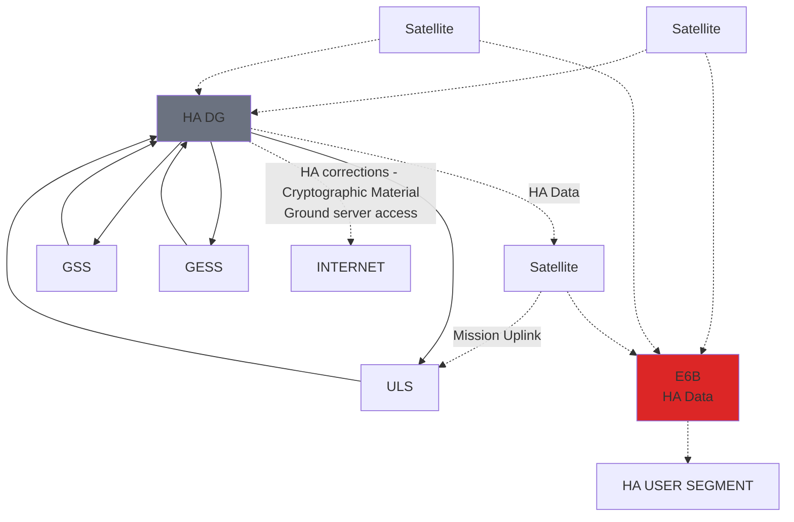

PROGRAMME OF THE
EUROPEAN UNION

# GALILEO HIGH ACCURACY SERVICE (HAS)- INFO NOTE

Issue 1.1 | December 2025

#EUSpace

GALILEO HIGH ACCURACY SERVICE (HAS), ISSUE 1.1, DECEMBER 2025

# TERMS OF USE AND DISCLAIMERS

Copyright © European Union Agency for the Space Programme, 2025

This document and the information contained in it is subject to applicable copyright and other intellectual property rights under the laws of the Czech Republic and other states. This document and information contained in this document may be excerpted, copied, printed, republished, made available to the public by wire or wireless means and/or otherwise provided to third parties only under the condition that the source and copyright owner is clearly stated as follows: "Source: Galileo High Accuracy Service (HAS) Info Note. © European Union Agency for the Space Programme, 2025". If you do republish, we would be grateful if you link back to the EUSPA website www.euspa.europa.eu

No part of this document, including any part of the information contained therein, in whichever format, whether digital or otherwise, may be altered, edited or changed without prior express and written permission of the European Union Agency for the Space Programme, to be requested via https://www.euspa.europa.eu/about/contact, clearly stating the element (document and/or information) and term of use requested. For reproduction or use of photos and any other artistic material, permission may have to be directly obtained from the copyright holder.

The designations employed, the representation of the materials and the views expressed by authors, editors, or expert groups, other EU agencies and/or their staff members or other third parties, do not necessarily represent the opinions or the stated policy of the EUSPA. The mention of specific companies or of certain manufacturers' products does not imply that they are endorsed or recommended by the EUSPA in preference to others of a similar nature that are not mentioned. Errors and omissions excepted, the names of proprietary products and copyright holders are distinguished by initial capital letters.

The present document is being distributed without warranty of any kind, either express or implied in relation to its content and/or use. To the extent permitted by the applicable law, the EUSPA shall not be liable for any damages arising from the content and use of the present document.

Should you become aware of any breach of the above terms of use, please notify the European Union Agency for the Space Programme immediately, through the above-mentioned contact site. Any breach of these terms of use may be subject to legal proceedings, seeking monetary damages and/or an injunction to stop the unlawful use of the document and/or any information contained therein. The above terms of use shall be governed by the EU law and the national substantive law of Belgium. The courts of Brussels shall have jurisdiction to give judgement for any claims arising out of these terms of use.

By downloading, forwarding, and/or copying this document or any parts thereof, in whichever format, whether digital or otherwise, the user acknowledges and accepts the above terms of use as applicable to him/her.

ISBN: 978-92-9206-093-0

doi: 10.2878/5982140

Copyright © European Union Agency for the Space Programme, 2020-2025    i
Document subject to terms of use and disclaimers p. i

GALILEO HIGH ACCURACY SERVICE (HAS), ISSUE 1.1, DECEMBER 2025

# DOCUMENT CHANGE RECORD

| REASON FOR CHANGE             | ISSUE | REVISION | DATE |
| ----------------------------- | ----- | -------- | ---- |
| First version of the document | 1     | 0        | 2020 |
| HAS P2 update                 | 1     | 1        | 2025 |

Copyright © European Union Agency for the Space Programme, 2020-2025    ii
Document subject to terms of use and disclaimers p. i

GALILEO HIGH ACCURACY SERVICE (HAS), ISSUE 1.1, DECEMBER 2025

# TABLE OF CONTENTS

| 1 | INTRODUCTION | 1 |
| 2 | TARGET MARKETS | 3 |
| 3 | HAS SERVICE CHARACTERISATION | 7 |
| 4 | HAS HIGH-LEVEL ARCHITECTURE | 9 |
| 5 | HAS ROADMAP | 10 |
| 6 | HAS RELEVANT DOCUMENTATION AND INTERFACES AVAILABLE | 12 |
| 7 | SUMMARY | 13 |
| ANNEX I – HAS ADDITIONAL INITIATIVES | 14 | |
| ANNEX II – ACRONYMS AND ABBREVIATIONS | 15 | |

## LIST OF TABLES

| Table 1: Overview of the most relevant HAS target applications | 6 |
| Table 2: Main HAS characteristics and target performances | 7 |
| Table 3: Milestones and opportunities | 11 |
| Table 4: Abbreviations | 15 |

## LIST OF FIGURES

| Figure 1: Examples of high accuracy GNSS Applications | 1 |
| Figure 2: Galileo HAS high-level architecture | 9 |
| Figure 3: Galileo HAS roadmap | 10 |

Copyright © European Union Agency for the Space Programme, 2020-2025    iii
Document subject to terms of use and disclaimers p. i

GALILEO HIGH ACCURACY SERVICE (HAS), ISSUE 1.1, DECEMBER 2025

# 1 INTRODUCTION

High-accuracy positioning services are understood as the services that allow users to achieve sub-decimetre level positioning accuracy. These kinds of services and their associated market are experiencing a massive uptick in interest thanks to the evolution of GNSS receivers and the rapid emergence of new applications requiring accurate location, which is making both equipment and services more affordable. Still today, high accuracy is mainly used in professional applications such as surveying, precision agriculture, civil engineering and geodesy, and is provided by the main GNSS augmentation service providers. However, new and emerging applications such as autonomous driving, unmanned vehicles (aerial, terrestrial and maritime), or robotics have started to make use of these services.

| **MASS MARKET** Inner ring divided into: PROFESSIONAL and SAFETY OF LIFE                                                                                                                                                                                |                                                                                                  |                                                                                                                                                       |
| ----------------------------------------------------------------------------------------------------------------------------------------------------------------------------------------------------------------------------------------------------------- | ------------------------------------------------------------------------------------------------ | ----------------------------------------------------------------------------------------------------------------------------------------------------- |
| **PROFESSIONAL applications:** - ASSET MANAGEMENT - CADASTRE - SURVEYING - PRECISION AGRICULTURE - HYDROGRAPHIC SURVEYING - TIMING - OFFSHORE EXPLORATION - PUBLIC WARNING OPERATIONS - SPACECRAFT - EARTH SCIENCES | **SAFETY OF LIFE applications:** - PERSONAL PROTECTION - INLAND WATERWAYS - MARITIME | **MASS MARKET applications:** - DRONES - AUTONOMOUS ROBOTS - VISUALLY IMPAIRED SUPPORT - IN-VEHICLE SYSTEMS - AUTOMOTIVE VEHICLES |

Figure 1: Examples of high accuracy GNSS Applications

While GNSS enables many applications across multiple industries, the standalone accuracy provided is often not sufficient for the above mentioned professional or emerging applications. Errors must be corrected to achieve high-accuracy positioning, and therefore multiple technologies, such as PPP (Precise Point Positioning), RTK (Real Time Kinematic), and more recently PPP-RTK have been developed over the years to achieve this. Network RTK (NRTK) is usually constrained by its operational model, which requires bi-directional communication, limiting the number of

Copyright © European Union Agency for the Space Programme, 2020-2025    1
Document subject to terms of use and disclaimers p. i

Copyright © European Union Agency for the Space Programme, 2020-2025
Document subject to terms of use and disclaimers p. i

users and the area the network can support. PPP has no such limitation, but it requires long convergence times which typically do not align with user demands, in particular in the fast-moving consumer goods market (e.g., smartphones, IoT). PPP-RTK, however, addresses these shortcomings and is therefore a promising technology for consumer devices.

In order to address the high-accuracy needs in these markets the European Commission proposed the provisioning of a High Accuracy Service (HAS) through the Galileo programme, the European GNSS.

As a result, the Galileo HAS Initial Service was declared operational in January 2023. This milestone confirmed Galileo as the first GNSS constellation able to provide a real time high-accuracy PPP service globally, directly through the Signal in Space, 24/7 operated, with committed performance and for free. Actually, Galileo HAS is based on the provision of open format accurate satellite data (clocks, orbits and biases) and atmospheric data (mainly ionospheric and tropospheric corrections) which is not only transmitted using the Galileo E6-B signal but also via the internet.

This paper provides an overview of the Galileo HAS service, covering its main characteristics and features such as service levels, target performance, an up-to-date planned implementation roadmap, milestones and an overview of the addressable markets, benefitting from the lessons learnt since its initial declaration.

GALILEO HIGH ACCURACY SERVICE (HAS), ISSUE 1.1, DECEMBER 2025

## 2 TARGET MARKETS

The high-accuracy positioning market is very dynamic, currently driven by emerging applications such as autonomous vehicles and drones, but also by technological evolution (e.g. dual- and even triple-frequency chipsets for the mass-market) and the market situation (cheaper or free-of-charge services in some countries), all of which is leading to the democratisation of high accuracy. Therefore, high accuracy is not only a domain for professional applications but is becoming a widespread commodity.

The right solution for a high-accuracy application is typically a trade-off between many factors such as requirements for accuracy, coverage, convergence time, integrity, price, user support, and also the operational complexity to implement the solution. An accuracy of less than two decimetres is assumed to be sufficient for a wide array of applications. This is the level of accuracy provided by the Galileo HAS, differentiating it from the niche centimetre- or millimetre-level applications addressed by commercial providers.

EUSPA is regularly collecting inputs from user communities through its User Consultation Platform, which is a part of a process developed at the EUSPA to collect user needs and requirements and take them as inputs for the definition of user-driven EGNSS services. The results have been compiled in a series of Reports on User Needs and Requirements1 per market segment, which ensure GNSS services anticipate and meet user needs. In addition, in alternate years the EUSPA publishes its EO & GNSS Market Report2 and GNSS and Secure SATCOM User Technology Report3, which provide in-depth analysis on GNSS global market and technology trends. Table 1 provides an overview of the most relevant applications that can benefit from the Galileo HAS.

| MARKETS                                                                     | APPLICATIONS                                                                                                                                                                                                                                                                                                                                                                                                                                                                                                                                                                                                                                                                                                                                                                                                                                                                                                                                                                                                                                                |
| --------------------------------------------------------------------------- | ----------------------------------------------------------------------------------------------------------------------------------------------------------------------------------------------------------------------------------------------------------------------------------------------------------------------------------------------------------------------------------------------------------------------------------------------------------------------------------------------------------------------------------------------------------------------------------------------------------------------------------------------------------------------------------------------------------------------------------------------------------------------------------------------------------------------------------------------------------------------------------------------------------------------------------------------------------------------------------------------------------------------------------------------------------- |
|  GEOMATICS | Geomatics\*, supporting applications in areas such as urban development and cultural heritage, is the segment with the most stringent accuracy requirements although, for certain ones, dm-level accuracy is sufficient:- GIS/MAPPING
- CADASTRE IN RURAL AREAS (LAND CONSOLIDATION)
- HYDROGRAPHIC SURVEY
- OFFSHORE EXPLORATIONThe performance offered by the HAS through E6B is expected to give a new boost to GIS applications, further supporting the creation of new services thanks to free access to high accuracy, from lane marking to utilities and points of interest connected to extended reality applications. Actually, a significant amount of surveying equipment manufacturers have already enabled HAS in their devices since the initial services declaration. *\* Geomatics applications are formally spread across several market segments as defined in EUSPA EO and GNSS Market Report², such as Infrastructure, Urban Planning or Maritime. However, they are grouped in this Info Note to facilitate a quick overview of them.* |

1 https://www.euspa.europa.eu/publications-multimedia/publications/user-needs-and-requirements

2 https://www.euspa.europa.eu/publications-multimedia/publications/eo-gnss-market-report

3 https://www.euspa.europa.eu/publications-multimedia/publications/gnss-and-secure-satcom-user-technology-report

Copyright © European Union Agency for the Space Programme, 2020-2025  
Document subject to terms of use and disclaimers p. i

3

GALILEO HIGH ACCURACY SERVICE (HAS), ISSUE 1.1, DECEMBER 2025

| MARKETS                                                                                                     | APPLICATIONS                                                                                                                                                                                                                                                                                                                                                                                                                                                                                                                                                                                                                                                                                                                                                                                                                                           |
| ----------------------------------------------------------------------------------------------------------- | ------------------------------------------------------------------------------------------------------------------------------------------------------------------------------------------------------------------------------------------------------------------------------------------------------------------------------------------------------------------------------------------------------------------------------------------------------------------------------------------------------------------------------------------------------------------------------------------------------------------------------------------------------------------------------------------------------------------------------------------------------------------------------------------------------------------------------------------------------ |
|  AGRICULTURE                          | There is a wide range of precision farming applications for certain type of crops that can benefit from dm-level accuracy such as:- AUTOMATIC STEERING
- MACHINERY GUIDANCE
- VRA-LOW APPLICATIONS
- SITE-SPECIFIC DATA ANALYSIS E.G. FIELD DELINEATIONThese applications can be used for farming activities such as soil condition monitoring, cultivation, spraying, seeding and fertilising, etc. Also, HAS can be relevant for Common Agricultural Policy (CAP) applications such as field boundaries delineation.                                                                                                                                                                                                                                                                                                                                 |
|  AVIATION                                     | GNSS's role is becoming more and more prominent in drones, since automated functions are becoming increasingly accessible and a HAS service with 20 cm positioning accuracy can be relevant, in the open or specific drones categories, for the applications below:- DRONES: POSITIONING SYSTEM (URBAN)
- DRONES: NAVIGATION SYSTEM (URBAN)
- DRONES: GEO-AWARENESS SYSTEMSpecialised functions such as "return to home" or flight planning are now available even in budget models, and for new emerging applications such as parcel delivery the accuracy provided by HAS is desirable.                                                                                                                                                                                                                                                              |
|  ROAD                                                                | The accuracy requirement for the following applications in the road segment is in line with the target positioning performance of the Galileo HAS (i.e. \~20 centimetres):- CONNECTED AND AUTOMATED DRIVING (CAD)
- IN-VEHICLE SYSTEMSHowever, CAD applications require additional critical performances, such as integrity, to ensure safe navigation. These will be achieved by integrating various sensors and navigation technologies (including GNSS) in a hybrid solution.                                                                                                                                                                                                                                                                                                                                                                       |
|  CONSUMER SOLUTIONS, TOURISM AND HEALTH | The addition of free high-accuracy positioning with dm-level precision can benefit the following applications in consumer solutions:- MAPPING AND GIS BASED ON SMARTPHONES
- VISUALLY IMPAIRED SUPPORT
- ROBOTICSDespite the lower achieved accuracy caused by the hardware found in smartphones and mass-market devices, HAS is expected to improve GNSS standalone accuracy and become useful for low accuracy mapping applications or visually impaired support. On the other hand, robotics is widely reported to be one of the fastest growing market sectors, driven by the developing capability of robots to navigate complex environments thanks to local sensors such as LIDAR that are critical to understanding the robot's immediate surrounding but also, with the inclusion of GNSS sensors, necessary for open environment navigation. |

Copyright © European Union Agency for the Space Programme, 2020-2025    4
Document subject to terms of use and disclaimers p. i

Copyright © European Union Agency for the Space Programme, 2020-2025  
Document subject to terms of use and disclaimers p. i

5

| MARKETS                                                         | APPLICATIONS                                                                                                                                                                                                                                                                                                                                                                                                                                                                                                                                                                                                                                                                                                                                                                                            |
| --------------------------------------------------------------- | ------------------------------------------------------------------------------------------------------------------------------------------------------------------------------------------------------------------------------------------------------------------------------------------------------------------------------------------------------------------------------------------------------------------------------------------------------------------------------------------------------------------------------------------------------------------------------------------------------------------------------------------------------------------------------------------------------------------------------------------------------------------------------------------------------- |
|  RAIL                                | For the following non-safety critical rail applications, a horizontal accuracy from 10 cm to 1 m is needed: • TRACKSIDE SHUNTING OPERATIONS • STRUCTURAL MONITORING The implementation of Galileo HAS for yard operations can enhance the efficiency and safety of rail freight activities. Shunting involves the precise movement of railcars within yards, sorting and organising them into complete trains, or breaking them down into individual cars. Achieving submeter level accuracy is crucial for avoiding collisions and ensuring correct positioning. On the other hand, the stability of rail infrastructure can be monitored by post-processing static relative GNSS observations at field control points (established directly into or in the vicinity of the asset).                    |
|  MARITIME & INLAND WATERWAYS | For the following maritime applications, a horizontal accuracy from dm-level to 1m is needed: • PORT OPERATIONS, NAVIGATION IN PORTS AND RESTRICTED WATERS • CABLE AND PIPE LAYING • LEISURE BOAT APPLICATIONS IN CONGESTED AREAS • PORT BATHYMETRY • RIVERBED SURVEY • COASTAL SEABED SURVEY • OFFSHORE SUPPLY VESSELS WITH DYNAMIC POSITIONING • PORT TERMINAL CRANES AND STRADDLE CARRIERS NAVIGATION • AUTONOMOUS SURFACE VESSELS Waterborne transportation (passengers and cargo) and engineering operations are already benefitting in terms of efficiency and safety thanks to the increased level of accuracy provided by the HAS, especially in those applications where the cost of a three-frequency receiver and antenna is negligible in comparison with the savings in operational costs. |
|  FORESTRY                    | With accuracy requirements in the 30cm – 1m range, HAS becomes a fitting solution in this segment, and in particular for: • AUTOMATIC STEERING • MACHINERY GUIDANCE • FOREST ASSET MANAGEMENT Users in this market segment might be located in remote areas, with no internet connection. In this context, HAS, by distributing its high-accuracy corrections via the SiS, practically becomes the only means to achieve highly accurate positioning to assist during machinery operations as well as to conduct inventory tasks.                                                                                                                                                                                                                                                                       |

GALILEO HIGH ACCURACY SERVICE (HAS), ISSUE 1.1, DECEMBER 2025

| MARKETS | APPLICATIONS                                                                                                                                                                                                                                                                                                                                                                                                                                                                                                                                                                                                                                                                                                                                                                |
| ------- | --------------------------------------------------------------------------------------------------------------------------------------------------------------------------------------------------------------------------------------------------------------------------------------------------------------------------------------------------------------------------------------------------------------------------------------------------------------------------------------------------------------------------------------------------------------------------------------------------------------------------------------------------------------------------------------------------------------------------------------------------------------------------- |
| SPACE   | For satellites and space vehicles orbiting Earth, vertical and horizontal high-accuracy positioning is a key enabler for applications linked with the determination of precise orbits: • AUTONOMOUS FORMATION FLYING AND IN-ORBIT RENDEZVOUS AND DOCKING • EARTH OBSERVATION, RADIO OCCULTATION AND REFLECTOMETRY The space industry has traditionally used expensive solutions (in terms of cost, power, and mass) for these applications, which in many occasions were either autonomous or non-real-time. HAS provides civilian satellites with access to real time Precise Orbit Determination, without assistance from on ground systems, removing complexity in the spaceborne architecture and as a consequence in full alignment of the needs from New Space users. |

Table 1: Overview of the most relevant HAS target applications

Copyright © European Union Agency for the Space Programme, 2020-2025    6
Document subject to terms of use and disclaimers p. i

GALILEO HIGH ACCURACY SERVICE (HAS), ISSUE 1.1, DECEMBER 2025

# 3 HAS SERVICE CHARACTERISATION

The HAS provides free of charge high-accuracy PPP corrections, in the Galileo E6-B data component and by terrestrial means, for Galileo and GPS (single and multi-frequency) to achieve real-time improved user positioning performances (positioning error of less than two decimetres in nominal conditions).

The HAS comprises two services levels for global and regional coverage:

• Service Level 1 (SL1): with global coverage; providing high accuracy corrections (orbits, clocks) and biases (code and phase) for Galileo E1/E5b/E5a/E6 and E5AltBOC and GPS L1/L5/L2 signals.

• Service Level 2 (SL2): with regional coverage (European Coverage Area); providing SL1 corrections plus atmospheric (at least ionospheric) corrections and potential additional biases.

Table 2 summarises the HAS full service characteristics and main targets for both service levels (note that the HAS initial service is currently providing a reduced performance level, as described in section 5).

| HAS                          | SERVICE LEVEL 1                                                              | SERVICE LEVEL 2                                                              |
| ---------------------------- | ---------------------------------------------------------------------------- | ---------------------------------------------------------------------------- |
| COVERAGE                     | Global                                                                       | European Coverage Area (ECA)                                                 |
| TYPE OF CORRECTIONS          | PPP - orbit, clock, biases (code and phase)                                  | PPP - orbit, clock, biases (code and phase) incl. atmospheric corrections    |
| FORMAT OF CORRECTIONS        | Open format similar to Compact-SSR (CSSR)                                    | Open format similar to Compact-SSR (CSSR)                                    |
| DISSEMINATION OF CORRECTIONS | Galileo E6B using 448 bits per satellite per second / terrestrial (internet) | Galileo E6B using 448 bits per satellite per second / terrestrial (internet) |
| SUPPORTED CONSTELLATIONS     | Galileo, GPS                                                                 | Galileo, GPS                                                                 |
| SUPPORTED FREQUENCIES        | E1/E5a/E5b/E6; E5 AltBOC L1/L5; L2C                                          | E1/E5a/E5b/E6; E5 AltBOC L1/L5; L2C                                          |
| HORIZONTAL ACCURACY 95 %     | <20cm                                                                        | <20cm                                                                        |
| VERTICAL ACCURACY 95 %       | <40cm                                                                        | <40cm                                                                        |
| CONVERGENCE TIME             | <300 s                                                                       | <100 s                                                                       |
| AVAILABILITY                 | 99%                                                                          | 99%                                                                          |
| USER HELPDESK                | 24/7                                                                         | 24/7                                                                         |

**Table 2:** Main HAS characteristics and target performances

Copyright © European Union Agency for the Space Programme, 2020-2025
Document subject to terms of use and disclaimers p. i

7

GALILEO HIGH ACCURACY SERVICE (HAS), ISSUE 1.1, DECEMBER 2025

Along with the HAS corrections via the Signal in Space (SiS), corrections are distributed using a terrestrial channel, the Internet Data Distribution (IDD), aiming to provide users (both SL1 and SL2) with an alternative or complementary input source to the SiS; additional information can be found in the HAS IDD ICD4 (available for registered users).

In addition, the European GNSS Service Centre (GSC)5 will deliver user support functions such as the provision of service status information, quarterly performance reports6, incident management, and user helpdesk support. Furthermore, system and service performances will be regularly monitored by Galileo through an independent monitoring facility (Galileo Reference Centre - GRC) and by appropriate system tools.

----

4 https://www.gsc-europa.eu/galileo/services/galileo-high-accuracy-service-has/internet-data-distribution-registration-form

5 https://www.gsc-europa.eu

6 https://www.gsc-europa.eu/electronic-library/performance-reports/galileo-high-accuracy-service-has

Copyright © European Union Agency for the Space Programme, 2020-2025                                                       8
Document subject to terms of use and disclaimers p. i

GALILEO HIGH ACCURACY SERVICE (HAS), ISSUE 1.1, DECEMBER 2025

## 4 HAS HIGH-LEVEL ARCHITECTURE

The figure below provides a simplified view of the Galileo HAS high-level architecture, with the main elements involved in the broadcasting of HAS data based on the following Galileo system capabilities:

1. A high data bandwidth compared to other GNSS signals (448 bits per second per connected satellite in the Galileo E6B component).

2. The transmission of data through satellites connected to Galileo uplink stations on the ground.

The HAS corrections module within the High Accuracy Data Generator (HADG) is in charge of the generation of the HA data that is relayed in real time for its uplink and broadcast through the Galileo E6B signal component.

Additionally, the HA data is available on a terrestrial basis (IDD), to registered users, by connecting to a NTRIP caster at the GSC.

In Galileo HAS Phase 2, the service will be enhanced with the provision of authentication of the HA Data; additional information will be available in the HAS SiS ICD.

Galileo's capacity to broadcast high-accuracy corrections will evolve in line with the continuous deployment of infrastructure, driven mainly by the number of operational satellites, but also by the evolution of ground infrastructures (more details are provided in the HAS Roadmap below).

Figure 2: Galileo HAS high-level architecture

Copyright © European Union Agency for the Space Programme, 2020-2025
Document subject to terms of use and disclaimers p. i

9

GALILEO HIGH ACCURACY SERVICE (HAS), ISSUE 1.1, DECEMBER 2025

# 5 HAS ROADMAP

It is planned that the implementation of the Galileo High Accuracy Service will be staggered, based on the 3 phases depicted in Figure 3. The main elements and objectives of each phase are as follows:

• **Phase 0 (HA testing and experimentation).** Activities aimed at validating Galileo's dissemination capabilities through the E6B channel and performing initial high-accuracy testing. Internal testing started in 2019. HAS SiS tests were executed from Q1 2021, including the involvement of key stakeholders and interested parties under certain conditions (see Call for Expression of Interest in Table 3).

• **Phase 1 (HA Initial Service).** Provision of an initial Galileo High Accuracy Service resulting from the implementation of a high-accuracy data generation system. The HA initial service is available since 24/01/2023 and delivers Service Level 1 only with a reduced performance (below the full service's targets).

• **Phase 2 (HA Full Service).** Full provision of the Galileo High Accuracy Service, Service Level 1 and Service Level 2, fulfilling its target performance (e.g. 20 cm positioning performance).

• **Phase X (HA Evolution).** Implementation of HAS Evolutions in the frame of Galileo 2nd generation developments, addressing the HAS users' feedback and lessons learned from the previous phases.

| **PHASE 0**  **HAS TESTING AND EXPERIMENTATION** | **PHASE 1**  **HAS INITIAL SERVICE** | **PHASE 2**  **HAS FULL SERVICE**     | **PHASE X**  **HAS EVOLUTION**            |
| ---------------------------------------------------------------- | ---------------------------------------------------- | ----------------------------------------------------- | --------------------------------------------------------- |
| **Validate dissemination capabilities**                      | **Use Galileo system data only (GSS)**           | **Validate dissemination capabilities**           | **Increase capabilities**                                 |
| **HAS SiS tests and experimentation**                        | **Relaxed performance targets**                  | **Additional data (GESS) to improve performance** | **Feedback and lessons learned from previous phases** |
| **Leverage lessons learned for following phases**            |                                                      |                                                       | **Evolutions of Galileo 2nd Generation**              |

Figure 3: Galileo HAS roadmap

In line with the Galileo HAS Roadmap, key milestones are planned to ensure continuous service development. Table 3 below shows the most relevant milestones with their corresponding tentative dates.

Copyright © European Union Agency for the Space Programme, 2020-2025
Document subject to terms of use and disclaimers p. i

10

GALILEO HIGH ACCURACY SERVICE (HAS), ISSUE 1.1, DECEMBER 2025

| DATE                      | MILESTONE                                                                                                                                                                                                                                                                                                                                                                                                                                                                              |
| ------------------------- | -------------------------------------------------------------------------------------------------------------------------------------------------------------------------------------------------------------------------------------------------------------------------------------------------------------------------------------------------------------------------------------------------------------------------------------------------------------------------------------- |
| 2020                      | **User Consultation Platform**- The User Consultation Platform (UCP) is a forum for interaction between users of position, navigation and time solutions and the organisations and institutions dealing, directly and indirectly, with Galileo and EGNOS. The platform serves as a key tool for gathering user requirements and validating the Galileo HAS target performance
- The UCP 2020 was held during European Space Week on 7-11 December 2020 (https\://www\.euspaceweek.eu/) |
| 2021                      | **Call for Expression of Interest**- Participating in the HAS SiS ICD public consultation
- Expressing interest in participating in ad-hoc HAS SiS testing campaigns
- Providing feedback on specific HAS user requirements                                                                                                                                                                                                                                                            |
| 2021                      | **HAS P0 Testing**- Validation of the dissemination capabilities
- HAS SiS Tests and experimentation                                                                                                                                                                                                                                                                                                                                                                                   |
| 2022                      | **HAS SiS ICD Publication**- Following the finalisation of the testing phase, the first version of the HAS message specification document has been published in May 2022.                                                                                                                                                                                                                                                                                                              |
| 2023                      | **HAS Initial Service Declaration**- Declared on the 24/01/2023. HA Service Definition Document published on the European GNSS Service Centre (GSC) website.                                                                                                                                                                                                                                                                                                                           |
| Q4 2025 - Q4 2026 | **HAS Documentation Updates for Phase 2**- In preparation of HAS Full service the update of the SiS and IDD ICD with message specification for SL2.
- Publication of a HAS receiver guidelines document and the HAS P2 Reference User Algorithm.                                                                                                                                                                                                                                       |
| > 2027                    | **HAS Full Service Declaration**- HAS Full Service Operational capability planned in Q4 2026
- Full Service Declaration targeted in Q1-Q2 of 2027, after the necessary service validation activities of newly procured ground elements.
- HAS Authentication will be available. Crypto Material available on EUSPA & GSC Websites.
- HA Service Definition Document will be updated.                                                                                                   |
| > 2030                    | **HAS Evolution of Service Capabilities**- Implementation of new features flown down from the outcome of the User Consultation Platform
- Galileo 2nd generation developments addressing the HAS user's feedback and lessons learned from previous phases.                                                                                                                                                                                                                             |

Table 3: Milestones and opportunities

7 The dates indicated are tentative and subject to change

Copyright © European Union Agency for the Space Programme, 2020-2025    11
Document subject to terms of use and disclaimers p. i

GALILEO HIGH ACCURACY SERVICE (HAS), ISSUE 1.1, DECEMBER 2025

# 6 HAS RELEVANT DOCUMENTATION AND INTERFACES AVAILABLE

• Galileo Programme reference documents: https://www.gsc-europa.eu/electronic-library/programme-reference-documents#ACCURACY

• For general information on Galileo: https://www.gsc-europa.eu/galileo/services/galileo-high-accuracy-service-has

• Galileo helpdesk: https://www.gsc-europa.eu/galileo-helpdesk

• EUSPA GNSS & EO Market Report: https://www.euspa.europa.eu/publications-multimedia/publications/eo-gnss-market-report

• EUSPA GNSS and Secure SATCOM User Technology Report: https://www.euspa.europa.eu/publications-multimedia/publications/gnss-and-secure-satcom-user-technology-report

• EUSPA Reports on User needs and requirements: https://www.euspa.europa.eu/publications-multimedia/publications/user-needs-and-requirements

Copyright © European Union Agency for the Space Programme, 2020-2025
Document subject to terms of use and disclaimers p. i
12

GALILEO HIGH ACCURACY SERVICE (HAS), ISSUE 1.1, DECEMBER 2025

# 7 SUMMARY

With the Galileo High Accuracy Service (HAS), Galileo will pioneer a worldwide, free high-accuracy positioning service aimed at applications that require higher performance than that offered by the Open Service. The HAS will be based on the provision of PPP corrections (orbit, clock, biases, atmospheric corrections), at a maximum rate of 448 bps per Galileo satellite connected to an uplink station, allowing the user to obtain a horizontal positioning error of less than two decimetres (95 %) in nominal conditions of use with an authentication of the HA message feature. The parameters and the business model of the service will foster innovation in both consolidated and emerging markets, notably in key areas such as drones and autonomous cars, minimising disruption in the current business models of established providers

The HAS is implemented in three phases, including testing and experimentation; an initial Galileo High Accuracy Service for a reduced number of signals, with relaxed performance targets and a reduced coverage area; and a full Galileo HAS that will offer two service levels and global coverage. Service Level 1 will provide PPP corrections globally to achieve 20 cm horizontal precision with <300s convergence time, while Service Level 2 will additionally offer atmospheric corrections for Europe to reduce the convergence time to 100s.

Galileo, through the HAS, will offer a unique service with the transmission of corrections directly via Galileo satellites, allowing free high-accuracy positioning globally, for everyone.

Copyright © European Union Agency for the Space Programme, 2020-2025    13
Document subject to terms of use and disclaimers p. i

GALILEO HIGH ACCURACY SERVICE (HAS), ISSUE 1.1, DECEMBER 2025

# ANNEX I – HAS ADDITIONAL INITIATIVES

Emerging/next-generation applications will require improved positioning performance to offer innovative services in the future. The European Commission and the EUSPA continue specifying the long-term evolution of the EGNSS programmes, in close cooperation with the European Space Agency, including new services for Galileo and EGNOS in the 2030+ timeframe. Therefore, beyond the HAS Roadmap described in this document, the Programme is already targeting the enhancement of the HAS performance in the frame of the Galileo Second Generation (G2G) developments. Moreover, EUSPA has launched additional initiatives to explore and evaluate the potential evolutions of EGNSS high-accuracy services to complement and support the evolving needs of new demanding applications.

• **EGNSS Service Demonstrator (EUSPA/OP/17/24):** Procures a modular platform for the demonstration of new and enhanced EGNSS services and will include the development of a module providing integrity complementing the High Accuracy Data Generator for Galileo HAS phase 2 platform.

• **Ongoing EUSPA HAS-related grants and procurements:**

FUNDAMENTAL ELEMENTS GRANTS:

• *Development of GNSS receiver technologies for premium and general mass markets*

• *Development of an Advanced Interference*

• *Detection and Robustness Capabilities System*

• *Receiver technologies for high-precision in the mass-market*

• *Filling the gaps and emerging E-GNSS receiver technologies*

• *Multi-frequency, multipurpose antenna for Galileo*

• *HAS implementation in Agriculture and Geomatics*

• *Galileo HAS and OSNMA implementation in cooperative, connected and automated mobility*

• *Galileo HAS enabled Maritime receiver*

• *Artificial Intelligence, Machine Learning*

• *Galileo Space Receiver*

• *Robust and professional receiver leveraging on Galileo differentiators*

Copyright © European Union Agency for the Space Programme, 2020-2025
Document subject to terms of use and disclaimers p. i

14

GALILEO HIGH ACCURACY SERVICE (HAS), ISSUE 1.1, DECEMBER 2025

# ANNEX II – ACRONYMS AND ABBREVIATIONS

| ABBREVIATION | DEFINITION                                   |
| ------------ | -------------------------------------------- |
| AltBoc       | Alternative Binary Offset Carrier Modulation |
| AR           | Augmented Reality                            |
| CAP          | Common Agricultural Policy                   |
| CSSR         | Compact State Space Representation           |
| ECA          | European Coverage Area                       |
| ERTMS        | European Rail Traffic Management System      |
| FE           | Fundamental Elements                         |
| GIS          | Geographic Information Systems               |
| GNSS         | Global Navigation Satellite System           |
| GPS          | Global Positioning System                    |
| GRC          | Galileo Reference Centre                     |
| GSA          | European GNSS Agency                         |
| GSC          | European GNSS Service Centre                 |
| GSS          | Galileo Sensor Station                       |
| HA           | High Accuracy                                |
| HADG         | High Accuracy Data Generator                 |
| HAS          | High Accuracy Service                        |
| ICD          | Interface Control Document                   |
| IoT          | Internet of Things                           |
| IWW          | Inland Waterways                             |
| LBS          | Location-based Services                      |
| LIDAR        | Light Detection and Ranging                  |
| MKD          | Market Development                           |
| NRTK         | Network Real Time Kinematics                 |
| PPP          | Precise Point Positioning                    |
| RTK          | Real Time Kinematics                         |
| SBAS         | Satellite-based Augmentation System          |
| SiS          | Signal in Space                              |
| SL           | Service Level                                |
| SSR          | Space State Representation                   |
| UCP          | User Consultation Platform                   |
| VRA          | Variable Rate Application                    |

Table 4: Abbreviations

Copyright © European Union Agency for the Space Programme, 2020-2025    15
Document subject to terms of use and disclaimers p. i

GALILEO HIGH ACCURACY SERVICE (HAS), ISSUE 1.1, DECEMBER 2025

## The European Union Agency for the Space Programs (EUSPA)

The EUSPA's mission is to support European Union objectives and achieve the highest return on European GNSS investment, in terms of benefits to users and economic growth and competitiveness by:

• Designing and enabling services that fully respond to user needs, while continuously improving the European GNSS services and infrastructures;

• Managing the provision of quality services that ensure user satisfaction in the most cost-efficient manner;

• Engaging market stakeholders to develop innovative and effective applications, added-value services and user technology that promote the achievement of full European GNSS adoption;

• Ensuring that European GNSS services and operations are thoroughly secure, safe and accessible.

## Galileo

Galileo is the European Union's Global Satellite Navigation System (GNSS) that provides accurate positioning and timing information. Galileo is a programme under civilian control and its services can be used for a broad range of applications. It is autonomous but also interoperable with existing satellite navigation systems.

On 15 December 2016, the Declaration of Initial Services marked the beginning of Galileo's operational phase. This means that anyone with a Galileo-enabled device is now, in combination with other GNSS systems, able to use signals provided by Galileo's global satellite constellation for positioning, navigation and timing.

The fully deployed Galileo system will provide the following high performance services worldwide:

• Open Service (OS) that targets the mass market. The OS offers either single (E1) or dual frequency (E1 and E5).

• OS Navigation Message Authentication (OS NMA) is the first to broadcast authentication data as a free access service that complements the OS by delivering authentication data, assuring users that the received Galileo navigation message comes from the system itself and has not been modified.

• HAS (High Accuracy Service) complements the OS and provides a higher positioning accuracy being broadcast on the E6-B signal component.

• SAS (Signal Authentication Service) will enable an authenticated positioning service by complementing the OSNMA with E6-based ranging authentication capabilities targeting to support civil applications.

• Public Regulated Service (PRS) is dedicated to government-authorised users. It is encrypted and secured against jamming and spoofing.

• Search and Rescue (SAR) service allows near real time alert localisation and message detection, higher beacon localisation accuracy, high availability and global satellite coverage. It has a return link, which is unique to Galileo, and will reduce the rate of false alerts.

• Galileo Emergency Warning Satellite Service (EWSS) allowing national civil protection authorities to directly transmit to smartphones (or any Galileo-enabled devices) for enhanced emergency response and resilient risk management.

• Timing Service (TS) provides timing and synchronisation information, including monitoring of GST and UTC products.

Copyright © European Union Agency for the Space Programme, 2020-2025
Document subject to terms of use and disclaimers p. i
16

TS-01-25-004-EN-N

EUSPA Logo - European Union Agency for the Space Programme

Linking space to user needs

www.euspa.europa.eu

**in** EUSPA

**🦋** euspa.bsky.social

**⊙** space4eu

#EUSpace 🇪🇺
